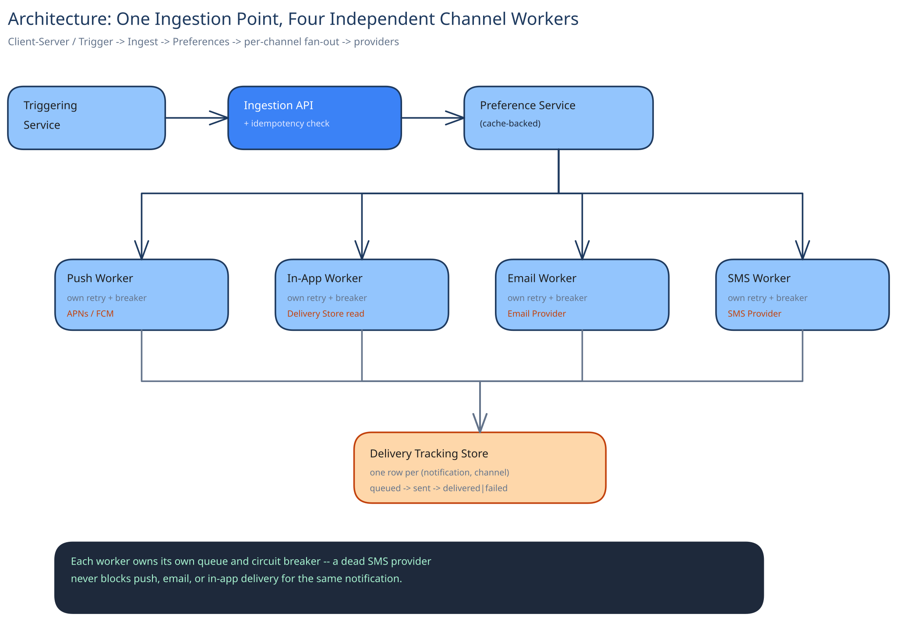

# Design a Notification System

## Requirements

**Functional:** an internal service (orders, security, social) publishes one event; the system delivers it to a user across whichever channels apply — push, email, SMS, in-app — while respecting that user's per-category, per-channel preferences; the same event never produces two notifications on the same channel.

**Non-functional** (stated as assumptions): ~100M notifications/day across all channels combined. Push and in-app should land within seconds of the triggering event; email and SMS are acceptable within a couple of minutes, since both already route through a third-party provider with its own queueing.

## The core design idea: one ingestion point, channel-specific fan-out after

Every internal service that wants to notify a user could call APNs, FCM, an email provider, and an SMS gateway directly — and every one of them would have to reimplement preference checks, dedup, and per-provider retry logic. Instead, every triggering service publishes **one event** to a notification service, which resolves the user's preferences and fans out to only the channels that apply. That centralization buys three things: preference rules are enforced in exactly one place instead of N times, deduplication has one source of truth, and adding a fifth channel later (say, WhatsApp) touches this one service instead of every service that ever sends a notification.

## Architecture, briefly

- **Ingestion** — an API endpoint or a queue topic (see [Message Queues & Pub/Sub](../../hld-building-blocks/message-queues-pubsub.md)) that every triggering service publishes to.
- **Preference service** — a lookup, per (user, category), of which channels are enabled. A "your post got a comment" event checks a different set of toggles than a "your card was charged" event.
- **Channel workers** — one per channel, each owning that channel's provider integration and its own retry/backoff policy: the push worker (this guide's [Push Notifications](../../push-notifications-fanout/00-overview.md) real-world deep dive covers this one's fan-out mechanism — token registries, provider rate limits, dead-token pruning — in full; this page doesn't repeat it), plus email and SMS workers, each a thin adapter over its own third-party API.
- **Delivery-tracking store** — one row per (event, channel, recipient) recording sent/delivered/failed, so retries know what's outstanding and analytics can answer "did this actually reach anyone."

## Deduplication and rate limiting, specifically

A flaky upstream retry can publish "order #4471 shipped" twice for the same order. The fix is the same one this guide uses everywhere a duplicate submission is possible: an idempotency key on the triggering event (see [Idempotency Keys](../../scalability-resilience/idempotency-keys.md)) — a second event with the same key is recognized and dropped before it reaches any channel worker, not de-duplicated separately per channel.

Separately, a *buggy* upstream service (not a retry — a real bug looping) can try to fire hundreds of legitimate-looking events at one user in a burst. Per-user rate limiting at the ingestion point (see [Rate Limiting](../../hld-building-blocks/rate-limiting.md)) caps how many notifications one user can receive in a window, independent of how many distinct triggering services are involved.

## Interviewer follow-ups

**How would you batch several related notifications into one digest instead of spamming a user?**
Delay low-priority categories (likes, minor social activity) by a short window at the preference/fan-out layer, collecting events for the same user into one summary send instead of one-per-event; transactional categories (security, 2FA) skip batching entirely and go out immediately.

**What happens if the email provider is down — do you retry, and against what backoff?**
The email worker retries with exponential backoff and jitter (see [Circuit Breakers & Retries](../../scalability-resilience/circuit-breakers-retries.md)), independent of the other channels — a dead email provider never blocks push or in-app delivery for the same event, since each channel worker consumes its own queue.

**How does a preference change take effect for an event already queued for delivery?**
The preference check happens at fan-out time, right before a channel worker picks up the job — not once at ingestion — so a user who disables email a second after the event was published still gets checked against their *current* preference, not a stale copy from ingestion time.

**Why not let each triggering service call the channel providers directly for its own events?**
Because then preference enforcement, dedup, and rate limiting all have to be correctly reimplemented in every one of those services — and any one of them getting it wrong means a real user gets spammed or a compliance-relevant opt-out gets ignored, with no single place to audit or fix it.
