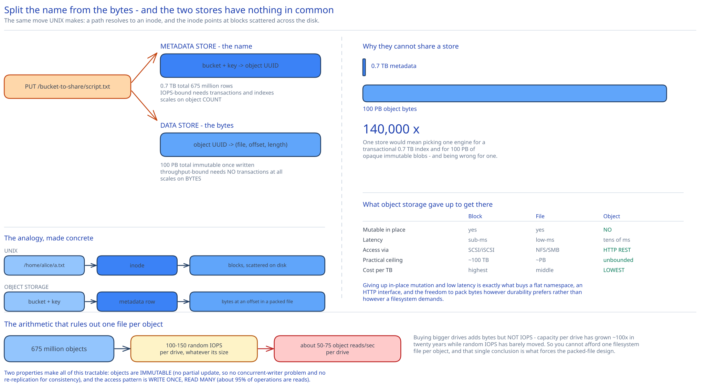

# Module 00 — Overview



## The feature, with no infrastructure in it yet

`PUT /photos/beach.jpg` stores some bytes under a name. `GET /photos/beach.jpg` gets them back, byte for byte, years later. That's the whole product: a namespace of names mapped to blobs, reachable over HTTP.

The hard constraint is **durability, and it's a much stranger requirement than it looks.** The target is 99.999999999% — eleven nines — which means that if you store 10 million objects you should expect to lose one every 10,000 years. No single piece of hardware comes remotely close: a commodity drive has an annualized failure rate around 0.81%, which is **eight orders of magnitude** worse than the promise. So the entire design is an exercise in composing unreliable parts into a system whose failure probability is arbitrarily small, and then proving it stays that way as drives die continuously in the background.

Two properties make that tractable, and both are worth stating early because they license nearly every later decision:

- **Objects are immutable.** You can replace an object or delete it, but you cannot modify byte 500 of an existing one. There is no partial update, so there is no concurrent-writer problem on object data, no read-modify-write, and no versioning conflict at the byte level.
- **Write once, read many.** Around 95% of operations are reads. Combined with immutability, this means a stored object never needs to be re-replicated for consistency reasons — only for repair.

## Where object storage sits

Interviewers frequently open by asking why you'd use object storage at all, and the answer is a genuine three-way trade rather than a preference:

| | Block storage | File storage | Object storage |
|---|---|---|---|
| Abstraction | Raw numbered blocks | Hierarchical directories + files | Flat namespace of keys → blobs |
| Mutable in place? | Yes | Yes | **No** — replace or version only |
| Access via | SCSI / iSCSI / FC (attached) | NFS / SMB (network file system) | **HTTP REST API** |
| Latency | Sub-ms | Low-ms | **Tens of ms** |
| Practical ceiling | ~100 TB per volume | ~PB per filer | **Effectively unbounded** |
| Cost per TB | Highest | Middle | **Lowest** |
| Built for | Databases, VM disks | Shared home dirs, build artifacts | Backups, media, data lakes, static assets |

The reason object storage can be so much cheaper and larger is precisely that it **gave up in-place mutation and low latency**, and those two sacrifices are what buy a flat namespace, an HTTP interface, and the freedom to pack data on disk however durability prefers rather than however a filesystem demands. Everything in this design follows from spending those two currencies well. Cross-ref [Object & Blob Storage](../../scalability-resilience/object-blob-storage.md) for the building-block view.

## Requirements

**Functional:**
- Create and delete buckets. Bucket names are **globally unique** across all tenants.
- `PUT` an object into a bucket; `GET` it back; `DELETE` it.
- **Multipart upload** for large objects, with resume after failure.
- **Versioning**, per bucket: keep every generation of an object, including deletes.
- **List objects in a bucket**, optionally filtered by prefix, with pagination.
- Access control per bucket and per object.

**Non-functional:**
- **Capacity:** 100 PB of stored data.
- **Durability: 11 nines** (99.999999999%). This is the requirement that shapes the design; it drives [Module 02](./02-durability.md) entirely.
- **Availability: 4 nines** (99.99%) — about 52 minutes/year. Deliberately *seven orders of magnitude looser than durability*, and the asymmetry is the point: losing data is unrecoverable, while being briefly unreachable is an inconvenience. When the two conflict, durability wins every time.
- **Storage efficiency:** cost per usable TB is a first-class requirement, not an afterthought. It's what makes erasure coding worth its complexity.
- Latency: tens of milliseconds for small objects; large objects are throughput-bound, not latency-bound.

## Capacity Estimation

Method from [Back-of-the-Envelope Estimation](../../foundations/back-of-envelope-estimation.md).

**Object count.** Object *size distribution* matters far more than total bytes here, because metadata cost and IOPS scale with object count while storage cost scales with bytes. Assume:

| Class | Share | Median size |
|---|---|---|
| Small (< 1 MB) | 20% | 0.5 MB |
| Medium (1–64 MB) | 60% | 32 MB |
| Large (> 64 MB) | 20% | 200 MB |

Weighted mean object size = (0.2 × 0.5) + (0.6 × 32) + (0.2 × 200) = **59.3 MB**.

At 100 PB raw with 40% utilization: 10¹¹ MB × 0.4 ÷ 59.3 MB ≈ **675 million objects**.

**Metadata.** At ~1 KB per object: 675M × 1 KB ≈ **~0.7 TB**. That fits on a single well-provisioned node, which is a genuinely important finding — it means metadata is sharded for *throughput and blast radius*, not capacity, and the two motivations lead to different shard-key choices ([Module 04](./04-db-design.md#scaling-the-schema)).

**The IOPS wall.** This is the constraint that actually bites, and it's the one most designs miss. A 7200 RPM SATA drive sustains only **100–150 random IOPS**, essentially independent of capacity. So:

- 675M objects, one file per object, and every `GET` costs at least one random seek for metadata plus one for data.
- A single drive therefore serves roughly **50–75 object reads/sec**, no matter how big it is.
- Buying bigger drives adds bytes but **not IOPS** — capacity per drive has grown ~100× in twenty years while random IOPS has barely moved.

The consequence: **you cannot afford one filesystem file per object.** That single conclusion is what forces the packed-file design in [Module 03](./03-lld.md#why-many-objects-share-one-file), and it comes purely from this arithmetic. It's worth stating in interviews as a derived result rather than a known trick.

**Throughput.** 95% reads. If the system serves 675M objects with a 1% daily access rate: 6.75M reads/day ≈ **78 reads/sec** average, 400/sec at peak — trivially small in request terms, but at 59.3 MB average that's **23 GB/sec of egress at peak**, which is a network provisioning problem, not a compute one.

## Approach Walkthrough

Split the object's **name** from the object's **bytes**, and store them in two completely different systems.

This is the design's founding move, and the cleanest way to see why is the UNIX filesystem analogy: opening a file resolves a path to an *inode*, and the inode holds pointers to blocks scattered across the disk. Object storage does the same thing at cluster scale — a **metadata store** maps `bucket + key → object UUID`, and a **data store** maps `UUID → the actual bytes`, wherever they happen to live.

Separating them means:
- The two scale independently, on different axes: metadata on object *count* (~0.7 TB, IOPS-heavy, needs transactions and indexes), data on object *bytes* (100 PB, throughput-heavy, needs no transactions at all).
- Renaming or re-permissioning an object touches only metadata and never moves a byte.
- The data store can organize bytes purely for durability and sequential throughput, with no obligation to make the layout resemble the namespace users see. That freedom is what makes packing many objects into one large file possible.

Durability then comes from **erasure coding across independent failure domains** rather than from any drive being reliable, and it is verified continuously by background checksum scrubbing rather than trusted.

## API Surface

```
PUT    /{bucket}                                   → 200 | 409 (name taken globally)
DELETE /{bucket}                                    → 204 | 409 (not empty)

PUT    /{bucket}/{key}                              → 200 { etag, version_id }
   Content-MD5, Content-Type, x-amz-meta-* custom headers
GET    /{bucket}/{key}[?versionId=]                 → 200 bytes | 404
   Range: bytes=0-1023                              → 206 Partial Content
HEAD   /{bucket}/{key}                              → 200 metadata only, no body
DELETE /{bucket}/{key}                              → 204 (writes a delete marker if versioned)

GET    /{bucket}?prefix=photos/&delimiter=/&max-keys=1000&continuation-token=…
                                                    → 200 { keys[], common_prefixes[], next_token }
```

**Multipart upload** — three calls, because a 5 TB object cannot be a single HTTP request:

```
POST /{bucket}/{key}?uploads                        → { upload_id }
PUT  /{bucket}/{key}?partNumber=N&uploadId=…        → { etag }        # parts uploaded in parallel
POST /{bucket}/{key}?uploadId=…                     → { etag }        # complete: send all part etags
DELETE /{bucket}/{key}?uploadId=…                   → 204             # abort, release parts
```

Two API details that carry real design weight:

**`Range` requests are why data layout matters.** A client asking for bytes 0–1023 of a 200 MB object must not cause 200 MB to be read. That requires the data store to know an object's byte offset within whatever file holds it — which is exactly the `object_mapping` table in [Module 03](./03-lld.md#why-many-objects-share-one-file). A design that stores objects as opaque blobs cannot serve ranges efficiently, and video streaming (the single largest real consumer of object storage) is entirely built on range requests.

**The ETag is a checksum, and it's load-bearing.** For a simple upload it's the MD5 of the content, letting a client verify what it stored. For a multipart upload it is deliberately *not* the MD5 of the whole object — it's a hash of the concatenated part hashes plus a part count (`…-12`), because computing a whole-object MD5 would require reading back all 5 TB after assembly. That the ETag's meaning changes between upload types is a real API wart worth knowing: it exists because the cheap-to-compute answer was chosen over the semantically clean one.

## Where this goes next

| Module | The question it answers |
|---|---|
| [01 · Architecture & HLD](./01-architecture-hld.md) | What are the boxes, and how do bytes actually get placed on a drive? |
| [02 · Durability](./02-durability.md) | **How do you get 11 nines out of drives that fail 0.81% of the time?** Replication vs. erasure coding, done with numbers. |
| [03 · LLD](./03-lld.md) | How are objects packed into files, and why is that not one-file-per-object? |
| [04 · DB Design](./04-db-design.md) | The metadata schema, the listing problem, and versioning. |
| [05 · Interviewer Q&A](./05-interviewer-qna.md) | The ten follow-ups this design invites. |
