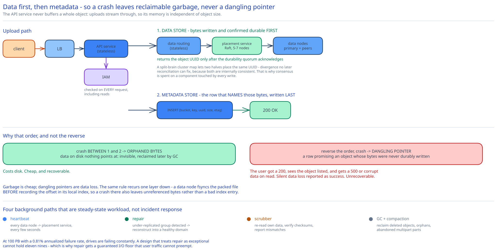

# Module 01 — Architecture & High-Level Design



## Monolith vs. microservices

This one genuinely is microservices, and unusually the seams are forced by physics rather than by team structure.

**The API service is stateless and separate** because it does orchestration only: authenticate, authorize, call metadata, call data, stream bytes. It holds nothing, so it scales purely on request rate and can be deployed anywhere.

**The metadata store and data store are separate services** for the reason [Module 00](./00-overview.md#approach-walkthrough) established: 0.7 TB of transactional, indexed, IOPS-bound data has nothing operationally in common with 100 PB of immutable, throughput-bound bytes. They need different hardware (SSD vs. dense HDD), different replication strategies (quorum replication vs. erasure coding), different backup regimes, and they scale on different signals (object count vs. byte count). Four independent reasons — that's a real boundary.

**IAM is separate** because it's shared with every other product in the cloud and its data changes on a completely different cadence.

**The placement service is separate from the data nodes**, and this is the subtle one. Data nodes are numerous (thousands), dumb, and disposable. The placement service is small (5–7 nodes), authoritative, and must never disagree with itself about where data lives. Those are opposite operational profiles: you want to be able to lose data nodes casually and never lose placement consensus. Merging them would mean the map lives on the same machines whose failure the map exists to survive.

What is deliberately **not** split: the API service does not become a separate "read service" and "write service". Both paths run the same authenticate-then-lookup-then-stream logic against the same two stores, so they share every reason to change.

## Per-path walkthrough

**Upload path (small object, single PUT)**

```
Client → LB → API service
   → IAM (does this principal have s3:PutObject on this bucket?)
   → Data store: routing service → placement service (which nodes hold this UUID's group?)
                → primary data node: append bytes to open file, fsync
                → primary replicates/erasure-codes to peers across failure domains
                → primary returns UUID only after the durability quorum acknowledges
   → Metadata store: INSERT (bucket_id, key, object_uuid, size, etag, version) — LAST
   → 200 { etag, version_id }
```

**The ordering is the whole correctness argument, and it must be data-then-metadata.** Bytes are written and confirmed durable *before* the metadata row that names them exists. A crash between the two leaves **orphaned bytes** — data on disk that nothing points at, invisible to users, reclaimed later by the garbage collector ([Module 03](./03-lld.md#garbage-collection)). That's wasted space, which is cheap.

Reverse the order and a crash leaves a **dangling pointer** — a metadata row promising an object whose bytes were never durably written. The user gets a `200`, sees the object listed, and receives a `500` or corrupt data when they read it. That is silent data loss presented as success, and it's unrecoverable. Given the durability-over-availability asymmetry from Module 00, trading reclaimable garbage for the elimination of dangling pointers isn't a close call. It's the same discipline the [transactional outbox](../../hld-building-blocks/transactional-outbox-cdc.md) applies to a different pair of writes: when two systems can't be updated atomically, order them so the survivable failure is the one that happens.

**Download path**

```
Client → LB → API service
   → IAM (s3:GetObject?)
   → Metadata store: SELECT object_uuid, size FROM objects WHERE bucket_id=? AND key=?   [404 here if absent]
   → Data store: routing service → placement service (locate group for UUID)
                → read from any replica / reconstruct from k of n erasure fragments
                → verify checksum before returning a single byte
   → stream bytes to client (chunked; Range honoured via the stored offset)
```

Note the checksum verification is **inside** the data store, before bytes leave it. Silent bit rot is a real failure mode at 100 PB ([Module 02](./02-durability.md#bit-rot-is-the-failure-you-cant-see)), and verifying at the edge of the storage layer means a corrupt read becomes a *reconstruct-and-repair*, not a corrupt response.

**Multipart upload path**

```
POST ?uploads  → metadata: INSERT into multipart_uploads (upload_id, bucket, key, initiated_at)
PUT  ?partNumber=N (× many, in parallel, independently retryable)
      → data store: each part stored as its own object with its own UUID
      → metadata: INSERT into multipart_parts (upload_id, part_number, uuid, etag, size)
POST ?uploadId  → verify every expected part is present and etags match the client's list
      → assemble: write ONE metadata row whose object points at the ordered part list
      → mark upload complete; the old part rows become GC candidates only after this commits
```

**Assembly is a metadata operation, not a data copy.** The completed object's metadata references the ordered sequence of part UUIDs; the bytes are never rewritten. Copying 5 TB to concatenate it would double the write cost and take hours. This is why an object's data can be non-contiguous, and why [Module 04](./04-db-design.md#from-entities-to-schema)'s schema needs a parts list rather than a single UUID.

**Background paths** (continuous, never user-triggered):

```
Heartbeat:   every data node → placement service, every few seconds
             (payload: drive count, per-drive used/free, health)
Repair:      placement service detects an under-replicated group
             → schedules reconstruction onto a node in a healthy failure domain
Scrubber:    every data node re-reads its own data and verifies checksums
             → reports mismatches; placement service triggers repair from good copies
GC:          reclaims delete-marked objects, orphaned bytes, abandoned multipart parts
Compaction:  rewrites packed files that are mostly dead bytes ([Module 03](./03-lld.md#garbage-collection))
```

These four are not optional extras. At 100 PB with a 0.81% AFR, drives are failing *constantly* — the repair pipeline is a steady-state workload, not an incident response. A design that treats repair as exceptional cannot hold 11 nines.

## Building blocks

**Load balancer + stateless API service** — cross-ref [Load Balancing](../../hld-building-blocks/load-balancing.md). Notable for what it does *not* do: it never buffers a whole object. Uploads stream through to the data store, so API service memory is independent of object size. A design that buffers a 5 TB upload has already failed.

**IAM service** — bucket policies and per-object ACLs, cross-ref [AuthN & AuthZ at the HLD Layer](../../hld-building-blocks/authn-authz-hld.md). Authorization is evaluated on **every** request, including reads, so it is aggressively cached with short TTLs.

**Metadata store** — sharded relational or wide-column, holding buckets, objects, versions, and multipart state. See [Module 04](./04-db-design.md).

**Data routing service** — stateless; the data store's front door. Caches the cluster map locally so the common path costs no network hop to the placement service.

**Placement service** — owns the **virtual cluster map**: the physical topology (which nodes are in which rack, in which datacenter) and which replication group each object UUID belongs to. Replicated across **5–7 nodes via Raft or Paxos** (cross-ref [Replication & Consensus](../../hld-building-blocks/replication-consensus.md)) because a split-brain cluster map is catastrophic in a way an unavailable one is not: two halves independently placing the same UUID produces divergent, undetectable data. A 7-node group tolerates 3 failures. Sizing note: this is where the durability-over-availability asymmetry shows up as an odd-looking choice — spending consensus on a component touched on every write.

**Data nodes** — the actual drives. Each runs a daemon that heartbeats to the placement service, serves reads/writes, and scrubs its own data. Deliberately dumb: a data node knows nothing about buckets, keys, or users, only UUIDs and byte ranges. That ignorance is what lets you replace one without coordination.

**Garbage collector & compactor** — reclaim space. Detailed in [Module 03](./03-lld.md#garbage-collection).

## Trade-offs to make explicit

| Decision | Chosen | Alternative | Why |
|---|---|---|---|
| Write ordering | **Data first, then metadata** | Metadata first (reserve the name, then fill it) | A crash must leave reclaimable garbage, never a metadata row pointing at bytes that were never durably written. Orphans cost disk; dangling pointers are silent data loss reported as success. |
| Object-to-file mapping | **Many objects packed into one large append-only file** | One filesystem file per object | 675M files exhausts inodes and wastes a 4 KB block per small object; more importantly it makes every read a random seek against a 100–150 IOPS drive. Derived in [Module 00](./00-overview.md#capacity-estimation). |
| Durability mechanism | **Erasure coding (8+4) for cold/large, 3× replication for hot/small** | One scheme everywhere | 50% vs. 200% storage overhead makes EC compelling at 100 PB, but EC read amplification punishes small objects. Full numbers in [Module 02](./02-durability.md). |
| Cluster map consistency | **Raft/Paxos across 5–7 nodes** | An eventually-consistent gossip map | A split-brain map lets two halves place the same UUID differently — divergence that no later reconciliation can safely resolve. Availability is the cheaper thing to lose. |
| Multipart assembly | **Metadata stitch of the part list** | Concatenate parts into contiguous bytes | Rewriting 5 TB to make it contiguous doubles write cost for a layout benefit that range reads don't need. |
| Object mutability | **Immutable; replace or version only** | Allow in-place byte updates | Immutability is what removes concurrent-writer conflicts, makes any replica safe to read, and lets a stored object never need re-replication for consistency. It's the cheapest guarantee in the design and it pays for everything. |
| Small-object handling | **Packed into shared files with an offset index** | A separate dedicated store for small objects | Two storage engines is a large operational cost; a per-node offset index gets most of the benefit for far less machinery. Revisited as a gap below. |

## Load Handling

- **Peak-vs-average.** Request rate is small (~400/sec peak); **bandwidth is the real load** — 23 GB/sec of egress at peak from [Module 00](./00-overview.md#capacity-estimation). This inverts normal capacity planning: you provision NICs and cross-rack fabric, not CPU. A design that reports QPS headroom while saturating its top-of-rack uplinks has measured the wrong thing.

- **Where backpressure kicks in first.** At the **data node's disk write queue**. Erasure-coded writes are the worst case: one 8+4 write becomes 12 concurrent writes to 12 different nodes across failure domains, and the write cannot acknowledge until the durability quorum returns — so the slowest of the twelve sets the latency. That fan-out is why a single slow drive degrades write latency cluster-wide and why per-node queue depth is the primary shedding signal.

- **What gets shed under overload**, in order:
  1. **Repair and scrub traffic is throttled** — but never to zero, and this is the most important throttle in the system. Repair competes with user traffic for the same disks, so it must be rate-limited under load. Suspend it entirely and the window of under-replication widens, which directly attacks durability. The rule: repair gets a guaranteed floor of I/O that user traffic cannot take, because durability outranks availability.
  2. **Large uploads throttled** before small ones — one 5 TB upload can starve thousands of small requests.
  3. **Writes shed before reads** (`503` with `Retry-After`) — reads are 95% of traffic and clients tolerate upload retries better than read failures.
  4. **Reads shed last.**

  Cross-ref [Backpressure & Load Shedding](../../scalability-resilience/backpressure-load-shedding.md).

- **Hot object problem.** A single viral object (a popular software release) can exceed one replication group's aggregate NIC bandwidth. Neither sharding nor erasure coding helps — the object lives in one group. The fix is a different axis entirely: **detect hotness and add read-only replicas beyond the durability requirement**, or front the data store with a CDN (cross-ref [CDN](../../hld-building-blocks/cdn.md)). This is the one case where you add copies for throughput rather than durability, and conflating those two reasons for replication is a common analysis error.

- **Autoscaling lag.** The API tier autoscales in minutes. The data tier **cannot** — adding capacity means racking drives, so it's a procurement cycle measured in weeks. Capacity planning here is a forecasting problem, and the operational signal is *time until full* (weeks of runway), not percent used.

- **Load-test target.** Sustain 400 object reads/sec at 59 MB average (23 GB/sec egress) with p99 < 100ms for small objects, **while** killing a random data node every 10 minutes and confirming (a) zero failed reads, (b) repair completes within its SLO, and (c) repair I/O never falls below its guaranteed floor.

## Concurrent-User Handling

| Race | Mechanism | What the "loser" sees |
|---|---|---|
| Two clients `PUT` the same key simultaneously | Both write bytes (two distinct UUIDs), then race on the metadata row. **Last writer wins** — the metadata store serializes it. On a versioned bucket both become versions and *neither* is lost. | The loser's object is either superseded (unversioned) or retained as a prior version. The loser's bytes are never corrupted by the winner, because they're separate UUIDs — immutability makes this race harmless. |
| Two clients create the same globally-unique bucket name | Unique constraint on `bucket_name` in a **single, unsharded** table. | `409 Conflict`. The global uniqueness requirement is precisely why this one table cannot be sharded — see [Module 04](./04-db-design.md#scaling-the-schema). |
| `GET` arrives while a `PUT` to the same key is mid-flight | The reader resolves the *old* metadata row; the new row isn't committed yet. Readers therefore never see a partial object. | The previous version, in full. The atomicity unit is the metadata commit, which is why data-then-metadata ordering also gives read atomicity for free. |
| `DELETE` while a long `GET` streams | The metadata row is marked deleted, but GC will not reclaim bytes while a read lease is open (and the grace period exceeds any read timeout). | The in-flight read completes normally. Later reads get `404`. |
| Two multipart clients upload part 3 of the same `upload_id` | `PRIMARY KEY (upload_id, part_number)`; the second `PUT` overwrites the part pointer. | The last part upload wins; the first part's bytes become orphans for GC. Because parts are independently addressed, a retried part upload is naturally idempotent. |
| Repair writes a reconstructed fragment while a client reads the same group | Reconstruction writes to a **new** node and only then updates the cluster map. Readers use the map they have. | Nothing — reads served from surviving fragments throughout. Immutability again: there is no version of the fragment to disagree about. |

## Scaling & Reliability

- **Horizontal scaling.** API tier on request rate. Metadata on object count (shard on `hash(bucket, key)`). Data on bytes (add data nodes; the placement service folds them into the cluster map and begins steering new writes at them). New nodes take **new writes** rather than triggering a rebalance of existing data — moving petabytes to even out utilization would cost more in bandwidth and durability risk than the imbalance costs in space.

- **Circuit breaker.** Around the IAM call. Fails **closed** — no authorization decision means no access. Cross-ref [Circuit Breakers & Retries](../../scalability-resilience/circuit-breakers-retries.md).

- **Retries.** Reads retry against a different replica or reconstruct from fragments. Writes are retried by the client against the same key; because each attempt writes fresh bytes under a fresh UUID, a retry is safe and the abandoned attempt becomes an orphan for GC — retry safety purchased with garbage.

- **Graceful degradation**, in order of severity:
  1. **A data node dies** → reads served from replicas/fragments; repair kicks in. Zero user impact. Routine, many times a day.
  2. **A whole rack dies** → because failure domains are spread deliberately ([Module 02](./02-durability.md#failure-domains-are-the-actual-mechanism)), no group loses more than one fragment. Reads unaffected; a large repair job begins.
  3. **The placement service loses quorum** → the cluster map freezes. Reads continue from cached maps; **writes stop**, because placing new data without an authoritative map risks divergence. Deliberately failing writes rather than guessing.
  4. **The metadata store loses a shard's primary** → reads from replicas; writes for that key range fail. Objects in other shards unaffected.
  5. **An entire datacenter dies** → depends on the EC layout. With 8+4 across 3 DCs (4 fragments each), losing one DC loses 4 fragments — exactly at the tolerance limit, so data survives but with **zero remaining margin**, and repair becomes the top priority in the system. Worth naming precisely: "survives one DC loss" and "survives one DC loss with headroom" are different promises.

- **Multi-region.** Cross-region replication is asynchronous and per-bucket, opt-in — cross-ref [DB Replication & Failover](../../database-design/db-replication-failover.md). Intentionally *not* synchronous: cross-region latency would dominate write time, and a region is already a failure domain the EC layout can be spread across if the requirement demands it.

## What you'd revisit as this grows

- **Small objects are still the weak spot.** Packing fixes the inode and block-waste problems, but a 4 KB object still costs a full metadata row (~1 KB) plus an index entry — a ~25% metadata overhead ratio, versus effectively zero for a 200 MB object. A billion tiny objects would make the metadata store, not the data store, the binding constraint. A dedicated small-object path (metadata-inline storage for objects under a few KB) is the known answer and isn't built here.

- **Listing remains the API's worst operation.** [Module 04](./04-db-design.md#the-listing-problem) explains why it fights the shard key, and the denormalized listing table only partially fixes it. Listing a bucket with a billion keys is slow by construction, and no amount of tuning changes that — it needs a different data structure.

- **Repair throughput sets the real durability ceiling**, and this design hasn't quantified it. Eleven nines assumes a repair window; if a 20 TB drive takes 3 days to reconstruct because the network can't go faster, the true durability is materially worse than the arithmetic in Module 02 implies. **Mean time to repair is a durability parameter, not an operational metric**, and it's the number most designs quietly omit.

- **No storage tiering.** Real object stores have hot/cold/archive classes with different cost and retrieval latency. Given that "storage efficiency" is a stated requirement, its absence is a real gap, and it interacts with the EC choice — archive tiers use wider stripes (e.g. 17+3) that are cheaper still but slower to reconstruct.

- **Metadata is sharded for blast radius, not capacity**, and 0.7 TB would fit on one node. That means the shard count was chosen by judgment rather than derived from a constraint — an honest weak point in the reasoning that deserves a load-test-driven answer.
