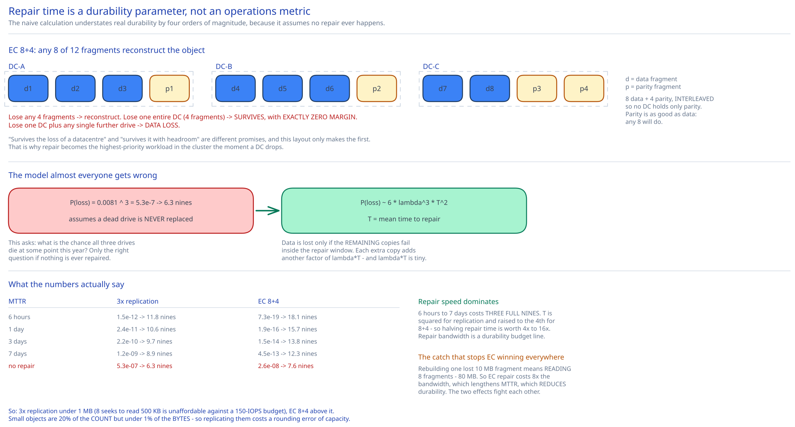

# Module 02 — Durability: Getting 11 Nines From Unreliable Drives



The requirement is 99.999999999% — **eleven nines** — annual durability. A commodity drive's annualized failure rate is **0.81%**, i.e. 99.19% durability. The gap is eight orders of magnitude, and closing it is the design problem this module exists for.

## The model almost everyone gets wrong

The natural first move is: with 3 copies, all three must fail, so multiply.

```
P(data loss) = 0.0081³ = 5.31 × 10⁻⁷  →  6.3 nines
```

You'll find that calculation in most write-ups. **It's wrong, and it's wrong in the direction that matters** — it *understates* real durability by four orders of magnitude, because it silently assumes **no repair ever happens.** It's computing "what's the chance all three drives die at some point during the year," which would only be the right question if a dead drive were never replaced.

Real systems detect a failure in seconds and rebuild the lost copy in hours. Data is lost only if the *remaining* copies fail **inside the repair window** — before redundancy is restored. That makes durability a race between failure and repair, and it means the governing parameter is one the naive model doesn't contain at all: **mean time to repair.**

For N copies with failure rate λ per drive-year and repair time T years, the annual data-loss probability is approximately:

```
P(loss) ≈ Nλ · (N−1)λT · (N−2)λT · …        # each subsequent failure must land inside T
        = 6 λ³ T²                            for N = 3
```

Each additional copy contributes another factor of λT, and λT is a tiny number — with λ = 0.0081/year and T = 1 day, λT ≈ 2.2 × 10⁻⁵. That's why redundancy is so effective, and why repair speed is squared into the answer.

## What the numbers actually say

| MTTR | 3× replication | EC 8+4 |
|---|---|---|
| 6 hours | 1.5 × 10⁻¹² → **11.8 nines** | 7.3 × 10⁻¹⁹ → **18.1 nines** |
| 1 day | 2.4 × 10⁻¹¹ → **10.6 nines** | 1.9 × 10⁻¹⁶ → **15.7 nines** |
| 3 days | 2.2 × 10⁻¹⁰ → **9.7 nines** | 1.5 × 10⁻¹⁴ → **13.8 nines** |
| 7 days | 1.2 × 10⁻⁹ → **8.9 nines** | 4.5 × 10⁻¹³ → **12.3 nines** |
| *(no repair — the naive model)* | *5.3 × 10⁻⁷ → 6.3 nines* | *2.6 × 10⁻⁸ → 7.6 nines* |

Three conclusions, and each one is a design directive:

**1. Repair speed dominates.** Under 3× replication, going from a 6-hour to a 7-day repair costs you **three full nines**. Because T is squared (and for EC, raised to the 4th power), halving repair time improves durability roughly 4× for replication and 16× for 8+4 coding. **MTTR is therefore a durability parameter, not an operations metric** — which means repair bandwidth is a *durability budget line*, and this is the single most under-appreciated fact in storage design. It's also why [Module 01](./01-architecture-hld.md#load-handling) gives repair traffic a guaranteed I/O floor that user traffic cannot preempt: throttling repair is directly spending durability.

**2. Plain 3× replication does not comfortably reach 11 nines.** It gets there only with sub-6-hour repair, which is optimistic when a 20 TB drive has to be rebuilt over a shared network. At a realistic 1–3 day MTTR it delivers 9.7–10.6 nines — close, but short, and with no margin.

**3. Erasure coding wins on both axes at once, which is unusual.** EC 8+4 is simultaneously **4× cheaper in storage** and **~5 orders of magnitude more durable** than 3× replication. Design choices this lopsided are rare enough to be worth interrogating — and the catch is real, it just isn't in these two columns. It's in read and repair amplification, below.

## Failure domains are the actual mechanism

All the arithmetic above assumes drive failures are **independent**. They are not, and correlated failure is what actually destroys data in practice.

A rack shares a top-of-rack switch, a power distribution unit, and a cooling zone. A datacenter shares utility power, network transit, and a physical building. If all 12 fragments of an 8+4 stripe sit in one rack, then a single PDU failure takes all 12 at once, and every probability in that table is meaningless — you've built a system whose durability is the durability of one PDU.

So the placement service ([Module 01](./01-architecture-hld.md#building-blocks)) doesn't just pick 12 nodes; it picks 12 nodes **subject to a failure-domain constraint**:

```
8+4 across 3 datacenters, 4 fragments each:
  DC-A: f1 f2 f3 f4      DC-B: f5 f6 f7 f8      DC-C: f9 f10 f11 f12
  and within each DC, no two fragments share a rack

  Lose any 4 fragments        → reconstruct. Fine.
  Lose one entire DC (4)      → survives, with EXACTLY ZERO margin.
  Lose one DC + any 1 drive   → DATA LOSS.
```

That last line is the honest reading of a common claim. "Survives the loss of a datacenter" is true, and it is *not* the same promise as "survives the loss of a datacenter with headroom" — after a DC failure the cluster is at its tolerance limit, and a single additional drive failure anywhere in the stripe is unrecoverable. This is exactly why repair becomes the highest-priority workload in the system the moment a DC drops, and why the layout is a genuine choice rather than a default:

| Layout | Survives 1 DC loss? | Margin after DC loss | Cross-DC write traffic |
|---|---|---|---|
| 8+4 across 3 DCs (4 each) | Yes | **Zero** | 2/3 of every write |
| 8+4 across 4 DCs (3 each) | Yes | 1 more failure | 3/4 of every write |
| 12+4 across 4 DCs (4 each) | Yes | Zero, but 33% overhead | 3/4 of every write |
| 8+4 in one DC, async-replicated to another | No (loses the whole stripe) | — | 1 full copy, async |

Spreading wider buys margin and pays for it in cross-DC bandwidth on **every single write** — which is the real cost, since inter-DC links are the most expensive network you own. Cross-ref [Data Partitioning & Sharding](../../hld-building-blocks/data-partitioning-sharding.md) for the general principle: the placement constraint, not the redundancy count, is what makes redundancy meaningful.

## How erasure coding actually works

Reed–Solomon coding over a finite field. For an `k + m` scheme (here 8 + 4):

- Split the object into **k = 8 data fragments** of equal size.
- Compute **m = 4 parity fragments** as independent linear combinations of the data fragments.
- Store all **n = 12** on 12 different nodes in different failure domains.
- **Any 8 of the 12** are sufficient to reconstruct the original object. It genuinely does not matter which 8 — parity fragments are as good as data fragments, which is the property that makes the scheme work.

The intuition without the algebra: 8 unknowns need 8 independent linear equations to solve. You've stored 12 equations. Lose any 4 and you still have 8, so the system is still solvable.

```
Object (80 MB)
  → d1..d8   (10 MB each)              ← the data itself, split
  → p1..p4   (10 MB each)              ← parity, computed
  → 120 MB stored for 80 MB of object  = 1.5× = 50% overhead
```

Compare 3× replication: 240 MB stored for 80 MB, = 3× = 200% overhead. From 100 PB of raw capacity you get **66.7 PB usable under 8+4** versus **33.3 PB under 3×** — double the usable capacity from the same hardware.

## The catch: amplification

Here's what the durability and cost columns don't show, and it's the reason this design does **not** use erasure coding for everything.

| | 3× replication | EC 8+4 |
|---|---|---|
| Normal read | 1 node, 1 seek | **8 nodes, 8 seeks** |
| Bytes read for a normal read | 1× object | 1× object (but split 8 ways) |
| Degraded read (fragment missing) | 1 node (another copy) | **8 nodes + reconstruction compute** |
| Repair one lost unit | read 1× the lost bytes | **read 8× the lost bytes** |
| Write fan-out | 3 nodes | **12 nodes** |
| CPU per write | ~0 (just copy) | Galois-field arithmetic over the whole object |

**Read amplification is fatal for small objects.** Reading a 4 KB object under 8+4 means fetching eight 512-byte fragments from eight different nodes — **8× the IOPS to move the same 4 KB.** Given [Module 00](./00-overview.md#capacity-estimation)'s finding that drives supply only 100–150 random IOPS, spending 8 of them on one small read is ruinous. Replication reads it with one seek.

**Repair amplification attacks durability itself**, and this is the subtle one worth spelling out. To rebuild a single lost 10 MB fragment you must read **8 fragments — 80 MB** — and compute over them. Replication rebuilds a lost 10 MB copy by reading 10 MB. So erasure coding's repair costs **8× the network and disk bandwidth** for the same amount of restored redundancy.

Now recall conclusion 1: repair speed determines durability. Erasure coding makes repair 8× more expensive, which makes MTTR longer, which *reduces* durability. The two effects fight each other. The table at the top of this module assumed the same MTTR for both schemes — a comparison that flatters EC, because in a bandwidth-constrained cluster EC's real MTTR is materially worse. **EC's durability advantage is real but smaller than the naive comparison suggests, and it shrinks as the cluster gets closer to its bandwidth limit.** Being able to say that is the difference between reciting the erasure-coding trade-off and understanding it.

## Chosen: a hybrid, split by object size

| Object class | Scheme | Why |
|---|---|---|
| **< 1 MB** (20% of objects, ~0.2% of bytes) | **3× replication** | 8 seeks to read 500 KB is unaffordable against a 150-IOPS budget, and these objects hold a negligible share of total bytes — so replication's 200% overhead costs almost nothing in absolute terms. |
| **1–64 MB** (60% of objects, ~32% of bytes) | **EC 8+4** | Fragments are 128 KB–8 MB: large enough that 8 parallel reads are bandwidth-bound rather than seek-bound, so amplification stops mattering. |
| **> 64 MB** (20% of objects, ~68% of bytes) | **EC 8+4**, wider stripes for archive tiers | Where the storage savings actually land. These objects dominate bytes, so halving their overhead is what pays for the whole scheme. |

The insight that makes the hybrid obviously right rather than a hedge: **object count and byte count have wildly different distributions.** Small objects are 20% of the *count* but a fraction of a percent of the *bytes*. So replicating all of them 3× costs a rounding error of capacity while buying a large IOPS win — and erasure-coding the large objects captures essentially all of the available savings. You get ~97% of EC's cost benefit and none of its small-object read penalty. The cost is running two durability schemes, and having to decide at write time which one applies (trivially, from the `Content-Length`).

## Bit rot is the failure you can't see

Everything above concerns drives that fail *detectably*. The harder problem is **silent data corruption**: a drive returns bytes without error, and the bytes are wrong. Causes include bit flips in the media, firmware bugs, controller faults, and cosmic-ray events in non-ECC paths. Published rates put undetectable-error events on the order of 10⁻¹⁵ per bit read — which sounds negligible until you multiply by 100 PB (8 × 10¹⁷ bits), at which point corruption is a **routine, expected event**, not an anomaly.

Redundancy alone does not help: if you don't know a copy is corrupt, you might hand it to the user, or worse, use it as the source for repairing the others and propagate the corruption into every replica.

Three layers, and all three are necessary:

1. **Checksum every object at write** (e.g. SHA-256 of the content), stored in metadata. Verified before any byte is returned to a client — [Module 01](./01-architecture-hld.md#per-path-walkthrough) puts this check *inside* the data store deliberately, so a corrupt read becomes a reconstruct-and-repair rather than a corrupt response.
2. **Checksum every packed file and every fragment separately.** Under EC you must verify each of the 8 fragments *before* reconstructing, because feeding one bad fragment into Reed–Solomon reconstruction yields plausible-looking garbage with no error raised. Verifying only the reassembled object would leave you unable to tell which fragment lied.
3. **Continuous background scrubbing.** Every data node re-reads its own data on a rolling schedule and re-verifies checksums, reporting mismatches to the placement service, which repairs from good copies. The scrub period is a real durability parameter: corruption discovered on a 30-day cycle has had up to 30 days to accumulate alongside other failures.

Note that scrubbing competes for exactly the disk I/O that user traffic and repair want — a three-way contention that [Module 01](./01-architecture-hld.md#load-handling)'s guaranteed-floor policy exists to arbitrate. The full cluster read bandwidth spent on a scrub cycle is unavoidable; the only question is how thinly you spread it.

## Practice: extend it yourself

1. **Derive the scrub interval from a durability target.** Given 100 PB, an undetectable-error rate of 10⁻¹⁵ per bit, and a requirement that no object goes more than *X* days with undetected corruption, compute the sustained read bandwidth a full scrub cycle demands. Then answer the design question: at what value of *X* does scrubbing exceed the cluster's spare I/O entirely, and what do you give up first?
2. **Price the 3-DC versus 4-DC layout.** For 8+4 across 3 DCs (zero margin after a DC loss) versus 4 DCs (one failure of margin), compute the difference in cross-DC write bandwidth for a 23 GB/sec ingest rate, and the difference in post-DC-failure durability during the repair window. Then state which you'd pick and what price per GB of inter-DC transit would flip your answer.
