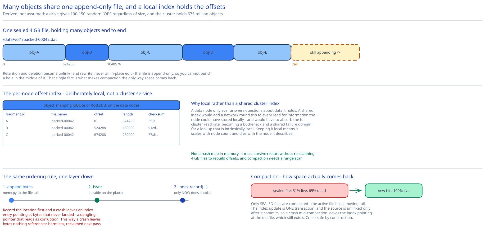

# Module 03 — Low-Level Design



## Interfaces vs. implementations

```
interface ObjectStore                          # what the API service sees
    put(bytes: Stream, size: long, class: SizeClass) -> ObjectId
    get(id: ObjectId, range: ByteRange?) -> Stream
    delete(id: ObjectId) -> void

interface PlacementService
    locate(id: ObjectId) -> PlacementGroup     # which nodes hold it; served from a cached map
    allocate(size: long, class: SizeClass) -> PlacementGroup
    reportUnhealthy(node: NodeId) -> void

interface DurabilityCodec                      # the Module 02 hybrid lives entirely here
    encode(bytes: Stream) -> List<Fragment>
    decode(fragments: List<Fragment>) -> Stream
    fragmentsNeeded() -> int
    totalFragments() -> int

interface DataNodeClient
    writeFragment(f: Fragment) -> Location      # (file_name, offset, length)
    readFragment(loc: Location, range: ByteRange?) -> bytes
    verify(loc: Location, expected: Checksum) -> bool

interface LocalObjectIndex                     # per-data-node; the packed-file offset map
    record(id: FragmentId, file: String, offset: long, len: long, ck: Checksum) -> void
    lookup(id: FragmentId) -> Location?
    delete(id: FragmentId) -> void
    scanFile(file: String) -> Iterator<Entry>   # for compaction
```

**Implementations:** `ReplicationCodec` (3×) and `ReedSolomonCodec(8,4)` — the Module 02 hybrid is a *codec selection* at write time based on `Content-Length`, and nothing above `DurabilityCodec` knows which one ran. `RaftPlacementService`. `SqliteLocalIndex` / `RocksDbLocalIndex`.

The interface worth defending is **`DurabilityCodec`**. Replication and erasure coding are wildly different mechanisms — one copies bytes, the other does Galois-field arithmetic and produces fragments that are individually meaningless. Putting them behind `encode`/`decode` with an explicit `fragmentsNeeded()` is what lets the [Module 02](./02-durability.md#chosen-a-hybrid-split-by-object-size) hybrid be a one-line policy decision instead of a fork in the write path:

```
codec = size < SMALL_OBJECT_THRESHOLD ? ReplicationCodec(3) : ReedSolomonCodec(8, 4)
```

`fragmentsNeeded()` is on the interface rather than assumed, because the read path needs it to know how many fragments to request in parallel — 1 for replication, 8 for 8+4. That single method is what keeps the read path from hard-coding either scheme.

## Why many objects share one file

[Module 00](./00-overview.md#capacity-estimation) derived the constraint: a drive supplies **100–150 random IOPS** regardless of capacity, and the cluster holds **675 million objects.** The naive layout — one filesystem file per object — spends far too many of those IOPS on the filesystem rather than on data.

Four separate costs, and it's worth separating them because they apply to different object sizes:

1. **Directory traversal on every read.** `open("/data/ab/cd/ef/<uuid>")` walks the directory tree; with 675M entries spread across a nested hierarchy, entries fall out of the dentry cache and each level can cost a seek. So a single object read becomes *several* seeks before any data moves. Packing replaces this with one lookup in a local embedded index (resident in page cache or on SSD) plus **exactly one** data seek.
2. **File creation is a journal write.** Creating a file is a filesystem metadata transaction — allocate an inode, write a directory entry, journal both, `fsync`. Appending to an already-open file is dramatically cheaper. At sustained write rates the *file creation rate* becomes the write bottleneck, not the byte rate.
3. **Inode pressure.** 675M objects means 675M inodes. `ext4` provisions inodes at format time (roughly one per 16 KB), so the count is a hard ceiling you can hit while the drive still has free bytes — and `fsck` time scales with inode count, turning a routine reboot into hours of downtime.
4. **Block rounding.** Every file occupies a whole number of 4 KB blocks. This one is frequently overstated: a 500 KB object wastes under 1%. It only bites for *genuinely tiny* objects, where a 2 KB object costs a 4 KB block plus a ~256 B inode plus a directory entry — over 100% overhead.

So the honest scope of the technique: **pack small and medium objects; give large objects their own files.** A 200 MB object amortizes all four costs to nothing, and giving it a dedicated file makes range reads, deletion and compaction simpler. Packing is a small-object optimization, and presenting it as a universal rule is a mistake.

```
/data/vol1/packed-00042.dat        ← 4 GB, append-only, sealed when full
  [obj-A: 0 … 524287][obj-B: 524288 … 1048575][obj-C: 1048576 … …]  ← still appending

/data/vol1/large/<uuid>.dat        ← objects > 64 MB get their own file
```

### The local object index

Each data node keeps its own embedded index mapping fragment to location:

```sql
CREATE TABLE object_mapping (
    fragment_id  BLOB PRIMARY KEY,   -- UUID + fragment number
    file_name    TEXT NOT NULL,
    offset       BIGINT NOT NULL,
    length       BIGINT NOT NULL,
    checksum     BLOB NOT NULL,      -- of THIS fragment (Module 02, layer 2)
    deleted_at   TIMESTAMP NULL      -- lazy delete; the compactor reclaims
);
```

**Why this lives on the data node rather than in a central cluster service.** A data node only ever needs to answer questions about data it holds, so a shared index would add a network round trip to every read to fetch information the node could have stored locally. It would also need to scale to 675M rows × fragment count and absorb the full cluster read rate — becoming a bottleneck and a shared failure domain for a lookup that is intrinsically local. Keeping it local means the index scales automatically with the node count and dies with the node it describes, which is exactly the right blast radius.

**Why an embedded relational store (SQLite) or an LSM store (RocksDB), not a hash map in memory.** It must survive process restart without a full scan of 4 GB files to rebuild offsets, and it must support the range scan that compaction needs (`scanFile`). SQLite suits the workload — write-once, read-many, low write rate per node. RocksDB suits nodes with higher small-object churn, since its LSM structure (cross-ref [Search & Inverted Indexes](../../scalability-resilience/search-inverted-indexes.md) for the LSM pattern) absorbs writes sequentially at the cost of read amplification.

## Pseudocode: write path

```
DataNode.writeFragment(fragment) -> Location:
    with fileLock(currentFile):                      # see the contention note below
        if currentFile.size + fragment.length > MAX_FILE_SIZE:   # 4 GB
            seal(currentFile)                        # never written again; now compaction-eligible
            currentFile = openNew()

        offset = currentFile.size
        currentFile.append(fragment.bytes)           # sequential write — the whole point
        currentFile.fsync()                          # durable BEFORE the index says it exists

    index.record(fragment.id, currentFile.name, offset, fragment.length, fragment.checksum)
    return Location(currentFile.name, offset, fragment.length)
```

**`fsync` before `index.record`, deliberately, and it's the same ordering argument as [Module 01](./01-architecture-hld.md#per-path-walkthrough) one level down.** If the index recorded the location first and the node crashed before the data hit the platter, the index would point at bytes that don't exist — a dangling pointer that reads as corruption. Doing it in this order means a crash leaves bytes in the file that no index entry references: unreachable, harmless, and reclaimed by the next compaction. The pattern recurs at every layer of this system because the asymmetry is always the same — **garbage is cheap, dangling pointers are data loss.**

**Write serialization is the real cost of packing**, and it's the honest downside. One append-only file has one tail, so concurrent writes to the same file must serialize. On a 64-core node with one open file, 63 cores wait. Two standard mitigations:

- **Multiple open files, one per core** (`packed-00042-core07.dat`), so each core appends to its own tail with no shared lock. This trades a modest increase in file count for eliminating contention entirely, and is the approach real implementations take.
- **Batch the appends**: accumulate fragments in a small buffer and write them in one `fsync`, amortizing the sync cost across many objects. This is the same throughput-versus-latency trade as batching in a distributed log (cross-ref [Kafka & the Distributed Log](../../hld-building-blocks/kafka-distributed-log.md)) — larger batches raise throughput and raise tail latency.

## Pseudocode: read path with ranges

```
DataNode.readFragment(fragmentId, range) -> bytes:
    loc = index.lookup(fragmentId)
    if loc is null: throw FragmentNotFound          # triggers reconstruction upstream
    if loc.deleted_at is not null: throw FragmentDeleted

    if range is null:
        start, length = loc.offset, loc.length
    else:
        if range.end >= loc.length: throw InvalidRange
        start  = loc.offset + range.start           # ← range translated into the packed file
        length = range.length

    bytes = pread(loc.file_name, start, length)     # ONE positioned read, no seek+read race

    if range is null:
        if sha256(bytes) != loc.checksum:
            metrics.increment("corruption.detected")
            throw ChecksumMismatch                   # caller reconstructs from other fragments
    return bytes
```

Two details. **`pread` rather than `seek` + `read`** because the file is shared by many concurrent readers — a separate seek would race with another thread's seek on the same descriptor. And **checksums can only be verified on a full-fragment read**: a range read has no checksum covering just that slice. That's a genuine hole in the corruption defence for range-heavy workloads (video streaming, which is most of them), and the real fix is per-block checksums at a fixed granularity — say every 64 KB — rather than one per fragment. Worth naming as a limitation rather than pretending fragment checksums cover the range case.

**Range reads under erasure coding are worse than they look.** A range that spans fragment boundaries requires fetching every fragment it touches, and if any is missing you must fetch 8 fragments and reconstruct the *whole* object to serve a 1 KB slice. This is a second, independent reason [Module 02](./02-durability.md#the-catch-amplification) keeps small objects on replication — and it also argues for EC striping that aligns fragment boundaries to a granularity range requests respect.

## Garbage collection

Deletion never removes bytes immediately, because a packed file is append-only — you cannot punch a hole in the middle of it. Deletes mark, and space is reclaimed by rewriting.

**What becomes garbage, and where each kind comes from:**

| Source | Cause |
|---|---|
| Lazily deleted objects | `DELETE` marks `deleted_at`; the bytes remain in the packed file |
| Orphaned bytes | A crash after `fsync` but before the metadata row committed ([Module 01](./01-architecture-hld.md#per-path-walkthrough)) — the deliberate cost of safe write ordering |
| Abandoned multipart parts | An upload that uploaded 40 of 50 parts and never completed |
| Superseded versions | A versioned bucket whose retention policy expired old generations |
| Failed-checksum fragments | Corrupt data replaced by reconstruction; the bad copy still occupies space |
| Compaction leftovers | The source file after its live objects were copied out |

**Compaction**, which is how reclamation actually happens:

```
Compactor.run():
    for file in index.sealedFiles():                 # never the file currently being appended to
        live, total = index.liveBytes(file), file.size
        if live / total > COMPACTION_THRESHOLD:      # e.g. 0.7
            continue                                 # not worth the rewrite

        dest = openNew()
        for entry in index.scanFile(file):           # sequential scan, sequential write
            if entry.deleted_at is null:
                newOffset = dest.append(read(file, entry.offset, entry.length))
                stagedUpdates.add(entry.id, dest.name, newOffset)
        dest.fsync()

        index.applyAtomically(stagedUpdates)         # ONE transaction: repoint every entry
        unlink(file)                                 # only now is the source removed
```

Three things make this correct:

- **Only sealed files are compacted.** The file being appended to has a moving tail; compacting it would race with writers. Sealing at 4 GB gives a stable, immutable input.
- **The index update is one atomic transaction, and the source file is unlinked only after it commits.** If the process dies mid-compaction, the index still points at the *old* file, which still exists — the partially-written destination is itself orphaned garbage that the next pass reclaims. Crash-safe by construction, and again the failure mode is garbage rather than a dangling pointer.
- **The threshold exists because compaction is expensive.** Rewriting a 4 GB file that is 69% live moves 2.8 GB of live data to reclaim 1.2 GB — read and write amplification competing with user traffic and repair for the same disks. This is the classic LSM-style space-versus-write-amplification trade: a lower threshold reclaims more space and spends more I/O. It also has to be scheduled against the repair floor from [Module 01](./01-architecture-hld.md#load-handling), and repair wins, because repair protects durability and compaction only protects cost.

**The grace period matters.** Bytes are not reclaimed for some window (hours) after deletion, for two reasons: an in-flight `GET` that already resolved metadata must be able to finish streaming, and accidental deletion is recoverable within the window. The window must exceed the longest possible read timeout, or a slow client streaming a large object can have the ground removed from under it.

## Concurrency at the code level

**What needs no application-level lock:**

- **Reads of a packed file.** Any number of concurrent `pread` calls at different offsets, no coordination. Sealed files are immutable, and the region of an unsealed file below the current tail is immutable too — **immutability is what makes lock-free concurrent reads correct**, and it's the same property that lets any replica serve any read in [Module 01](./01-architecture-hld.md#concurrent-user-handling).
- **Two clients `PUT`-ing the same key.** They write different UUIDs to possibly different nodes; the race resolves at the metadata store's single-row commit. No data-layer coordination at all, because neither write can affect the other's bytes.
- **Fragment reconstruction during reads.** Reconstruction writes to a *new* location and only then updates the cluster map. Readers using the old map read surviving fragments; readers using the new one read the rebuilt fragment. Both are correct, so no lock is needed — a property that holds only because fragments are immutable.

**What does need a lock, and it's a short list:**

- **The append tail** (`fileLock(currentFile)` above) — the one genuine intra-process race, since two threads must not receive the same offset. Mitigated by per-core files rather than by making the lock cleverer.
- **The index's compaction transaction** — `applyAtomically` must not interleave with concurrent `record`/`delete` calls for the same fragments. The embedded store's own transaction provides this; it's a database concern, not an application one.
- **File sealing** — the size check and the switch to a new file must be atomic with respect to appends, which is why it's inside the same lock rather than checked before acquiring it.

The pattern is the same one that recurs throughout this guide: **cross-process races belong to a database or a consensus service; intra-process races belong to a mutex.** Here the cross-process races are handled by the metadata store's row commit and the placement service's Raft group, and the only mutex guards a file offset.

## Design patterns you just used, named

- **Strategy** — `DurabilityCodec`. Replication and Reed–Solomon behind one interface is what makes the size-based hybrid a policy line rather than a branching write path.
- **Repository** — `LocalObjectIndex` hides whether the offset map is SQLite or RocksDB.
- **Log-structured storage** — append-only files plus an offset index plus background compaction is the LSM pattern applied to blobs instead of key-value pairs. Naming it that way is what makes the compaction threshold's space-versus-write-amplification trade recognisable rather than novel.
- **Tombstone** — `deleted_at` marks rather than removes, because append-only storage cannot delete in place.
- **Leader–follower** — the primary data node in a replication group coordinates writes to its peers.

## Practice: extend it yourself

1. **Add per-block checksums** so range reads can be verified, which fragment-level checksums cannot do. Pick a block granularity and justify it against two competing costs: index size (one checksum per block per fragment across 675M objects) and the read amplification of verifying a block to serve a smaller range. Then state what changes in `readFragment` and in `object_mapping`.
2. **Design compaction scheduling under the repair floor.** Compaction and repair want the same disks, and [Module 01](./01-architecture-hld.md#load-handling) gives repair priority. Write the admission rule: what signal tells the compactor to yield, how does it avoid starving forever (a node whose files are 90% dead but which is always repairing), and what metric would tell you the policy is wrong?
