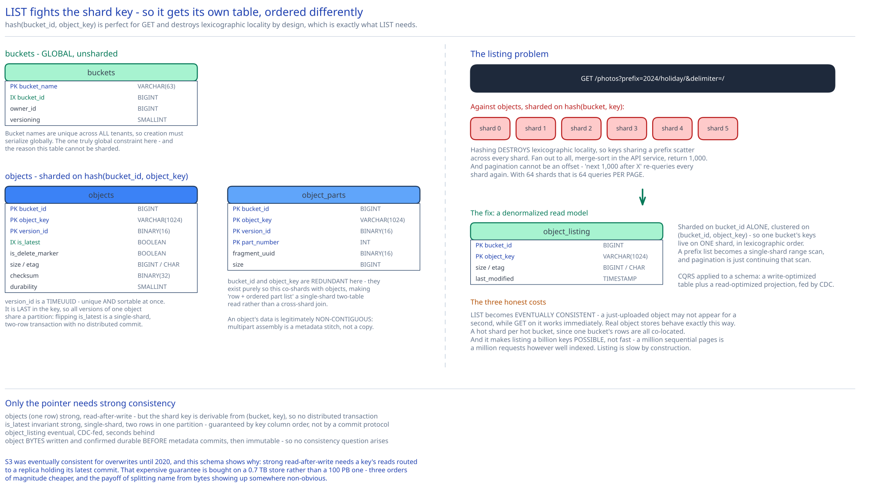

# Module 04 — Database Design (Metadata Store)



This module covers the **metadata store** — the 0.7 TB of names, versions and pointers. The 100 PB of bytes has no schema; its on-disk layout is [Module 03](./03-lld.md).

## From entities to schema

```sql
-- GLOBAL and deliberately UNSHARDED. Bucket names must be unique across all tenants.
CREATE TABLE buckets (
    bucket_name     VARCHAR(63)  NOT NULL,       -- DNS-compatible, globally unique
    bucket_id       BIGINT       NOT NULL,       -- internal surrogate; what everything else joins on
    owner_id        BIGINT       NOT NULL,
    region          VARCHAR(20)  NOT NULL,
    versioning      SMALLINT     NOT NULL,       -- disabled | enabled | suspended
    created_at      TIMESTAMP    NOT NULL,
    PRIMARY KEY (bucket_name),
    UNIQUE  (bucket_id)
);

-- The big one. Sharded on hash(bucket_id, object_key).
CREATE TABLE objects (
    bucket_id       BIGINT       NOT NULL,
    object_key      VARCHAR(1024) NOT NULL,
    version_id      BINARY(16)   NOT NULL,       -- TIMEUUID: unique AND sortable by creation time
    is_latest       BOOLEAN      NOT NULL,
    is_delete_marker BOOLEAN     NOT NULL DEFAULT FALSE,
    size            BIGINT       NOT NULL,
    etag            CHAR(34)     NOT NULL,
    content_type    VARCHAR(128) NULL,
    checksum        BINARY(32)   NOT NULL,       -- SHA-256 of the whole object (Module 02, layer 1)
    durability      SMALLINT     NOT NULL,       -- which codec: 3x-replication | ec-8-4
    storage_class   SMALLINT     NOT NULL,
    created_at      TIMESTAMP    NOT NULL,
    PRIMARY KEY (bucket_id, object_key, version_id)
);

-- An object's bytes may be many fragments/parts, in order. Co-sharded with `objects`.
CREATE TABLE object_parts (
    bucket_id       BIGINT       NOT NULL,       -- carried purely so this co-shards with `objects`
    object_key      VARCHAR(1024) NOT NULL,
    version_id      BINARY(16)   NOT NULL,
    part_number     INT          NOT NULL,       -- 1 for a simple PUT
    fragment_uuid   BINARY(16)   NOT NULL,       -- what the data store knows it by
    size            BIGINT       NOT NULL,
    PRIMARY KEY (bucket_id, object_key, version_id, part_number)
);

-- DENORMALIZED read model for LIST. Sharded on bucket_id alone. See "The listing problem".
CREATE TABLE object_listing (
    bucket_id       BIGINT       NOT NULL,
    object_key      VARCHAR(1024) NOT NULL,
    size            BIGINT       NOT NULL,
    etag            CHAR(34)     NOT NULL,
    last_modified   TIMESTAMP    NOT NULL,
    PRIMARY KEY (bucket_id, object_key)          -- clustered: keys stored in lexicographic order
);

-- In-flight multipart uploads. Sharded on upload_id.
CREATE TABLE multipart_uploads (
    upload_id       BINARY(16)   NOT NULL,
    bucket_id       BIGINT       NOT NULL,
    object_key      VARCHAR(1024) NOT NULL,
    initiated_at    TIMESTAMP    NOT NULL,
    PRIMARY KEY (upload_id)
);

CREATE TABLE multipart_parts (
    upload_id       BINARY(16)   NOT NULL,
    part_number     INT          NOT NULL,
    fragment_uuid   BINARY(16)   NOT NULL,
    etag            CHAR(34)     NOT NULL,
    size            BIGINT       NOT NULL,
    uploaded_at     TIMESTAMP    NOT NULL,
    PRIMARY KEY (upload_id, part_number)         -- makes a retried part upload idempotent
);
```

### Why `version_id` is a TIMEUUID and part of the primary key

A TIMEUUID embeds a timestamp in its high bits, so it is simultaneously **globally unique** and **lexicographically sortable by creation time**. That single property does three jobs at once:

- **Versions sort naturally.** `ORDER BY version_id DESC` gives newest-first with no separate sequence number and no clock coordination between API servers.
- **No coordination is needed to mint one.** Any API server generates a version ID locally with no counter, no allocator, no round trip. Contrast the [URL shortener](../url-shortener/02-short-code-generation.md#b1-dont-use-snowflake-ids-directly), which explicitly *rejects* time-based IDs because it needs short codes — here there's no length constraint, so the trade flips completely. Same technique, opposite verdict, purely because of one differing requirement.
- **It makes the primary key naturally append-mostly** within a key, so version inserts land at the end of the index rather than in the middle.

Putting it in the primary key rather than in a secondary index means "give me every version of this object, newest first" is a single clustered range scan — one B-tree descent, then sequential reads. Cross-ref [Database Indexing](../../database-design/database-indexing.md).

### Why `is_latest` is a denormalized boolean

The overwhelmingly common query is `GET /{bucket}/{key}` with no version — "give me the current one". Without `is_latest` that requires finding the max `version_id` among all versions of the key: a range scan plus a sort, on the hottest query in the system.

`is_latest` makes it a point lookup. The cost is a **write-time invariant**: creating a new version must, in one transaction, set `is_latest = FALSE` on the previous latest and `TRUE` on the new one. Two rows, same partition (same `bucket_id, object_key`), so it's a single-shard transaction with no distributed commit — which is only true because `version_id` is *last* in the primary key. Had the key been `(bucket_id, version_id, object_key)`, versions of one object would scatter across shards and this would need a cross-shard transaction on every write. Key column order is doing real work here.

This is a deliberate normalization violation of the kind [Normalization & Schema Design](../../database-design/normalization-schema-design.md) describes: derived data stored to serve a read pattern, paid for with a write-time consistency obligation.

### Why a delete marker instead of deleting the row

On a versioned bucket, `DELETE` inserts a **new version** with `is_delete_marker = TRUE` rather than removing anything. So:

- `GET` finds the latest version, sees it's a delete marker, returns `404`.
- `GET ?versionId=<older>` still works — deletion is undoable, which is the entire point of versioning.
- The delete is itself an auditable event with a timestamp and an actor.

Removing the row instead would make deletion silently destroy history on a bucket whose owner explicitly asked for history to be kept.

### Why `object_parts` carries a redundant `bucket_id`

`fragment_uuid` alone would identify a part, and `(version_id, part_number)` would be a perfectly good key. The redundant `bucket_id` and `object_key` exist purely so **`object_parts` shards on the same key as `objects`** — meaning "fetch the object row and its ordered part list" is a single-shard, two-table read rather than a cross-shard join. Denormalizing a column to force co-location is a standard sharded-schema move, and the cost (a few hundred bytes per part row) is trivially worth eliminating a cross-shard read from the hot download path.

## Indexes

| Index | Serves |
|---|---|
| `PRIMARY KEY (bucket_name)` on `buckets` | Bucket resolution on every request; enforces global uniqueness. |
| `UNIQUE (bucket_id)` on `buckets` | The surrogate everything else joins on. |
| `PRIMARY KEY (bucket_id, object_key, version_id)` on `objects` — clustered | `GET`/`HEAD` by key, and version listing as a range scan. Column order is load-bearing (above). |
| `INDEX (bucket_id, object_key) WHERE is_latest` on `objects` | The unversioned `GET` — a point lookup. Partial, so buckets with deep version history don't bloat it. |
| `PRIMARY KEY (bucket_id, object_key)` on `object_listing` — clustered | Prefix `LIST` as a single ordered range scan. The reason this table exists. |
| `PRIMARY KEY (upload_id, part_number)` on `multipart_parts` | Part registration, and the idempotency of a retried part upload. |
| `INDEX (initiated_at)` on `multipart_uploads` | The sweeper that aborts uploads abandoned for > 7 days. |
| `INDEX (created_at) WHERE is_delete_marker OR NOT is_latest` on `objects` | The GC's scan for reclaimable versions. Partial — live latest versions are never GC candidates, so indexing them would be pure write cost. |

**Deliberately absent:** nothing on `size`, `content_type` or `etag`. They're returned with the row, never searched by. Nothing on `owner_id` in `objects` — ownership is a bucket-level property, and duplicating it per object would cost 675M index entries to answer a question the `buckets` table already answers.

## The listing problem

This is the hardest query in object storage, and the reason it's hard is worth stating precisely: **`LIST` fights the shard key.**

```
GET /photos?prefix=2024/holiday/&delimiter=/
→ SELECT object_key, size, etag, last_modified
  FROM objects
  WHERE bucket_id = 42 AND object_key LIKE '2024/holiday/%'
  ORDER BY object_key LIMIT 1000
```

`objects` is sharded on `hash(bucket_id, object_key)`, which is exactly right for `GET` (single-shard point lookup, derivable from the request) and exactly wrong for `LIST`. Hashing the key **destroys lexicographic locality by design** — keys sharing a prefix land on entirely different shards. So the query becomes:

1. Fan out to **every** shard.
2. Each returns its matching keys, locally sorted.
3. Merge-sort the results in the API service.
4. Return the first 1,000.

And pagination is worse than the fan-out. A continuation token can't be a simple offset, because "the next 1,000 after key X" requires re-querying every shard with `object_key > X` and re-merging — each page costs another full fan-out. With 64 shards, listing a bucket in 1,000-key pages costs 64 queries **per page**.

**The fix: a denormalized listing table sharded on `bucket_id` alone.**

`object_listing` is clustered on `(bucket_id, object_key)`, so all keys for one bucket live on **one shard, stored in lexicographic order.** A prefix list becomes a single-shard range scan — one B-tree descent to `2024/holiday/`, then sequential reads. Pagination is a natural continuation of the scan from the last key returned. This is CQRS applied to a schema: a write-optimized model (`objects`, sharded for point lookups) plus a read-optimized projection (`object_listing`, sharded for ordered scans).

What it costs, stated honestly:

- **A second write per object mutation**, updated asynchronously from `objects` via CDC (cross-ref [The Transactional Outbox & CDC](../../hld-building-blocks/transactional-outbox-cdc.md)). So listings are **eventually consistent** — a just-uploaded object may not appear in a `LIST` for a second or two, while `GET` on it succeeds immediately. Real object stores have exactly this behaviour, and it's the right trade: `GET` correctness is non-negotiable, `LIST` freshness is not.
- **A hot shard for a hot bucket.** All of one bucket's listing rows are on one shard, so a bucket with a billion keys concentrates there. Partly mitigated by splitting very large buckets by key-range sub-partition — which reintroduces a bounded fan-out, but over 4 sub-ranges rather than 64 shards.
- **It doesn't make listing a billion keys fast**, only *possible*. Enumerating a billion keys at 1,000 per page is a million sequential requests no matter how well it's indexed. Listing is slow by construction; the schema only decides whether it's slow-and-linear or slow-and-quadratic.

The `delimiter=/` parameter (which synthesizes folder-like `CommonPrefixes` from a flat namespace) also becomes tractable only on ordered storage: with keys in lexicographic order you can *skip* an entire subtree once you've emitted its prefix, rather than reading and discarding every key inside it.

## Consistency

| Data | Model | Why |
|---|---|---|
| `buckets` | **Strong, globally linearizable** | Bucket names are globally unique, so creation must serialize across the whole system. This is the one truly global constraint in the design, and the reason this table cannot be sharded. |
| `objects` (a single object's row) | **Strong within its shard; read-after-write** | A `PUT` that returns `200` must be immediately readable by `GET`. Achieved trivially because the row lives on one shard — the shard key is derivable from `(bucket, key)`, so no distributed transaction and no quorum read across shards is needed. |
| `objects` (`is_latest` invariant) | **Strong, single-shard transaction** | Two rows in the same partition flipped atomically. Guaranteed by the key column order, not by a distributed commit. |
| `object_parts` | **Strong, co-sharded with `objects`** | Committed in the same transaction as the object row, so an object never exists with a partial part list. |
| `object_listing` | **Eventual**, seconds behind | Deliberate. CDC-fed projection; `LIST` may lag a `PUT`. The alternative — writing both synchronously — would mean a cross-shard transaction on every upload to make `LIST` fresher, which nothing requires. |
| `multipart_parts` | **Strong** | Completing an upload verifies every expected part is present and its etag matches; a stale read here would assemble an incomplete object. |
| Object bytes (data store) | **Strong on write, then immutable** | Written and confirmed durable before metadata commits ([Module 01](./01-architecture-hld.md#per-path-walkthrough)). After that, immutable — so any replica or fragment set is equally valid, and no read consistency question arises. |

**The one nuance worth pre-empting.** S3 was famously eventually consistent for overwrite `PUT`s and `DELETE`s until 2020, then became strongly read-after-write. The reason the older behaviour existed is visible in this schema: if metadata were itself replicated eventually across regions or availability zones, a `GET` routed to a lagging replica would return the previous version. Strong consistency requires routing reads for a key to a replica guaranteed to have that key's latest commit — a quorum read, or a single-primary-per-shard. This design chooses **single primary per metadata shard, reads served from the primary for `GET`**, accepting the availability cost. Because object data is immutable and only the *pointer* needs strong consistency, that cost is paid on a 0.7 TB store rather than a 100 PB one — which is what makes it affordable.

## Scaling the schema

**`objects` and `object_parts` — shard on `hash(bucket_id, object_key)`.**

Every `GET`, `PUT`, `HEAD` and `DELETE` names a bucket and a key, so the shard is computable from the request with no lookup: **single-shard hot path, always.** Alternatives all fail on a specific query:

- **Shard on `bucket_id` alone** → a single large bucket concentrates on one shard. Real workloads are extremely skewed (one customer's data lake versus millions of tiny buckets), so this creates unfixable hotspots.
- **Range-shard on `object_key`** → would make `LIST` single-shard, but keys are user-chosen and pathologically skewed. Everyone's keys start with `20`, `img`, or `data/`, so range shards would be wildly unbalanced, and a customer could hotspot a shard by choosing a prefix.
- **Shard on `created_at`** → the classic mistake: all writes land on the newest shard while historical shards idle.

**`buckets` — not sharded.** Global name uniqueness demands a single authority. It's small (a bucket count in the millions, not billions), so it fits comfortably on one replicated node; it scales for **read** throughput via replicas and aggressive caching (bucket metadata changes almost never, so a cache with a long TTL absorbs essentially all reads). The write rate — bucket creation — is a few per second at most.

**`object_listing` — shard on `bucket_id`.** Deliberately a *different* shard key from `objects`, which is the entire point: the two tables exist to serve two query shapes that want incompatible physical orderings. Accepting a hot shard per large bucket is the price of ordered scans.

**`multipart_uploads` / `multipart_parts` — shard on `upload_id`.** Every operation carries the `upload_id`, so it's single-shard, and random UUIDs distribute perfectly. These tables are also small and self-cleaning: rows are deleted on completion or swept after 7 days.

**Read replicas versus sharding, again separated:** `objects` is sharded for **write throughput and blast radius**, not capacity — 0.7 TB would fit on one node, but that node would absorb every write and every failure. Replicas serve `GET` throughput. Two different problems, two different mechanisms; cross-ref [DB Replication & Failover](../../database-design/db-replication-failover.md).

## Connecting it back

**"11 nines of durability"** (Module 00) → erasure coding across failure domains, with a hybrid split by object size (Module 02) → which requires the write path to select a codec and place fragments across domains, and repair to be a continuously-funded workload (Module 01) → surfacing here as the `durability` column on `objects` (so a read knows how to reconstruct what it's fetching) and the per-fragment `checksum` that makes corrupt fragments detectable before they poison a reconstruction.

**"675 million objects against 100–150 IOPS drives"** (Module 00) → many objects packed into large append-only files with a local offset index (Module 03) → so the metadata store holds only a `fragment_uuid`, and translating that to a byte offset is the data node's private business → which is why `object_parts` stores a UUID and *not* a file name or offset. The cluster metadata deliberately knows nothing about physical layout, so compaction can move bytes freely without a single metadata write.

**"List objects by prefix"** (Module 00's API) → fights the `hash(bucket, key)` shard key that everything else needs → resolved with a CDC-fed `object_listing` projection sharded on `bucket_id`, bought with eventual consistency for `LIST` while `GET` stays strongly read-after-write.

**"Multipart upload for large objects"** (Module 00) → assembly is a metadata stitch, never a byte copy (Module 01) → which is exactly why `object_parts` is an ordered list rather than a single pointer, and why `PRIMARY KEY (upload_id, part_number)` makes a retried part upload idempotent for free.

## What you'd revisit as this grows

- **`object_listing` has no answer for a billion-key bucket.** Key-range sub-partitioning is named above but not designed, and it reintroduces a fan-out. A bucket that large arguably needs a different interface (an inventory manifest generated nightly, which is what real object stores actually offer) rather than a live `LIST`.
- **No lifecycle policy tables.** "Transition to archive after 90 days, expire after 7 years" is a standard feature and a stated requirement adjacent to storage efficiency. It needs a policy table plus a scanner, and the scanner's query (`created_at` across all objects in a bucket) fights the shard key in the same way `LIST` does.
- **Per-object ACLs aren't modelled.** [Module 01](./01-architecture-hld.md#building-blocks) mentions them; the schema only supports bucket-level ownership. Adding a per-object ACL is a row-size and IOPS problem at 675M objects, and the usual answer (bucket policies plus rare per-object exceptions) needs the exception table designed.
- **`buckets` is a global singleton with no partition story.** It's small enough today. The uncomfortable question is what happens in a multi-region deployment where bucket creation must serialize globally — every region's bucket creation takes a cross-region round trip, and a network partition blocks it entirely. That's the same conclusion the [URL shortener](../url-shortener/05-interviewer-qna.md) reaches about custom aliases, and it's unsolved here too.
- **The `is_latest` invariant is a write-time obligation with no verifier.** A bug that leaves two rows with `is_latest = TRUE` would make `GET` non-deterministic. A background consistency checker asserting exactly one latest per key belongs in the design and isn't there.
