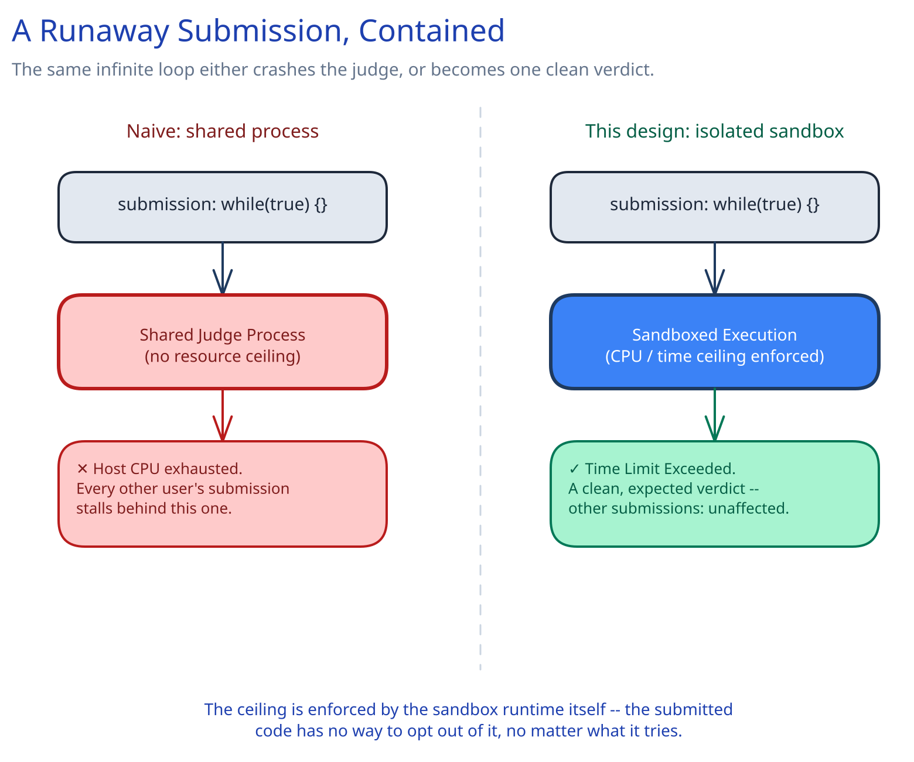

# Module 00 — Overview

## The feature, with no infrastructure in it yet

A user writes code in the language of their choice and submits it against a problem. The system compiles it (if needed), runs it against a set of hidden test cases, and returns a verdict: Accepted, Wrong Answer, Time Limit Exceeded, Memory Limit Exceeded, Runtime Error, or Compile Error. That's the entire feature from the user's side.

The interesting design problem is entirely in one sentence most other case studies in this guide never have to deal with: **the code being run is written by an untrusted stranger, on purpose, and the system's job is to execute it anyway — safely, with a hard ceiling on what it can do, no matter what it tries.** A submission that writes `while(true){}`, forks itself recursively, or tries to read `/etc/passwd` isn't a bug in someone else's code from this system's point of view — it's Tuesday. Every other requirement below exists to make that submission's worst behavior end in a clean, bounded verdict rather than a crashed judge.

## Requirements

**Functional:**
- Accept a code submission (source code + chosen language) against a specific problem.
- Compile the submission if the language requires it, then run it against every one of the problem's test cases.
- Return a verdict per test case and an overall verdict for the submission.
- *(Stretch, not required for the core design)* support "run against a custom test case" without judging it, and interactive problems (multiple rounds of I/O with a judge program).

**Non-functional** (these are what actually drive the architecture):
- **Scale:** assume 5M submissions/day platform-wide, with sharp bursts during live contests — a contest start can spike submission volume by 20x within the first minute.
- **Latency:** a typical submission should get a verdict within a few seconds; a submission is allowed to wait in queue briefly under load, but never indefinitely.
- **Isolation:** one submission's execution must never affect another's, and must never affect the judge's own infrastructure — this is a security boundary, not a performance nice-to-have.
- **Determinism:** the same code against the same test case, run twice, must produce the same verdict. A judge whose answer depends on which machine happened to run it is not trustworthy.

## Capacity Estimation

- 5M submissions/day ≈ 58/sec average. At a 20x contest-start spike: **~1,160/sec peak** — the number the worker pool actually has to absorb, not the average.
- Assume each submission runs against ~30 test cases, each capped at a 2-second execution limit: worst case, one submission occupies a sandbox for up to 60 seconds of CPU time (most submissions finish far faster, or fail fast on an early test case).
- Submission source code: small (a few KB each) — 5M/day × 5KB ≈ 25GB/day, trivial to store. Test-case data per problem is the larger cost, but is written once per problem and read constantly, not written per submission.

## Approach Walkthrough

A submission is never executed in the request path — it's recorded, queued, and picked up by a horizontally-scaled worker pool, each worker running the submission's code inside a fresh, isolated sandbox per test case with a hard CPU/memory/wall-clock ceiling enforced by the sandbox runtime itself, not by the submitted code's own cooperation. The ceiling is what turns "this code doesn't halt" from an infrastructure incident into a normal, expected verdict: Time Limit Exceeded.

## API Surface

- `POST /api/v1/submissions {problem_id, language, source_code}` → `202 {submission_id, status: "queued"}` — accepted, not yet judged.
- `GET /api/v1/submissions/{submission_id}` → `{status, verdict, per_test_case: [...]}` — for polling; `status` moves `queued → running → done`.
- `GET /api/v1/problems/{problem_id}` → problem statement, constraints, and sample (non-hidden) test cases.
- `429 Too Many Requests` — from a per-user submission rate limiter sitting in front of the submission endpoint.
