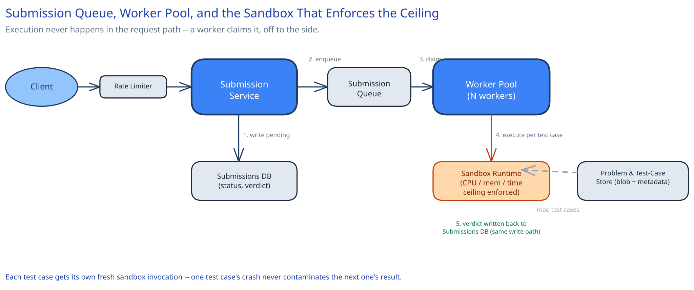

# Module 01 — Architecture & High-Level Design

## Monolith vs. microservices

The judge/execution path is pulled out as its own service, never folded into the general problem-catalog/web-platform service, for a reason that's a security boundary, not a scaling preference: the execution workers are the only part of this system that runs untrusted, arbitrary code, and they need a fundamentally different network posture from everything else — no access to the internal database, no access to other services, often no outbound network access at all. Folding execution into the same deployable as the web platform would mean either weakening that isolation for the whole service, or running the whole service inside a sandbox it doesn't need. The seam sits exactly at "compiles and runs untrusted code" vs. "everything else" — problem catalog, user accounts, and submission history stay in a normal service with normal access, and only talk to the execution service over its own narrow API.

## Building Blocks

| Block | Role |
|---|---|
| **Submission Service** (stateless) | Accepts a submission, writes it durably with `status=queued`, and enqueues it — this write is the atomic step the whole design depends on |
| **Submission Queue** | Decouples accepting a submission from executing it, and absorbs a contest-start burst without the Submission Service or the workers needing to scale instantly |
| **Worker Pool** (stateless, horizontally scaled) | Claims a queued submission, spins up a sandbox per test case, and reports results |
| **Sandbox Runtime** (Firecracker/gVisor-style microVM) | Enforces CPU, memory, wall-clock, process-count, and network limits — this is the actual security and correctness boundary, not the worker process itself |
| **Problem & Test-Case Store** — metadata in a relational DB, test-case payloads in blob storage | Test cases are read constantly and written rarely, the inverse of submissions |
| **Rate Limiter** | Caps submissions per user, both to prevent abuse and to protect the worker pool from a single user's runaway retry loop |

## Per-path walkthrough

**Submission path (write)** — `Client → Submission Service (write submissions row, status=queued, SAME transaction as accepting the request) → Queue (enqueue submission_id)`. This path only needs to be correct and fast to acknowledge — it never waits on actual execution.

**Execution path** — `Worker (dequeue) → for each test case: Sandbox Runtime (fresh isolated execution, hard resource ceiling) → compare actual vs. expected output → record per-test-case verdict → aggregate overall verdict → write submissions row, status=done`. Each test case gets its own sandbox invocation — one test case's crash or resource exhaustion never contaminates the next one's result.

**Result-retrieval path (read)** — `Client → Submission Service → submissions row (by id)`. A cheap point lookup; polling this is far simpler than trying to push results, and acceptable given verdicts typically land within seconds.

## Trade-offs to make explicit

| Decision | Chosen | Alternative | Why |
|---|---|---|---|
| Sandbox lifecycle | Fresh sandbox per test case | One warm sandbox reused across a submission's test cases | Reuse risks state leaking between test cases (a file written, a process left running) corrupting the next test case's result — determinism is a hard requirement here, not a nice-to-have |
| Isolation mechanism | MicroVM (Firecracker-style) | A plain container / cgroup | A container shares the host kernel's syscall surface with the untrusted code; a microVM gives each execution its own kernel, closing an entire class of container-escape vulnerabilities |
| Verdict delivery | Async — client polls `GET /submissions/{id}` | Synchronous — hold the request open until judged | Judging can legitimately take several seconds under load; holding an HTTP connection open that long ties up a connection slot for no benefit over polling |
| Warm sandbox pools per language | Pre-warmed pool of ready-to-use sandboxes per language runtime | Cold-start a fresh sandbox on every single test case | A cold microVM boot adds real latency multiplied across ~30 test cases per submission; a warm pool trades a small standing resource cost for materially faster verdicts |
| Compile step | Compiled once per submission, reused across all its test cases | Recompile per test case | The source code doesn't change between test cases — recompiling would be pure waste and would multiply compile-time failures needlessly |

## Load Handling

- **Peak-vs-average tolerance:** the defining spike here is a contest start — potentially 20x average submission volume within the first minute, not a smooth ramp. The queue is what absorbs this: the Submission Service keeps accepting and enqueuing at its own steady pace, and the worker pool drains the backlog as fast as it can scale up, rather than the burst directly hitting worker capacity.
- **Where backpressure kicks in first:** if the queue itself grows past a safe depth, the Submission Service starts rejecting *new* submissions with a `503` and a retry hint, rather than accepting unboundedly and letting queue depth (and therefore verdict latency) grow without limit — a bounded, explicit failure beats an unbounded, silent slowdown.
- **What gets shed under overload:** never a submission that's already been accepted — once `queued` is durably written, that submission will eventually be judged. What can be delayed is *how quickly* — verdict latency is allowed to degrade under load; a lost or silently-dropped submission is not acceptable.
- **Autoscaling lag:** the worker pool scales on queue depth, not CPU, since a burst of long-running submissions can spike queue depth well before worker CPU saturates. A few seconds to a couple of minutes of autoscaling lag is absorbed by the queue's own depth, not by rejecting new submissions.
- **Load-test target:** sustain 1,160 submissions/sec accepted for 10 minutes with zero submissions lost, and p99 time from `queued` to a judged verdict under 30 seconds even while the worker pool is still scaling up.

## Concurrent-User Handling

| Race | Mechanism | What the "loser" sees |
|---|---|---|
| Two workers both attempt to claim the same queued submission | The queue's own dequeue semantics guarantee a message is delivered to exactly one consumer at a time (or, for an at-least-once queue, an atomic `claim` conditional update on the submission row, `WHERE status='queued'`) | The second claim attempt sees the row already `claimed`/`running` and simply moves on to the next queued submission — never double-executes |
| A user resubmits identical code, or a client retries a submission request after a timeout | The submission endpoint is idempotent on a client-supplied `idempotency_key`; a duplicate returns the original `submission_id` rather than creating a second judged attempt | The same result as the original request — never a second judging attempt or a second quota charge |
| A worker crashes mid-execution, after claiming a submission but before reporting a verdict | The claim carries a lease (a time-bounded ownership), and a submission whose lease expires without a reported verdict is returned to `queued` for another worker to pick up | The submission is re-judged from scratch by a different worker; the crashed worker's partial state is discarded entirely, never partially trusted |

## Scaling & Reliability

- **Horizontal scaling:** both the Submission Service and the worker pool are stateless and scale by request rate / queue depth respectively.
- **Circuit breaker:** the call from a worker to the sandbox-provisioning layer is wrapped in a circuit breaker — if sandbox provisioning is failing systematically (a capacity issue in the underlying microVM host fleet), the breaker trips and that worker instance stops claiming new submissions rather than accepting work it can't execute.
- **Retries:** bounded and careful — a submission whose sandbox crashed for an infrastructure reason (not a verdict like Runtime Error) is retried a small, fixed number of times before being marked as a judging failure requiring manual attention; retrying indefinitely would let a systematically broken submission consume worker capacity forever.
- **Dead-letter queue:** a submission that fails judging repeatedly (malformed language flag, a corrupted test-case reference) lands in a DLQ for investigation rather than being retried forever or silently dropped.
- **Graceful degradation:** if the blob store holding test cases is briefly degraded, the worker pool can pause claiming new submissions for problems whose test cases aren't cached locally, while continuing to serve problems whose test cases already are — a partial slowdown, not a full outage.
- **Multi-region:** not built here — see "what you'd revisit" below.

## What you'd revisit as this grows

- **Warm sandbox pools per language, sized dynamically.** A fixed warm pool per language works until submission mix shifts sharply (a contest in a less-common language) — a real system needs to detect demand shift and rebalance pool sizes, which this design doesn't build.
- **Multi-region execution.** A single-region design is a single point of regional failure; real judges at this platform's scale run execution capacity in multiple regions, routing a submission to whichever region has spare worker capacity.
- **Plagiarism / cheating detection.** Explicitly out of scope for this module — it's a separate, much harder problem (comparing submission content across users) layered on top of, not tangled into, the execution-safety discipline this module covers.
