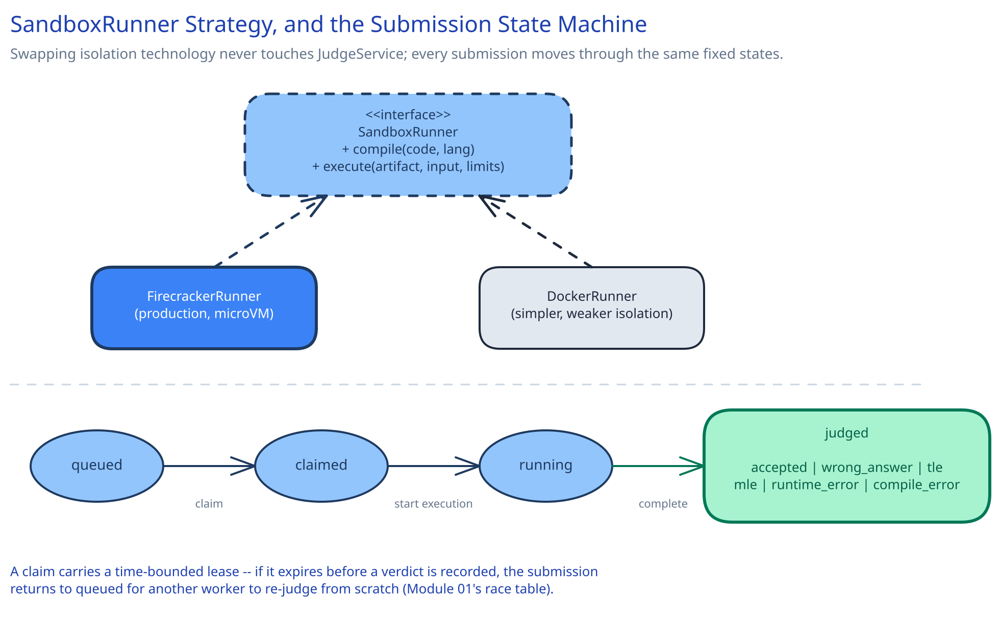

# Module 02 — Low-Level Design



**`SubmissionStatus`**, as an explicit state machine, matching this guide's convention elsewhere: `queued → claimed → running → judged`, where `judged` carries one of the terminal verdicts (`accepted`, `wrong_answer`, `time_limit_exceeded`, `memory_limit_exceeded`, `runtime_error`, `compile_error`).

## Interfaces vs. implementations

- **`SandboxRunner`** *(interface)* → **`FirecrackerRunner`** / **`DockerRunner`** — `execute(code, language, testCaseInput, limits) -> ExecutionResult`. `FirecrackerRunner` is the production implementation (microVM isolation); a `DockerRunner` is a legitimate, weaker alternative for a lower-stakes internal tool, behind the exact same interface.
- **`SubmissionRepository`** *(interface)* → **`SqlSubmissionRepository`** — `claimNext()`, `updateStatus(id, from, to)`, `recordVerdict(id, verdict, perTestCaseResults)`.
- **`JudgeService`** — the orchestrator. Depends on both interfaces above, implements neither's actual execution or storage itself.

## Pseudocode for the judging flow

```
JudgeService.judge(submissionId):
    submission = repo.claimNext()          # atomic conditional claim, see Module 01's race table
    if submission is None:
        return                              # nothing queued right now

    compileResult = sandboxRunner.compile(submission.code, submission.language)
    if not compileResult.ok:
        repo.recordVerdict(submission.id, verdict="compile_error", perTestCaseResults=[])
        return

    results = []
    for testCase in problemStore.testCasesFor(submission.problemId):
        result = sandboxRunner.execute(
            compiledArtifact = compileResult.artifact,
            input = testCase.input,
            limits = submission.problemLimits)   # CPU/memory/wall-clock, enforced by the sandbox itself

        verdict = compare(result.output, testCase.expectedOutput, result.resourceUsage, submission.problemLimits)
        results.append(verdict)

        if verdict != "accepted":
            break                            # stop at first failing test case -- no need to keep running

    overall = "accepted" if all(r == "accepted" for r in results) else firstFailure(results)
    repo.recordVerdict(submission.id, verdict=overall, perTestCaseResults=results)
```

Two error cases worth designing for deliberately, not as an afterthought:

- **Compile failure:** short-circuits immediately — no test case is ever run against code that didn't compile, and the verdict (`compile_error`) is distinguished from a runtime failure so the user knows exactly which stage failed.
- **Sandbox crash for an infrastructure reason (not a verdict):** distinguished from a legitimate `runtime_error` verdict — a sandbox that failed to even start, or that the host killed for reasons unrelated to the submission's own behavior, is a judging failure eligible for the bounded retry from Module 01, not a verdict handed to the user.

## Concurrency at the code level

`repo.claimNext()` needs no in-process lock, and this is worth stating explicitly: `JudgeService` runs on many horizontally-scaled worker instances (Module 01), so a language-level mutex would only protect against other threads *on the same instance* — it would do nothing about another worker instance claiming a submission a moment later. Correctness comes entirely from the claim being an atomic conditional update at the database or queue level (`UPDATE ... WHERE status='queued'`), the same pattern this guide uses everywhere two workers might race for the same unit of work: push the atomicity requirement down into the one system that can actually guarantee it.

The one place an application-level decision *is* needed: how long a claim's lease lasts before it's considered abandoned and returned to `queued`. Too short, and a legitimately slow submission (a compute-heavy but correct one) gets re-claimed and executed twice; too long, and a genuinely crashed worker's submissions sit stuck for a long time before recovery. This is a tuned constant, not something correctness depends on either way — a duplicate execution from an overly-short lease is wasteful but not incorrect, since re-judging the same submission is idempotent.

## Design patterns you just used, named

- **Strategy pattern** — `SandboxRunner` is a strategy: `FirecrackerRunner` and `DockerRunner` are interchangeable behind one interface, and swapping isolation technology never touches `JudgeService`.
- **State pattern** — `SubmissionStatus`'s enforced transitions are the same state-machine discipline this guide applies consistently: a lifecycle modeled as named states with legal transitions, never a boolean or a free-text field.
- **Template Method** — the judging flow itself (compile → for-each-test-case run-and-compare → aggregate) is a fixed skeleton every language's `SandboxRunner` implementation fills in identically at the orchestration level, while the actual compile/execute mechanics differ per language underneath.

## Practice: extend it yourself

Before moving to Module 03, try sketching (even just in pseudocode) how you'd add:

1. **Interactive problems** — where the judge program and the submission exchange several rounds of input/output rather than one input producing one output. Which part of `SandboxRunner`'s interface has to change, and does the "stop at first failing test case" short-circuit still make sense?
2. **A "run against custom input" mode**, where a user supplies their own test input and just wants to see the output — no verdict, no comparison against an expected answer. Does this reuse `SandboxRunner.execute()` as-is, or does it need its own method?

Neither has one right answer — the point is to notice that the interface boundaries already drawn make it obvious *where* each change belongs.
