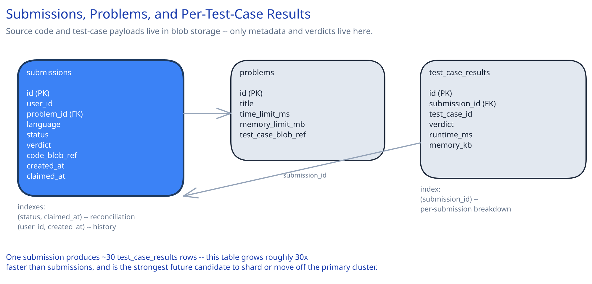

# Module 03 — Database Design & Scaling

## From entities to schema

Three entities fall directly out of the requirements in Module 00:

- **`submissions`** — one row per submission: who submitted it, against which problem, in what language, its current status, and its final verdict.
- **`problems`** — the catalog: title, constraints (time/memory limits), and a reference to where its test cases actually live.
- **`test_case_results`** — one row per (submission, test case): pass/fail, runtime, memory used.

## Why source code and test cases live in blob storage, not the database

A submission's source code and a problem's test-case input/output files are exactly the shape this guide's [Object / Blob Storage & Large Uploads](../../scalability-resilience/object-blob-storage.md) page describes: variable-sized blobs, read far more than written for test cases (every judging run reads them, they're written once when a problem is authored), and awkward to index or query *inside* a relational row. `submissions` and `problems` store only a reference (a blob key) plus the metadata that's actually queried — status, verdict, limits — keeping the relational tables small and fast regardless of how large submissions or test case files get.

## Why `submissions` needs a composite index on `(status, claimed_at)`

The worker pool's core query — "find a submission stuck in `claimed` past its lease" (Module 02's reconciliation) — is exactly this composite index's leftmost-prefix shape: filter to `status='claimed'` first, then range-scan `claimed_at` for anything past the lease threshold. Without this index, reconciliation would mean scanning every submission in the table to find the small number that are actually stuck.

## Why `test_case_results` is a separate table, not a JSON column on `submissions`

Per-test-case results (`~30` rows per submission) are queried independently of the parent submission in real access patterns — "show me exactly which test case first failed," or an aggregate "what's this problem's per-test-case pass rate across all submissions" for problem-authors debugging a badly-specified test case. A JSON blob on `submissions` would make the second query nearly impossible without deserializing every row; a real table with `submission_id` and `test_case_id` columns serves both patterns as ordinary indexed queries.

## Indexes

- `submissions(user_id, created_at)` — serves "my submission history," the most common user-facing query.
- `submissions(status, claimed_at)` — **composite**, serves the worker pool's stuck-claim reconciliation query (above).
- `submissions(problem_id, status)` — serves "how many submissions are currently in flight for this problem," useful for contest-time load monitoring.
- `test_case_results(submission_id)` — serves "show me this submission's full per-test-case breakdown."
- `problems(id)` — the catalog's primary-key lookup; no additional index needed since problems are read far more by ID than searched.

## Consistency

- **`submissions.status`:** strongly consistent — a user polling `GET /submissions/{id}` must see the true current status, never a stale `queued` for a submission that already finished. This is a hard requirement given determinism and trust in the verdict are the whole point of the system.
- **`test_case_results`:** written once, atomically, alongside the final status transition to `judged` — never partially written, since a submission is either fully judged or still in progress, with no meaningful in-between state a reader should see.
- **`problems` / test-case blobs:** read-heavy and effectively immutable once a problem is published — a strong candidate for aggressive caching (Module 01's blob store), since staleness here would only matter in the rare case a problem's test cases are corrected after publication, which is itself a rare, deliberate, cache-invalidating event.

## Scaling the schema

- **Sharding `submissions`:** once volume demands it, shard by a hash of `id` (or `user_id`, if "my submission history" is the dominant query) — the reconciliation query above still needs to fan out across shards, which is an acceptable cost since it's a background job, not a user-facing hot path.
- **Splitting `test_case_results` out to a separate store as it grows:** this table grows roughly 30x faster than `submissions` (many test cases per submission) and has no need for joins beyond its parent submission — a strong future candidate to move off the primary relational cluster into a wide-column or document store built for high write volume with simple key-based lookups, the same reasoning this guide applies to other high-write, low-join tables.
- **Read replicas vs. sharding, again:** replicas solve read throughput for "my submission history" and problem-catalog browsing; sharding solves the sheer write volume and total row count of `submissions` and `test_case_results` as the platform's total submission history grows into the billions of rows.

## Connecting it back

The chain holds end to end: Module 00's "the same code must always produce the same verdict" requirement is why Module 01 gives every test case its own fresh, isolated sandbox rather than a reused one; that same determinism requirement is why `test_case_results` is a real, queryable table instead of an opaque blob — a disputed verdict has to be independently auditable, per test case, not just trusted. Nothing in this schema is arbitrary — every table and index traces back to a requirement stated in Module 00.
