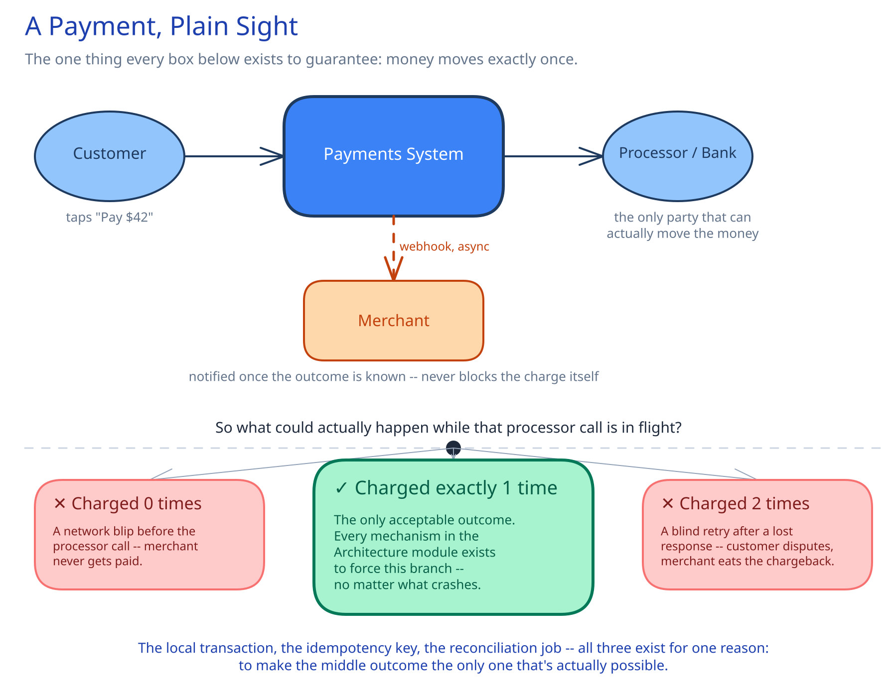

# Module 00 — Overview

## The feature, with no infrastructure in it yet

A merchant asks to charge a customer $42.00. Somewhere between that request and the customer's bank, real money has to move exactly once — not zero times (the merchant loses a sale and never finds out why), and not twice (the customer disputes a charge and the merchant eats a chargeback fee on top of the refund). Every other requirement in this module is downstream of that one sentence: **a payment is the one place in this entire guide where "probably correct" is not an acceptable answer.**

That's a sharper bar than most systems in this guide sit under. A like count that's briefly wrong self-corrects and nobody notices. A payment that's briefly wrong is either a customer's money missing or a merchant's money duplicated — both are incidents, not eventual consistency.

## Requirements

**Functional:**
- Charge a payment method (card, wallet, bank transfer) via one or more external processors.
- Support full and partial refunds against a completed payment.
- Notify merchants of payment status changes via webhook (`payment.succeeded`, `payment.failed`, `payment.refunded`).

**Non-functional** (stated as assumptions, interview-style):
- 50M transactions/day.
- p99 payment-decision latency under 2 seconds, including the external processor's own round trip.
- A payment must **never** be double-charged and must **never** be silently lost. This one requirement dominates every decision below — correctness beats speed here, explicitly, in a way it doesn't for most of this guide's other case studies.

## Capacity Estimation

Using this guide's [back-of-envelope method](../../foundations/back-of-envelope-estimation.md):

- **Transactions/sec, average:** 50M / 86,400 ≈ 580/sec. At a 5x peak factor (a flash sale, a holiday): **~2,900/sec peak**.
- **Storage/day:** assume ~500 bytes/transaction record (ids, amount, currency, status, processor reference, timestamps). 50M × 500B = 25GB/day. Transaction records are typically retained for years for compliance, not days — at ~9TB/year, a 7-year retention policy is **~65TB** of transaction history alone, before the ledger and webhook logs.
- **Ledger volume:** every transaction writes exactly 2 ledger rows (debit + credit — see Database Design), so the ledger grows at 2x the transaction rate: **~100M rows/day**, the single fastest-growing table in the system precisely because it's append-only by design.
- **Webhook deliveries:** roughly 1-2 per transaction (succeeded, and later maybe refunded) → **~600-1,200/sec average**.

## Approach Walkthrough

Before any boxes: the system records its **intent** to charge — durably, locally — *before* it ever calls an external processor, then calls the processor, then records the outcome, then notifies the merchant. That ordering is the whole design. Calling the processor first and only recording afterward would leave a crash-mid-call in an unrecoverable, ambiguous state: did the charge go through or not? Recording intent first means a crash always leaves behind a concrete `pending` row that a recovery job can resolve later — never a question mark.

Notice the shape of that guarantee: it isn't "never crash." It's "crash safely" — every intermediate state the system can be caught in mid-operation is a state a recovery job knows how to resolve. That's the actual engineering standard a payments system has to hit, and it's a theme worth carrying into the Architecture module below.

## API Surface

- `POST /payments {idempotency_key, amount, currency, payment_method, merchant_id}` → `{payment_id, status}`. `idempotency_key` is **required**, not optional (cross-ref [Idempotency Keys](../../scalability-resilience/idempotency-keys.md)) — there is no safe version of this endpoint without it.
- `POST /payments/{id}/refund {idempotency_key, amount?}` → `{refund_id, status}` — omitting `amount` refunds the full remaining balance.
- `GET /payments/{id}` → current status, for polling.
- Outbound webhook to the merchant: `payment.succeeded {payment_id, amount, merchant_id}`, `payment.failed {payment_id, reason}`, `payment.refunded {payment_id, refund_id, amount}`.
