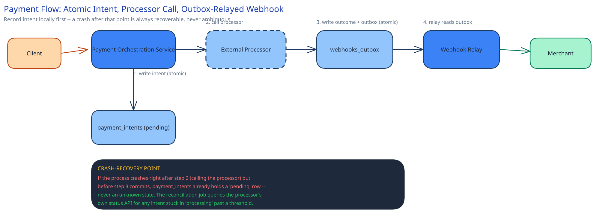

# Module 01 — Architecture & High-Level Design

**Building blocks:**
- **Payment Orchestration Service** — on a charge request, writes a `payment_intents` row (`status = pending`) in the *same local transaction* as accepting the request. This is the atomic step the whole design depends on, and it only ever needs to span one database, which is why it's safe.
- **External processor call** — a bounded-timeout call to the actual card network/processor, with retries governed by [Circuit Breakers & Retries](../../scalability-resilience/circuit-breakers-retries.md). Retries here are non-negotiably idempotent: the same `idempotency_key` is forwarded to the processor itself (real processors support this), so a retried call after a timeout can never result in two real-world charges.
- **Outbox + webhook relay** — the payment's outcome and the merchant webhook are written to an `webhooks_outbox` table in the same transaction as the status update, then relayed asynchronously (cross-ref [The Transactional Outbox & CDC](../../hld-building-blocks/transactional-outbox-cdc.md)) — so a merchant is reliably notified even if the direct API response to the original request was lost in transit.
- **Ledger Service** — every settled transaction writes a **double-entry** pair: a debit row and a credit row, never a single balance update. The ledger is self-auditing this way — sum every entry across the system, and a nonzero total means something is wrong, immediately, without needing to trust any one balance column.

**Load Handling.** A flash-sale peak is exactly the load spike this design has to absorb without shedding the payment path itself — unlike this guide's other systems, you cannot drop a payment request the way [Backpressure, Load Shedding & Bulkheads](../../scalability-resilience/backpressure-load-shedding.md) recommends shedding a "recommendations" call. What *can* be shed under pressure: deferring non-critical work riding alongside the charge (fraud-score enrichment, analytics events) — never the intent write or the processor call. The Orchestration Service and processor-call tier both scale horizontally and statelessly to absorb the multiple; a concrete load-test target: sustain 3,000 requests/sec for 10 minutes with p99 decision latency still under 2 seconds.

**Concurrent-User Handling.** Two races, named explicitly:
1. **The same `idempotency_key` submitted twice concurrently** (a client retry racing its own original request) — resolved exactly as [Idempotency Keys](../../scalability-resilience/idempotency-keys.md) describes: a unique constraint on `payment_intents(idempotency_key)` means the second concurrent insert fails the constraint, not a race the application code has to detect itself; the loser's request handler catches that failure and returns the *first* attempt's result instead of erroring.
2. **A refund request racing a not-yet-confirmed charge** — a refund can only be issued against a payment whose status is already `succeeded`; if the intent is still `pending` or `processing`, the refund request is rejected outright ("payment not yet settled") rather than queued against an outcome that doesn't exist yet — there is no safe way to refund money that hasn't definitively moved.
