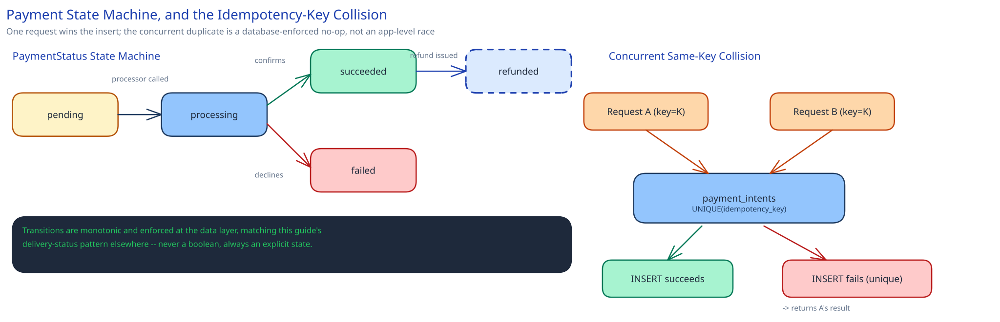

# Module 02 — Low-Level Design



**`PaymentStatus`**, as an explicit state machine, matching this guide's convention elsewhere: `pending → processing → succeeded | failed`, with `succeeded → refunded` as a separate, one-way transition.

Pseudocode for the charge flow:
```
OrchestrationService.charge(idempotency_key, amount, currency, payment_method, merchant_id):
    existing = PaymentIntents.findByIdempotencyKey(idempotency_key)
    if existing is not None:
        return existing                                  # duplicate request, already handled

    intent = PaymentIntents.insert(idempotency_key, amount, currency, status="pending")
                                                           # ^ same local transaction as above
    result = ProcessorClient.charge(intent.id, amount, currency, payment_method,
                                     idempotency_key=idempotency_key)   # forwarded, not regenerated

    with db.transaction():
        intent.status = "succeeded" if result.ok else "failed"
        PaymentIntents.update(intent)
        Outbox.insert(event="payment." + intent.status, payload=intent)   # atomic with the status update

    return intent
```

**Reconciliation job**, for the case the pseudocode above can't resolve on its own: a `payment_intent` stuck in `processing` because the processor call timed out with no response ever arriving. Neither assuming success nor assuming failure is safe here — the job instead queries the *processor's own status API* for that transaction (a safe, idempotent read) to learn the true outcome, then applies the same status-update-plus-outbox-write step the main flow uses.
