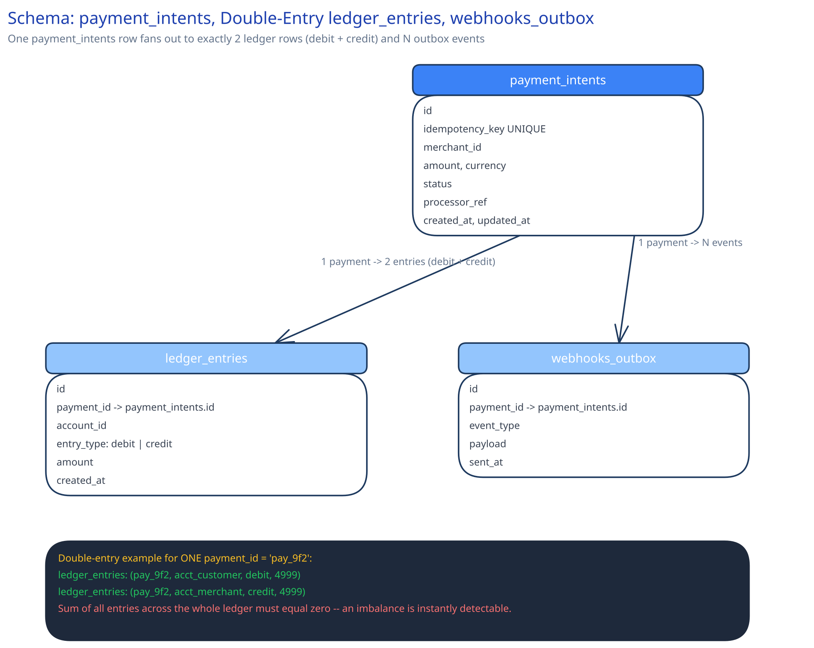

# Module 03 — Database Design & Scaling

**Entities:** `payment_intents` (id, idempotency_key UNIQUE, merchant_id, amount, currency, status, processor_ref, created_at, updated_at), `ledger_entries` (id, payment_id, account_id, entry_type: debit|credit, amount, created_at — one payment produces exactly two rows), `webhooks_outbox` (id, payment_id, event_type, payload, sent_at).

**The unique constraint on `idempotency_key` is the actual concurrency-safety mechanism**, not a nice-to-have layered on top — it's what makes the "duplicate request" case in the Concurrent-User Handling section a guaranteed, database-enforced outcome rather than an application-level check that could race.

**Why strongly consistent and relational, not eventually consistent:** money is the canonical case both [ACID vs BASE](../../database-design/acid-vs-base.md) and [SQL vs NoSQL](../../database-design/sql-vs-nosql.md) already name for exactly this choice — a balance that's briefly wrong is not an acceptable trade the way a briefly-stale like-count is.

**Sharding**, once volume demands it: by `merchant_id` (or the payer's `account_id` for the ledger specifically), keeping one account's full ledger on one shard so a balance query never has to fan out and merge across shards to answer "what does this account's history actually show right now."
