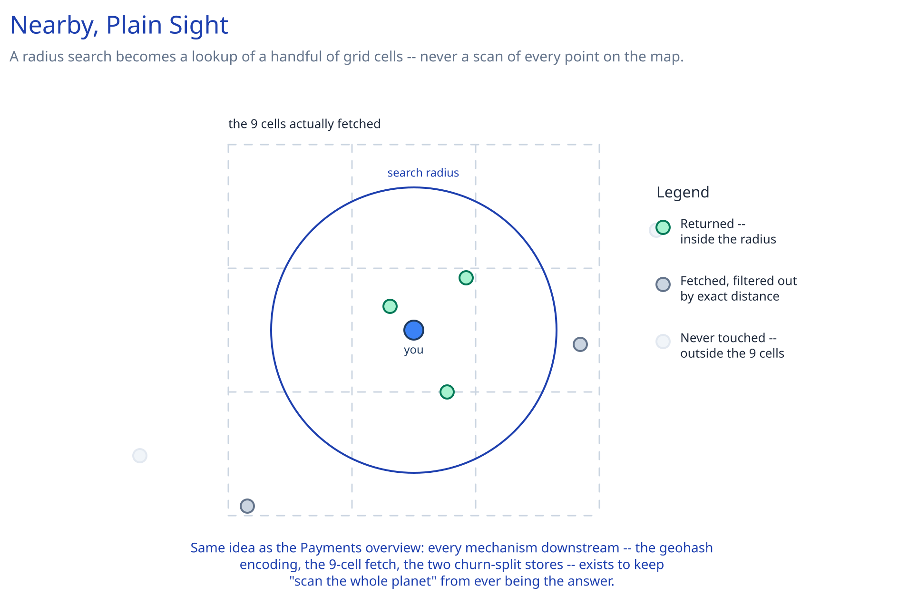

# Module 00 — Overview

## Requirements

**Functional:**
- Given a location and radius, return nearby entities sorted by distance (restaurants, or moving drivers).
- Support both largely static entities (a restaurant, opened once and rarely moved) and highly dynamic ones (a driver's location, updated every few seconds).
- Update a moving entity's current location.

**Non-functional** (stated as assumptions, interview-style):
- Nearby queries need sub-100ms latency against tens of millions of candidate points.
- Dynamic-entity location updates are extremely high-frequency and don't need long-term durability — a driver reconnecting re-establishes their position within seconds regardless.
- Static POI data is read far more than written, and unlike a driver's position, DOES need durability.

## Capacity Estimation

Using this guide's [back-of-envelope method](../../foundations/back-of-envelope-estimation.md):

- **Dynamic writes:** 1M active drivers pinging their location every 4 seconds ≈ **~250,000 writes/sec** — this dwarfs the read volume and is the number that actually shapes the design.
- **Static reads:** 50M points of interest, queried by a search/browse app at ~10,000 queries/sec — heavily read-skewed, and heavily clustered around dense areas (city centers), not spread evenly across the map.
- **Working set per query:** a well-chosen radius over a well-chosen index touches thousands of candidates, not millions — the entire design exists to avoid a full scan of "all points on Earth" for every query.

## Approach Walkthrough

Encode each 2D `(lat, lng)` pair into a geohash: a string where two points sharing a longer prefix are guaranteed to be close together (each additional character subdivides the map into a finer grid cell). This turns "find points near me" from an unindexable 2D range problem into an ordinary prefix/range query over a single sortable key — something both a relational index and an in-memory sorted structure already handle well. A query computes the geohash cell containing the search point plus its 8 neighbors (to catch nearby points that happen to fall just across a cell boundary), fetches candidates from those cells, then filters to the exact radius using the haversine distance formula, since a geohash cell is a rectangle, not a circle.

## API Surface

- `POST /entities/{id}/location {lat, lng}` -> ack — used only for movable entities (drivers).
- `GET /nearby?lat=&lng=&radius_km=&limit=20` -> `[{entity_id, lat, lng, distance_km}]`
