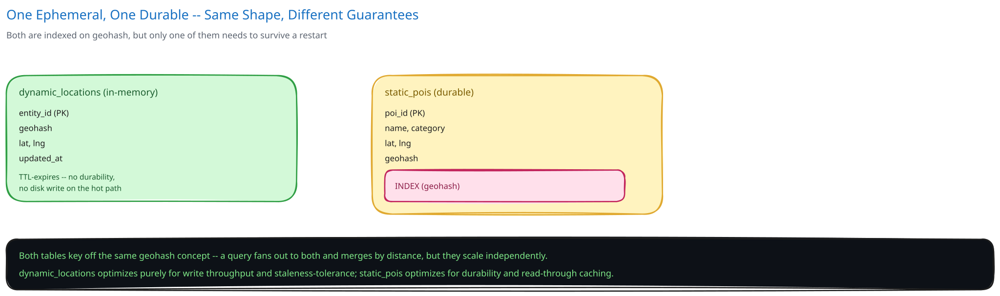

# Module 03 — Database Design & Scaling

- **Dynamic locations:** `(entity_id, geohash, lat, lng, updated_at)` — in-memory only, entries TTL-expire naturally when an entity stops pinging (an offline driver ages out of "nearby" results without any explicit cleanup job).
- **Static POIs:** `(poi_id, name, category, lat, lng, geohash)` — indexed on `geohash` (cross-ref [Database Indexing](../../database-design/database-indexing.md)'s prefix-matching reasoning: a range scan over sorted geohash strings is what answers "all points starting with this prefix" efficiently).
- **Scaling:** more geo-shards means finer-grained parallelism as either store grows — since shard boundaries follow geohash prefixes, adding shards is "split a dense region's cells across more nodes," not a global rebalance, matching the general reasoning in [Data Partitioning & Sharding](../../hld-building-blocks/data-partitioning-sharding.md).
