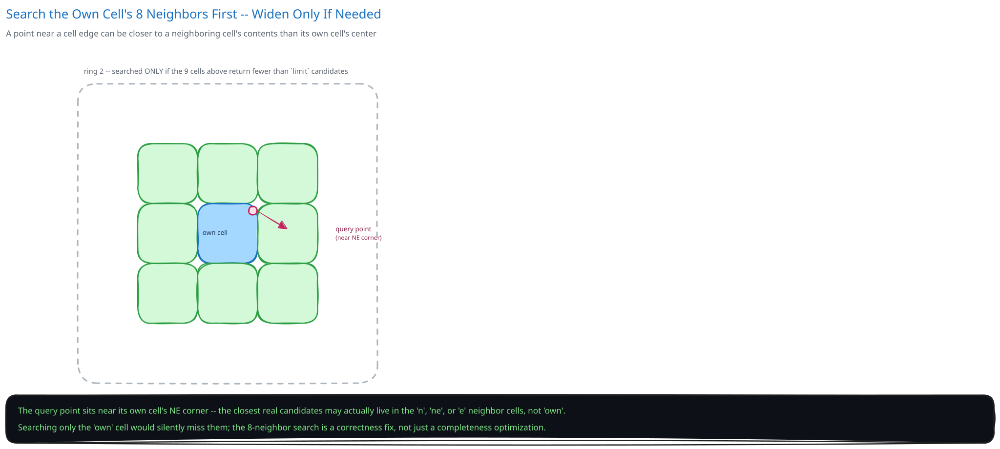

# Design a Proximity Service (Nearby Places)


## Requirements

**Functional:**
- Given a location and radius, return nearby entities sorted by distance (restaurants, or moving drivers).
- Support both largely static entities (a restaurant, opened once and rarely moved) and highly dynamic ones (a driver's location, updated every few seconds).
- Update a moving entity's current location.

**Non-functional** (stated as assumptions, interview-style):
- Nearby queries need sub-100ms latency against tens of millions of candidate points.
- Dynamic-entity location updates are extremely high-frequency and don't need long-term durability — a driver reconnecting re-establishes their position within seconds regardless.
- Static POI data is read far more than written, and unlike a driver's position, DOES need durability.

## Capacity Estimation

Using this guide's [back-of-envelope method](../../foundations/back-of-envelope-estimation.md):

- **Dynamic writes:** 1M active drivers pinging their location every 4 seconds ≈ **~250,000 writes/sec** — this dwarfs the read volume and is the number that actually shapes the design.
- **Static reads:** 50M points of interest, queried by a search/browse app at ~10,000 queries/sec — heavily read-skewed, and heavily clustered around dense areas (city centers), not spread evenly across the map.
- **Working set per query:** a well-chosen radius over a well-chosen index touches thousands of candidates, not millions — the entire design exists to avoid a full scan of "all points on Earth" for every query.

## Approach Walkthrough

Encode each 2D `(lat, lng)` pair into a geohash: a string where two points sharing a longer prefix are guaranteed to be close together (each additional character subdivides the map into a finer grid cell). This turns "find points near me" from an unindexable 2D range problem into an ordinary prefix/range query over a single sortable key — something both a relational index and an in-memory sorted structure already handle well. A query computes the geohash cell containing the search point plus its 8 neighbors (to catch nearby points that happen to fall just across a cell boundary), fetches candidates from those cells, then filters to the exact radius using the haversine distance formula, since a geohash cell is a rectangle, not a circle.

## API Surface

- `POST /entities/{id}/location {lat, lng}` -> ack — used only for movable entities (drivers).
- `GET /nearby?lat=&lng=&radius_km=&limit=20` -> `[{entity_id, lat, lng, distance_km}]`

## High-Level Design

**Two stores, split by churn rate, not by entity type.** A driver's location and a restaurant's location are the same KIND of data (a geohash-indexed point), but they have wildly different write patterns, so they live in different systems:
- **Dynamic location store** (an in-memory geo-indexed structure, e.g. Redis `GEOADD`/`GEOSEARCH`) for frequently-moving entities — optimized for extremely high write throughput, with no durability requirement, since a stale or lost entry is corrected by the next location ping seconds later.
- **Static POI store** (a relational table with a geohash-prefix index, cross-ref [Database Indexing](../../database-design/database-indexing.md)) for rarely-changing points — optimized for durability and heavy read volume, not write throughput.

**Geo-sharding** — both stores are partitioned by geohash prefix (cross-ref [Data Partitioning & Sharding](../../hld-building-blocks/data-partitioning-sharding.md), [Consistent Hashing](../../hld-building-blocks/consistent-hashing.md)): the same spatial-locality property that makes geohashes useful for querying also makes them a natural shard key — a "nearby" query for a point in one city resolves against one or two shards, never the whole planet's worth of data.

**Caching the static store's hot regions** — city-center POI density means a small fraction of geohash cells serve a disproportionate share of queries; a cache-aside layer (cross-ref [Caching Strategies](../../hld-building-blocks/caching-strategies.md)) in front of the static store absorbs this skew, since restaurant listings changing once a day tolerate a cache far more comfortably than a driver's position would.

**Load Handling.** The dominant load risk is regional write bursts — a city's evening rush hour driving up ping volume in exactly the shards covering that city, while other regions' shards are unaffected because of geo-sharding. A second, cheaper lever: a location ping that hasn't moved meaningfully (within a few meters of the last recorded position) is dropped before it reaches the store at all — most write amplification in a system like this comes from stationary or slow-moving entities re-reporting a position that hasn't changed.

**Concurrent-User Handling.** This system deliberately has almost no "race" in the strict sense other case studies need to close. A rider's nearby-query reading a driver's position that's a few hundred milliseconds stale — updated by a concurrent location ping that landed a moment later — is an accepted trade, not a bug (cross-ref [Consistency Models](../../hld-building-blocks/consistency-models.md)): unlike a payment or a job claim, there's no correctness requirement that a nearby-search see the ABSOLUTE latest position, only a recent one. This is why the dynamic store can skip transactions, locks, or idempotency keys entirely — the cost of a stale read here is invisible to the user, not a lost or duplicated write.

## Low-Level Design



**Nearby-query pseudocode:**
```
ProximityService.nearby(lat, lng, radius_km, limit):
    cell = geohash_encode(lat, lng, precision=default_for(radius_km))
    candidate_cells = [cell] + neighbors(cell)   # own cell + 8 surrounding cells

    candidates = []
    for c in candidate_cells:
        candidates += Store.getByGeohashPrefix(c)

    if len(candidates) < limit:                   # sparse area; own ring wasn't enough
        candidate_cells = expandRing(candidate_cells)
        candidates += Store.getByGeohashPrefix(candidate_cells - already_fetched)

    exact = [(e, haversine(lat, lng, e.lat, e.lng)) for e in candidates]
    exact = [pair for pair in exact if pair[1] <= radius_km]
    return sorted(exact, key=distance)[:limit]
```
Searching the point's own cell ALONE is a real bug, not just an optimization gap: a point sitting a few meters across a cell boundary from the query point can have a totally different geohash prefix despite being the closest match — the 8-neighbor search is what makes the geohash approach correct, not just fast.

**Distance ranking is a first pass, not the final answer.** For a rideshare-style query, a downstream ranking step (driver rating, ETA, availability) runs only over the small candidate set this query already narrowed down to — geohash + haversine filtering solves "which few thousand points are even plausible," not "which one is best," and keeps that expensive ranking step from ever running over the full dataset.

## Database Design & Scaling


- **Dynamic locations:** `(entity_id, geohash, lat, lng, updated_at)` — in-memory only, entries TTL-expire naturally when an entity stops pinging (an offline driver ages out of "nearby" results without any explicit cleanup job).
- **Static POIs:** `(poi_id, name, category, lat, lng, geohash)` — indexed on `geohash` (cross-ref [Database Indexing](../../database-design/database-indexing.md)'s prefix-matching reasoning: a range scan over sorted geohash strings is what answers "all points starting with this prefix" efficiently).
- **Scaling:** more geo-shards means finer-grained parallelism as either store grows — since shard boundaries follow geohash prefixes, adding shards is "split a dense region's cells across more nodes," not a global rebalance, matching the general reasoning in [Data Partitioning & Sharding](../../hld-building-blocks/data-partitioning-sharding.md).

## Interviewer Q&A

**What happens when two requests hit the same resource at the same instant?**
This system is the rare case where that's barely a race at all: a nearby-query reading a driver's position concurrently with a location-update ping just sees whichever value landed first — there's no shared mutable state that needs protecting, since one path only reads and the other only writes a single entity's own row.

**What happens when traffic spikes 10x for an hour?**
Geo-sharding contains the spike to whichever region is actually busy (a major event in one city) — shards covering unrelated regions see no additional load, which is a direct benefit of choosing a SPATIAL shard key instead of, say, hashing entity IDs uniformly across all shards.

**Why a geohash instead of separate indexes on `lat` and `lng` columns?**
A database index on `lat` alone (or `lng` alone) can narrow a search along ONE dimension but still leaves a large candidate set to filter along the other — a geohash folds both dimensions into a single sortable string, so one prefix range scan narrows both at once, which is exactly the leftmost-prefix reasoning [Database Indexing](../../database-design/database-indexing.md) covers generally.

**Why two separate stores instead of one table for both drivers and restaurants?**
They're the same shape of data with wildly different churn: optimizing one store for 250,000 writes/sec with no durability need (drivers) would be wasteful and unnecessary for data that changes once a month (restaurants), and optimizing for restaurant-style durability would make driver-location writes far too slow.

**How do you avoid missing a nearby point that falls just across a geohash cell boundary?**
Always search the query point's own cell plus its 8 immediate neighbors, never the query point's cell alone — two physically close points can land in different cells purely because of where the grid lines fall, and skipping the neighbor search would silently produce wrong (not just incomplete) results.

**What if the initial 9-cell search doesn't return enough candidates (a sparse rural area)?**
Expand the search to the next ring of surrounding cells (or drop to a coarser geohash precision covering a larger area per cell) and repeat, rather than returning fewer than the requested `limit` results whenever an area happens to be sparse.

**How does the dynamic store avoid growing unbounded with drivers who went offline without a clean disconnect?**
Every location entry carries a TTL tied to the expected ping interval — a driver who stops pinging simply ages out of the store on their own; there's no separate "mark offline" step or cleanup job required.

**How would you rank results by more than raw distance — driver rating, ETA, availability?**
Run distance filtering first specifically because it's cheap and narrows millions of points down to a small candidate set — the more expensive ranking factors then only need to be computed over that already-small set, not the full dataset.
