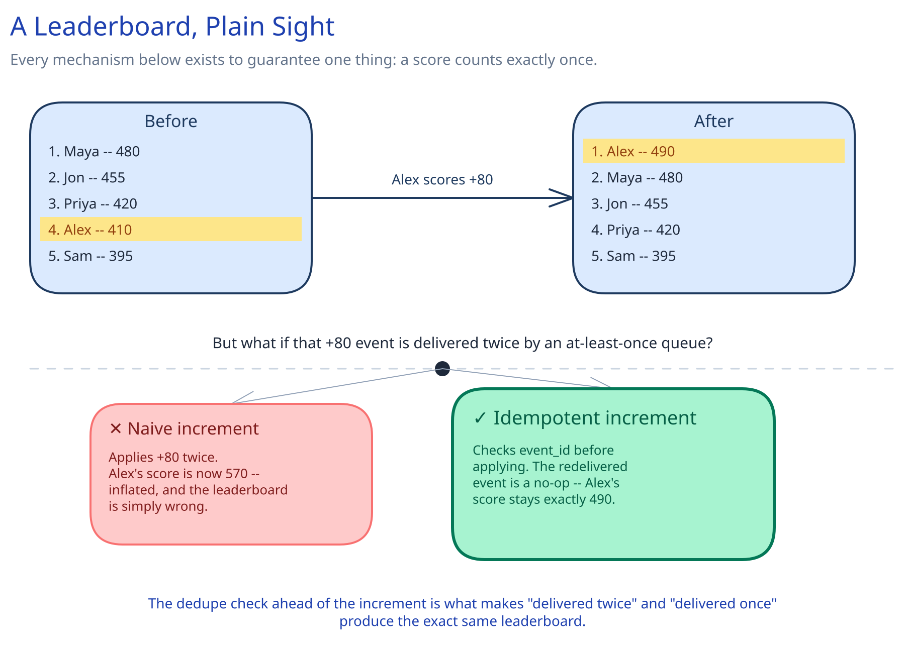

# Module 00 — Overview

## Requirements

**Functional:**
- Submit a score update for a user on a given leaderboard (a specific game, season, or daily/weekly window).
- Query the top-K entries (e.g. top 100) for a leaderboard.
- Query a specific user's current rank, score, and the handful of players ranked just above/below them ("nearby").
- Support many independent leaderboards (per-game, per-season) that reset on a schedule.

**Non-functional** (stated as assumptions, interview-style):
- 50M daily active players, each finishing ~10 scored matches/day.
- Top-K and rank lookups are read FAR more often than scores are written — every app open re-renders the leaderboard.
- Rank queries need single-digit-millisecond latency; this is a screen users check constantly, not a batch report.
- A brief delay before a score change is reflected globally is acceptable; losing a score update, or getting an obviously wrong rank, is not.

## Capacity Estimation

Using this guide's [back-of-envelope method](../../foundations/back-of-envelope-estimation.md):

- **Writes:** 50M users x 10 matches/day = 500M score updates/day ≈ **~5,800/sec average**, with tournament-finale bursts pushing several times that for short windows.
- **Reads:** every app open re-fetches the leaderboard; at a conservative 5 opens/user/day that's 250M reads/day ≈ **~2,900/sec average** — but unlike writes, reads cluster heavily around the SAME few leaderboards (this week's, this season's), not spread evenly across all of them.
- **Working-set size:** a single global leaderboard with 50M members, each entry ~40 bytes (user ID + score) in a sorted-set structure, is ~2GB — small enough to keep entirely in memory, which is exactly what makes single-digit-millisecond rank queries possible at all.

## Approach Walkthrough

A sorted-set data structure (score-ordered, O(log N) insert, O(log N + K) range read) IS the leaderboard — not a cache in front of one. Every score update is an atomic increment against this structure; every top-K or rank query reads directly from it. A separate durable event log records every update so the sorted set can be rebuilt after a crash or failover, since the sorted set itself lives in memory.

## API Surface

- `POST /leaderboards/{id}/scores {user_id, match_id, delta}` -> `{rank, score}` — `match_id` is the idempotency key.
- `GET /leaderboards/{id}/top?limit=100` -> `[{user_id, score, rank}]`
- `GET /leaderboards/{id}/users/{user_id}` -> `{rank, score, nearby: [{user_id, score, rank}]}`
