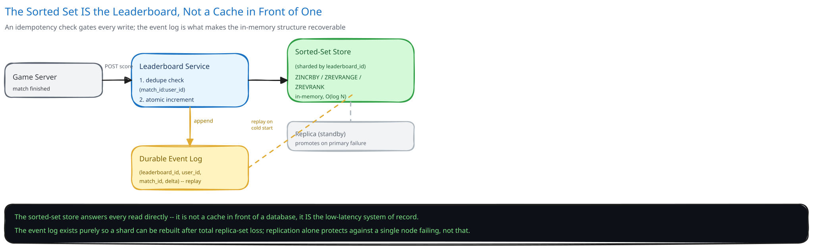

# Module 01 — Architecture & High-Level Design

## Monolith vs. microservices

The leaderboard is pulled out as its own service, never folded into whichever service actually owns match results or scoring logic, for a reason that's structural: the sorted-set store is a single, shared, specialized piece of infrastructure that potentially dozens of different game modes or scoring sources all need to write into and query the same way. If leaderboard logic lived inside each game mode's own service, every one of them would need to reimplement sharding-by-leaderboard-ID, the idempotency dedupe, and the event-log replay path — or worse, several slightly different versions of it. Centralizing it means one team owns the one hard problem (fast, correct, concurrent rank-keeping) and every scoring source is just a client that calls `submitScore`.

There's a second reason the seam holds even for a single game: rank-query latency is a completely different concern from wherever scores are computed. A match-resolution service's job is to decide "this match is over, player X gets 50 points" — a job that can take as long as match logic needs. The leaderboard's job is "answer a rank query in single-digit milliseconds, constantly" — a completely different latency and read-scaling profile that would force the match service to be provisioned and operated for a read pattern that has nothing to do with resolving matches. If your game has one leaderboard and one scoring source, this split isn't buying anything yet — say so rather than defaulting to a separate service because it looks more scalable.

## Building blocks

| Block | Role |
|---|---|
| **Leaderboard Service** (stateless) | Validates and routes score-submit and query requests; owns the idempotency check |
| **Sorted-Set Store** (sharded, in-memory) | The system of record for "what's the leaderboard right now" — not a cache; `ZINCRBY`/`ZREVRANGE`/`ZREVRANK`-style operations |
| **Dedupe Store** | Short-lived `(leaderboard_id, match_id, user_id)` records backing the idempotency check |
| **Durable Event Log** | Append-only record of every applied score update, independent of the in-memory structure — the actual source of truth for replay |
| **Read-through Cache** | Short-TTL (1-2s) cache of each leaderboard's top-K, absorbing read fan-in during a tournament finale |

## Per-path walkthrough

**Score-update path (write)** — `Game Server → Leaderboard Service (dedupe check) → Sorted-Set Store (atomic ZINCRBY) → Event Log (append, durable)`. The dedupe check and the increment are two separate steps against two different stores on purpose (see Module 02) — everything on this path is designed so a retried request is safe, never a question of whether it's safe to retry.

**Rank/top-K query path (read)** — `Client → Leaderboard Service → Read-through Cache (check first, 1-2s TTL)` → on a miss `→ Sorted-Set Store (ZREVRANGE / ZREVRANK) → back to Cache (populate)`. On a cache hit — the overwhelming majority of requests during any read spike — the sorted-set store itself is never touched.

**Crash-recovery replay path** — `Event Log → new/recovering shard replays events in `applied_at` order → Sorted-Set Store rebuilt`. This path only runs when a shard's entire replica set is lost or a new region is being seeded; it exists so the in-memory structure is never the ONLY copy of the data, even though it's the only copy that's fast to query.

## Trade-offs to make explicit

| Decision | Chosen | Alternative | Why |
|---|---|---|---|
| Core data structure | In-memory sorted set (skip list), sharded by leaderboard ID | A regular relational table with `ORDER BY score DESC LIMIT K` | The relational query is O(N log N) to sort (or an index scan that still costs more) and a SPECIFIC user's rank is a full scan-and-count; the sorted set gives O(log N) writes and O(log N + K) range reads for exactly the two shapes this system needs |
| Update safety | Idempotency key (`match_id:user_id`), checked before the increment | Trust the caller never to retry, or de-duplicate after the fact | A game server WILL retry a timed-out call; catching the duplicate before it reaches the increment is the only way to guarantee it's a no-op rather than a race against an already-applied update |
| Durability model | Durable append-only event log, independent of the in-memory store | Rely solely on the sorted-set store's own replication | Replication protects against a single node failing, not against losing the entire replica set or needing to seed a new region — the event log is the only copy independent of the in-memory structure's own failure modes |
| Read-spike absorption | Short-TTL (1-2s) cache in front of the store | Scale the sorted-set store itself to absorb the read spike directly | A staleness window measured in seconds is invisible to a user refreshing a leaderboard; over-provisioning the hot store for a spike that a cheap cache already absorbs is paying for the same guarantee twice |
| Tie-breaking | Encode `score` and `achieved_at` into one combined sort key | Compare scores first, then a secondary tiebreak query on ties | A combined key means the structure's native ordering already reflects the tiebreak rule with zero special-case logic in the read path — see Module 02 |

## Load Handling

- **Peak-vs-average tolerance:** this system's real spike is read-heavy, not write-heavy — a tournament finale means a large fraction of daily active players refreshing the same handful of leaderboards within minutes. The average write rate (~5,800/sec) barely moves during this kind of event; it's the read rate that can spike by an order of magnitude.
- **Where backpressure kicks in first:** the read-through cache is the actual shock absorber — a 1-2 second TTL on a hot leaderboard's top-K means thousands of concurrent viewers of the SAME leaderboard collapse into a single sorted-set query per TTL window, not one query per viewer. Writes need no equivalent backpressure mechanism, since `ZINCRBY`-style atomic increments execute inside the store's own single-threaded command processing and scale by adding shards, not by buffering requests.
- **What gets shed under overload:** the "nearby rank" query (rank ± 5) is more expensive per-request than a cached top-K read and less critical — under genuine overload, it's a legitimate candidate to degrade (serve a slightly stale nearby-rank snapshot, or briefly disable it) before ever touching the top-K path or the write path, since a wrong or missing score update is a correctness bug and a stale "nearby" list is a cosmetic one.
- **Autoscaling lag:** the Leaderboard Service tier autoscales on a 1-3 minute horizon; the read-through cache's TTL-based collapsing of concurrent identical reads is what covers the gap between a spike starting and new capacity coming online, not autoscaling itself.
- **Load-test target:** sustain a 10x read spike (from ~2,900/sec to ~29,000/sec) against a single hot leaderboard for 10 minutes, with cache-hit rank/top-K queries still under 10ms p99, and zero degradation to the write path's throughput or latency.

## Concurrent-User Handling

| Race | Mechanism | What the "loser" sees |
|---|---|---|
| Two different users' scores updated concurrently on the same leaderboard | Not actually a race at the data-structure level — the sorted-set store's command execution is atomic and ordered per key, so concurrent increments to different users never corrupt each other or the overall ranking | Both updates apply independently and correctly; there is no "loser" |
| A game server retries a "match finished, +50 points" call after a timeout, and the original attempt actually succeeded | The idempotency key (`match_id:user_id`) is checked before the increment runs; a retried request with the same key is a safe no-op | The retried request's response reflects the already-applied result, never a second increment |
| A rank query races an in-flight score update for the SAME user | The sorted-set store's own atomicity means a query either sees the update fully applied or not yet applied — never a partially-applied increment; a query landing a few milliseconds before the write simply reflects the pre-update rank | The querying client sees a rank that's momentarily one step behind, resolved on its very next query — not a corrupted or inconsistent read |
| A duplicate score event replayed from an at-least-once event source (a message queue redelivery, not just a client retry) | Identical mechanism to the game-server-retry case — the dedupe key doesn't distinguish "why" a duplicate arrived, only that one already did | The redelivered event is a no-op, exactly as if a client had retried directly |

## Scaling & Reliability

- **Horizontal scaling:** each leaderboard shards independently by leaderboard ID via consistent hashing, so a hot leaderboard (a viral game mode, a global finale) doesn't slow down an unrelated one on a different shard — and a single wildly popular leaderboard can itself be split further by `user_id` hash into sub-leaderboards (see Module 03).
- **Circuit breaker & retries:** calls from a game server into the Leaderboard Service are wrapped the same way this guide treats any external dependency (cross-ref [Circuit Breakers & Retries](../../scalability-resilience/circuit-breakers-retries.md)) — a game server that can't reach the Leaderboard Service should queue the score update locally and retry with backoff rather than losing the point entirely, relying on the idempotency key to make the eventual retry safe.
- **Graceful degradation:** if a specific shard's primary is down and failover hasn't completed yet, that ONE leaderboard's writes queue briefly (absorbed by the game server's own retry) while every other leaderboard, on other shards, is entirely unaffected — this is the direct payoff of sharding by leaderboard ID rather than running one giant shared structure.
- **Multi-region:** not built here, and worth naming as a real gap — see "what you'd revisit" below.

## What you'd revisit as this grows

- **Multi-region active-active.** A player in one region updating a global leaderboard that players in every other region also read needs either a single writer region per leaderboard (simple, but adds latency for distant writers) or real conflict resolution for concurrent cross-region increments — this design doesn't take on that problem.
- **A billion-member leaderboard.** Past a certain size, "exact rank for every user, on every request" stops being worth its cost — sharding by `user_id` hash and approximating an individual's global rank (a sampled percentile estimate) rather than computing it exactly across all shards is the direction this guide's Interviewer Q&A explores.
- **Per-friend or per-region leaderboards at real scale.** A single global leaderboard is one sorted set; a "leaderboard among your 200 friends" for every one of 50M users is a fundamentally different, much higher-cardinality problem — worth reasoning about separately rather than assuming the same sharded-sorted-set approach scales down for free.
- **Anti-cheat and score validation**, sitting in front of the score-submit path without adding synchronous latency to it — deliberately scoped out of this module, since it's a separate concern (verifying a claimed score is legitimate) layered on top of, not tangled into, the idempotency and ordering discipline this module covers.
