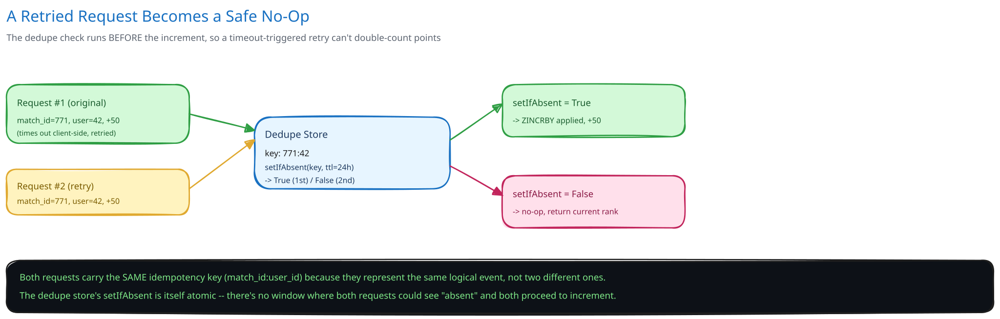
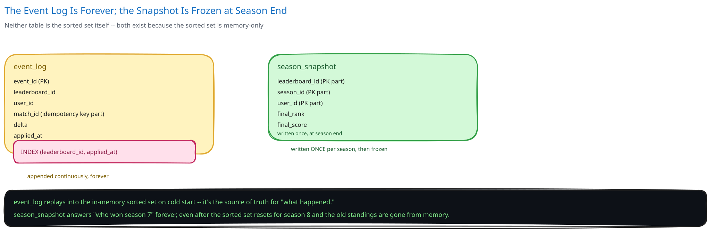

# Design a Real-Time Leaderboard


## Requirements

**Functional:**
- Submit a score update for a user on a given leaderboard (a specific game, season, or daily/weekly window).
- Query the top-K entries (e.g. top 100) for a leaderboard.
- Query a specific user's current rank, score, and the handful of players ranked just above/below them ("nearby").
- Support many independent leaderboards (per-game, per-season) that reset on a schedule.

**Non-functional** (stated as assumptions, interview-style):
- 50M daily active players, each finishing ~10 scored matches/day.
- Top-K and rank lookups are read FAR more often than scores are written — every app open re-renders the leaderboard.
- Rank queries need single-digit-millisecond latency; this is a screen users check constantly, not a batch report.
- A brief delay before a score change is reflected globally is acceptable; losing a score update, or getting an obviously wrong rank, is not.

## Capacity Estimation

Using this guide's [back-of-envelope method](../../foundations/back-of-envelope-estimation.md):

- **Writes:** 50M users x 10 matches/day = 500M score updates/day ≈ **~5,800/sec average**, with tournament-finale bursts pushing several times that for short windows.
- **Reads:** every app open re-fetches the leaderboard; at a conservative 5 opens/user/day that's 250M reads/day ≈ **~2,900/sec average** — but unlike writes, reads cluster heavily around the SAME few leaderboards (this week's, this season's), not spread evenly across all of them.
- **Working-set size:** a single global leaderboard with 50M members, each entry ~40 bytes (user ID + score) in a sorted-set structure, is ~2GB — small enough to keep entirely in memory, which is exactly what makes single-digit-millisecond rank queries possible at all.

## Approach Walkthrough

A sorted-set data structure (score-ordered, O(log N) insert, O(log N + K) range read) IS the leaderboard — not a cache in front of one. Every score update is an atomic increment against this structure; every top-K or rank query reads directly from it. A separate durable event log records every update so the sorted set can be rebuilt after a crash or failover, since the sorted set itself lives in memory.

## API Surface

- `POST /leaderboards/{id}/scores {user_id, match_id, delta}` -> `{rank, score}` — `match_id` is the idempotency key.
- `GET /leaderboards/{id}/top?limit=100` -> `[{user_id, score, rank}]`
- `GET /leaderboards/{id}/users/{user_id}` -> `{rank, score, nearby: [{user_id, score, rank}]}`

## High-Level Design

**Sorted-set store (the hot path)** — an in-memory sorted-set structure (e.g. Redis `ZSET`) holds `(user_id, score)` pairs kept in score order by a skip list, giving O(log N) writes and O(log N + K) range reads — precisely the two shapes a leaderboard needs (`ZINCRBY` for an atomic score bump, `ZREVRANGE` for top-K, `ZREVRANK` for a user's position). This is the system of record for "what's the leaderboard right now," not a cache (cross-ref [Caching Strategies](../../hld-building-blocks/caching-strategies.md) for how that distinction usually cuts the other way).

**Sharding by leaderboard ID** — each leaderboard (a specific game, season, or daily window) is independent and lives on its own shard, distributed by consistent hashing across the sorted-set nodes (cross-ref [Consistent Hashing](../../hld-building-blocks/consistent-hashing.md) and [Data Partitioning & Sharding](../../hld-building-blocks/data-partitioning-sharding.md)) — a hot single leaderboard doesn't slow down an unrelated one on a different shard.

**Replication for durability-in-memory** — each shard has replicas (cross-ref [Replication & Consensus](../../hld-building-blocks/replication-consensus.md), [DB Replication & Failover](../../database-design/db-replication-failover.md)); a primary failing over promotes a replica that already has the sorted set in memory from the replication stream, so a crash doesn't mean rebuilding 50M entries from scratch on the failover path.

**Durable event log** — every score update is also appended to a durable, append-only store `(event_id, leaderboard_id, user_id, match_id, delta, applied_at)`, independent of the in-memory sorted set. This is what makes the in-memory structure recoverable at all: a brand-new empty shard (after a total replica-set loss, or when spinning up a new region) replays this log to reconstruct the sorted set, rather than the sorted set being the ONLY copy of the data that exists.

**Load Handling.** Reads for a given leaderboard's top-K are identical for every requester at a given moment, so an application-level cache of the top-100 result with a 1-2 second TTL sits in front of the sorted-set store and absorbs a tournament-finale read storm — a staleness window measured in seconds is invisible to users refreshing a leaderboard, unlike a stale bank balance. Writes don't need this: `ZINCRBY`-style atomic increments execute inside the store's own single-threaded command processing, so write throughput scales by adding shards (more leaderboards, more nodes), not by adding request-side buffering.

**Concurrent-User Handling.** The obvious race — many users finishing matches at the same instant and updating scores concurrently — isn't actually a race at the data-structure level: each update targets one user's entry, and the sorted-set store's own command execution is atomic and ordered, so concurrent increments to DIFFERENT users never corrupt each other or the overall ordering. The real hazard is a SINGLE update being applied twice — a game server retries a "match finished, add 50 points" call after a timeout, and the first attempt actually succeeded — which this design closes with an idempotency key (`match_id:user_id`, cross-ref [Idempotency Keys](../../scalability-resilience/idempotency-keys.md)): the Leaderboard Service checks a short-lived dedupe record before applying the increment, so a retried request is a safe no-op rather than double-counted points.

## Low-Level Design



**Score-submit pseudocode:**
```
LeaderboardService.submitScore(leaderboard_id, user_id, match_id, delta):
    dedupe_key = f"{leaderboard_id}:{match_id}:{user_id}"
    if not DedupeStore.setIfAbsent(dedupe_key, ttl=24h):
        return currentRank(leaderboard_id, user_id)   # already applied; safe no-op

    new_score = SortedSet.increment(leaderboard_id, user_id, delta)   # atomic ZINCRBY
    EventLog.append(leaderboard_id, user_id, match_id, delta, now())   # durable, for replay
    return {rank: SortedSet.reverseRank(leaderboard_id, user_id), score: new_score}
```
The dedupe check and the increment are deliberately two separate steps against two different stores, not one transaction — losing the dedupe record after a successful increment (a cache eviction, say) only risks a rare double-count on a retried request, not a lost update, which is the safer failure direction for a leaderboard.

**Tie-breaking:** a sorted set alone breaks ties on insertion/member order, which usually isn't what a game wants (typically: whoever reached the tied score FIRST should rank higher). This is solved without any extra logic by encoding a single combined sort key — `sort_key = score * SCALE + (MAX_TIMESTAMP - achieved_at)` — so the structure's native ordering already reflects "higher score first, earlier achievement breaks ties," with no special-case comparison logic anywhere in the read path.

**Nearby-rank query:** `rank = SortedSet.reverseRank(id, user_id)`, then a single range read for `[rank-5, rank+5]` — one O(log N + 11) operation, not 11 separate rank lookups.

## Database Design & Scaling



- **Event log:** `(event_id, leaderboard_id, user_id, match_id, delta, applied_at)`, append-only, indexed on `(leaderboard_id, applied_at)` for ordered replay (cross-ref [Database Indexing](../../database-design/database-indexing.md)) — this table, not the in-memory sorted set, is the durable source of truth.
- **Season-end snapshot:** `(leaderboard_id, season_id, user_id, final_rank, final_score)`, written once when a leaderboard resets — since the sorted set is memory-only and gets wiped/reset for the next season, this is the only PERMANENT record of "who won season 7," separate from the append-only event log which just accumulates forever.
- **Scaling past one shard's capacity:** a single wildly popular leaderboard (a global all-time board, not scoped to a season) can outgrow one node's memory or CPU even with per-leaderboard sharding — split it further into N sub-leaderboards by hashing `user_id`, each maintaining its own top-K independently, and merge the N already-sorted top-K lists at query time (a bounded K-way merge over N*K items, not a scan of all N shards' full membership).

## Interviewer Q&A

**What happens when two requests hit the same resource at the same instant?**
Two concurrent score updates for the SAME user are naturally serialized by the sorted-set store's own atomic increment command — no external lock needed. The actual hazard is one logical update being submitted twice (a client retry), which the `match_id`-based idempotency key catches before the increment ever runs twice.

**What happens when traffic spikes 10x for an hour?**
This system's real spike is read-heavy, not write-heavy — a tournament finale means everyone refreshing the same handful of leaderboards. A short-TTL (1-2s) cache of each leaderboard's top-K in front of the sorted-set store absorbs the fan-in; a few seconds of staleness on a leaderboard nobody expects sub-second accuracy from is an acceptable trade, not a correctness bug.

**Why a sorted-set structure instead of `SELECT ... ORDER BY score DESC LIMIT 100` against a regular database?**
That query is O(N log N) to sort or relies on an index scan that still costs more than a purpose-built ordered structure with O(log N) inserts and O(log N + K) range reads — and computing a SPECIFIC user's rank ("what position is user X in") is a full scan-and-count in a plain relational table, versus a single O(log N) operation in a sorted set.

**Why keep a separate durable event log if the sorted-set store already replicates for HA?**
Replication protects against a single node failing, not against losing the ENTIRE replica set, a bad deploy that corrupts the in-memory structure, or needing to seed a brand-new region. The event log is the only copy that's independent of the in-memory structure's own failure modes — replication and the event log protect against different classes of loss.

**How would you reset a leaderboard for a new season without any downtime?**
Write to a NEW sorted-set key (`leaderboard:season8`) from the moment the new season starts, while `leaderboard:season7` keeps serving reads until its snapshot is taken — the reset is "start using a new key," not "clear the old one in place," so there's no window where reads race a clear operation.

**How would this scale to a leaderboard with a billion members, where even top-K needs to stay fast?**
Beyond a certain size, "exact rank for every user" stops being worth its cost — shard by `user_id` hash into many sub-leaderboards, keep exact top-K per shard, and for a given user's OWN rank, approximate it (sample-based percentile estimate) rather than computing an exact global rank across all shards on every request.

**Why is the idempotency key `match_id:user_id` rather than just `match_id`?**
A single match can produce score updates for multiple users (e.g. both players in a head-to-head match) — keying on `match_id` alone would let the SECOND player's legitimate update collide with the dedupe record from the first, silently dropping it.

**How would you support "nearby" (rank ± 5) without 11 separate rank lookups?**
Get the user's own rank once, then issue a single range read spanning `[rank-5, rank+5]` against the same sorted-set structure — one O(log N + 11) operation instead of 11 independent ones.
