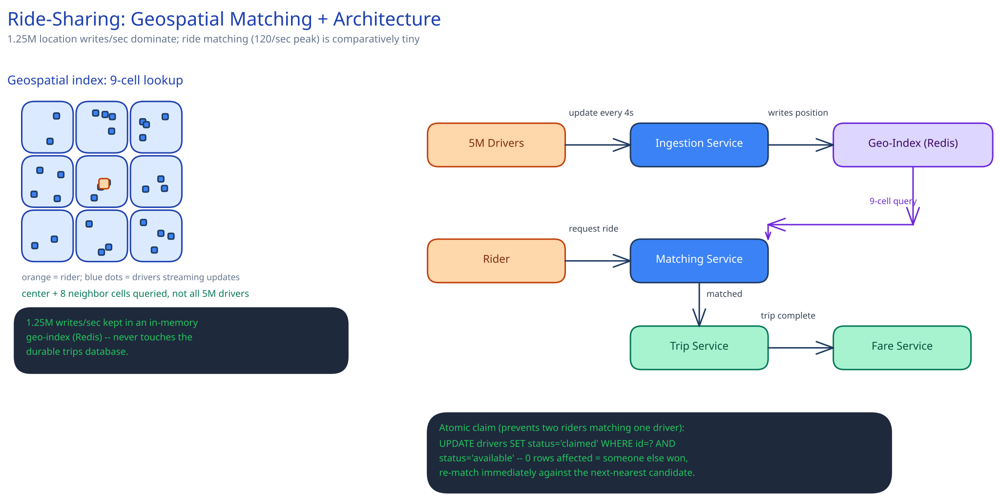

# Module 01 — Architecture & High-Level Design

**Location-ingestion service.** Every driver's app holds a persistent connection to a fleet of ingestion servers (the same stateful-connection shape as [Long Polling, WebSockets & SSE](../../scalability-resilience/long-polling-websockets-sse.md) describes) and streams `location.update` every 4 seconds. The ingestion tier's only job is to validate and forward each update into the geospatial index — it does not touch the matching decision at all.

**Geospatial index.** Drivers are bucketed by geohash cell (a string prefix that encodes a rectangular lat/lng region — precision length trades cell size against how many drivers land in one bucket). "Find nearby available drivers" becomes: compute the rider's cell, look up that cell plus its 8 neighbors, and scan only the drivers registered in those 9 buckets — a lookup against a few hundred candidates, never a scan of 5M.

**Matching service.** Given the candidate set from the geospatial index, rank by real distance/ETA and attempt to claim the nearest available one. Claiming is the one place this design needs to be careful — see Concurrent-User Handling below.

**Trip service.** Owns the trip state machine (`requested → matched → in_progress → completed`, detailed in Low-Level Design) and is the only writer of the trip's final fare record.

**Pricing/fare service.** Computes a fare estimate at request time (for the rider to see before confirming) and the final fare at trip end from actual distance/time plus a demand multiplier — kept as a separate service because pricing logic changes far more often than the trip state machine does, and shouldn't require redeploying the matching path to tweak a multiplier.

### Load Handling

The dominant load is the 1.25M/sec location stream, not ride requests (120/sec peak is noise by comparison). Ingestion scales horizontally by sharding drivers across ingestion instances by driver ID — adding capacity is adding instances, not a re-architecture. Under extreme load (an ingestion-tier outage in one shard, or a spike from a service disruption reconnecting the whole metro at once), the shedding order is deliberate and asymmetric: first reduce update frequency for drivers who are idle/parked (4s → 15s costs nothing real — a parked car isn't moving), then for active-but-far-from-any-pending-request drivers, and only as an absolute last resort degrade updates for drivers *currently on a trip*, since that's the one feed a rider is actively watching. Load-test target: sustain 1.5x peak ingestion (≈1.9M writes/sec) with p99 geospatial-index staleness still under 10 seconds.

### Concurrent-User Handling

The core race: two ride requests both compute the same driver as nearest-available and both try to claim them at the same instant. Resolution is an atomic claim — a conditional update (`UPDATE drivers SET status='claimed' WHERE id=? AND status='available'`) or a [distributed lock](../../scalability-resilience/distributed-locks.md) with a short TTL, either way checked-and-set in one atomic operation against the driver's status field. The request whose claim lands second sees zero rows affected (or fails to acquire the lock), and is immediately re-matched against the next-nearest candidate from the same cell lookup — not bounced back to the rider as a bare failure. A second, quieter race: a driver's location update arriving while that driver is mid-claim — the claim and the location write touch different fields and don't conflict, but the matching service should treat a driver's position as a snapshot taken at claim time, since re-reading it after the claim could show them already a block away.
