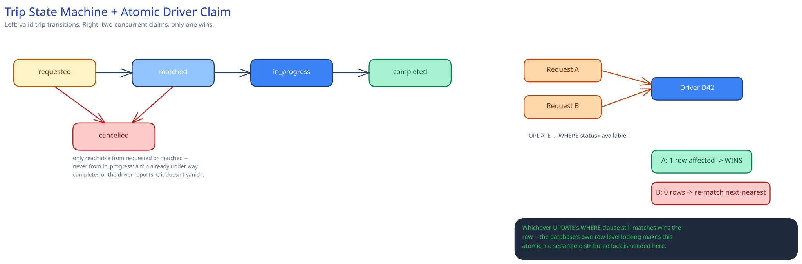

# Module 02 — Low-Level Design



**Trip state machine** (explicit states, not a boolean):

```
requested -> matched -> in_progress -> completed
                |
                +-> cancelled (rider or driver, only from requested/matched)
```

A transition is only valid from its named predecessor state — `in_progress -> completed` directly from `requested` is rejected, which catches a class of bugs (a duplicate "complete" event replayed out of order) for free.

**Geospatial lookup, pseudocode:**

```
function findNearbyDrivers(riderLat, riderLng):
    cell = geohash_encode(riderLat, riderLng, precision=6)
    candidateCells = [cell] + neighboring_cells(cell)
    candidates = []
    for c in candidateCells:
        candidates += geoIndex.get(c)  # drivers currently registered in this cell
    return candidates.filter(status == "available")
           .sortBy(realDistanceTo(riderLat, riderLng))
```

**Atomic claim, pseudocode:**

```
function claimDriver(driverId, rideId):
    result = db.execute(
        "UPDATE drivers SET status='claimed', claimed_by=? WHERE id=? AND status='available'",
        rideId, driverId
    )
    return result.rowsAffected == 1   # false means someone else claimed it first
```
