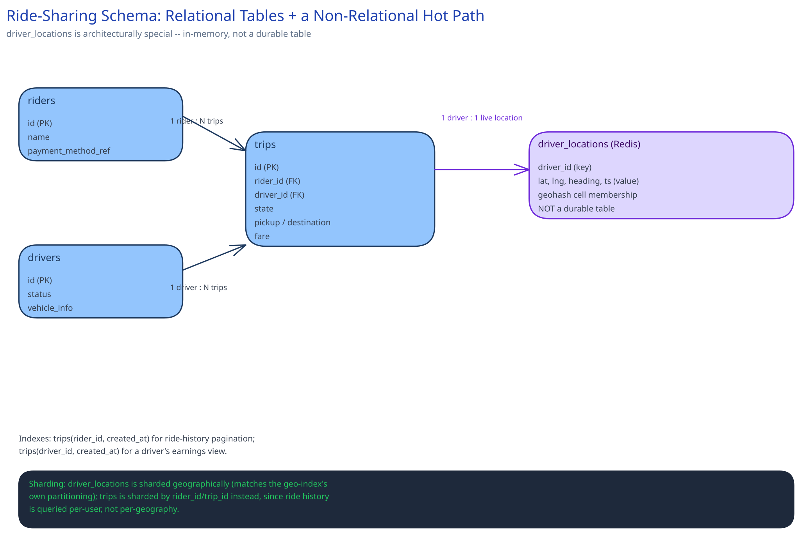

# Module 03 — Database Design & Scaling

- **`drivers`** — id, current status, vehicle info. Small, low write-rate, a normal relational table.
- **`riders`** — id, profile, payment method reference.
- **`trips`** — id, rider_id, driver_id, state, pickup/destination, fare. The durable, ACID-sensitive record of what actually happened.
- **`driver_locations`** — architecturally *not* a normal table. At 1.25M writes/sec of data that's stale in 4 seconds anyway, this belongs in an in-memory store (Redis, holding each driver's latest position plus geohash-cell membership) rather than a durable relational table — the same reasoning [Object / Blob Storage](../../scalability-resilience/object-blob-storage.md) applies to "don't default to the primary DB for a workload with fundamentally different characteristics." Nothing about ride history needs the 4-seconds-ago position once the trip is over.

**Sharding:** `driver_locations` is sharded geographically — a metro area's drivers stay in one shard, matching the geospatial index's own partitioning, so a nearby-driver lookup never has to fan out across shards (see [Data Partitioning & Sharding](../../hld-building-blocks/data-partitioning-sharding.md)). `trips` is sharded by `rider_id` or `trip_id` instead, since trip history is queried per-user, not per-geography, and geographic sharding would scatter one rider's trip history across every metro they've ever ridden in.

**Indexes:** `trips(rider_id, created_at)` for ride-history pagination; `trips(driver_id, created_at)` for a driver's earnings view. No index on `driver_locations` in the relational sense — the geohash bucket structure in Redis *is* the index.
