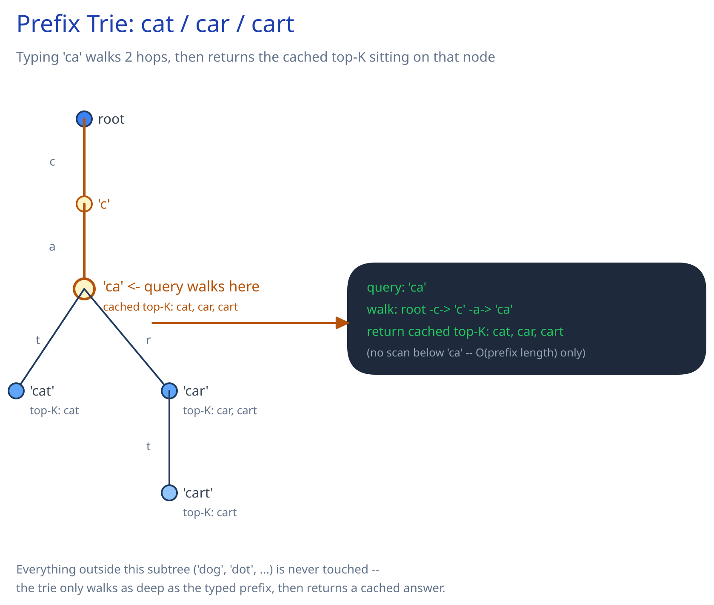

# Module 00 — Overview

## The feature, with no infrastructure in it yet

A user types "sal" into a search box, one character at a time, and after each keystroke a ranked list of completions appears — "salad", "salmon", "salary" — before they've finished typing the word. The hard constraint that makes this an interesting design problem isn't the ranking logic, it's the clock: **this endpoint fires on every single character, not once on submit**, and it has to answer inside roughly the time a human notices a UI lag. A search results page that takes 400ms feels normal; a search *box* that lags 400ms per keystroke feels broken.

## Requirements

**Functional:**
- Given a partial, in-progress query (a prefix), return the top-K most likely completions, ranked by how often people actually search for them — not just any string match.
- Keep rankings fresh as search trends shift, without making every keystroke a write.
- Optionally personalize results using a user's own recent search history.

**Non-functional** (stated, not guessed):
- p99 suggestion latency under **100ms** per keystroke.
- Global vocabulary: **50M** distinct indexed search phrases, average length ~18 characters.
- Freshness: a brand-new trending term should surface in autocomplete within minutes, not hours — but a few minutes of staleness is an explicit, accepted trade, not a bug.

## Capacity Estimation

Using this guide's [back-of-envelope method](../../foundations/back-of-envelope-estimation.md):

- **Search sessions:** 200M/day, each averaging ~4 keystroke-triggered suggestion requests after client-side debouncing → **800M suggestion requests/day**.
- **Requests/sec, average:** 800M / 86,400 ≈ 9,260/sec. At a 5x peak factor (evening browsing peak, a viral moment): **~46,300/sec peak**. This is the number that rules out a database on the read path — see below.
- **Vocabulary size in memory:** 50M phrases × ~18 characters, with heavy prefix sharing (many words share the first several characters) — a rough 4-5x compaction factor from sharing puts the trie at **~200M nodes**. At ~150 bytes/node (child pointers, end-of-word flag, and a cached top-10 list on branching nodes), that's **~30-40GB** — too big for one commodity instance's comfortable working set, small enough to replicate across a handful of memory-optimized instances (see Architecture & HLD's prefix-range sharding).
- **Frequency-feed log volume:** roughly 1 "search selected" event per session (not per keystroke) → 200M/day ≈ **2,300 writes/sec average** into the async pipeline — two orders of magnitude below the read path, which is exactly the point of decoupling them.

## Approach Walkthrough

The one hard problem this design has to solve: answer "what comes after this prefix" in the time it takes to render a keystroke, at a rate where a database index simply cannot keep up (see below). The fix is to stop treating this as a database problem at all — build a data structure, held entirely in memory, whose lookup cost depends only on the length of what's typed so far, never on how much data exists behind it. Freshness (which terms are currently popular) is then handled as a completely separate, slower, asynchronous concern layered on top, so the read path never has to choose between being fast and being consistent with the very latest trends.

## Why a database query per keystroke doesn't work

The naive version — `SELECT query FROM search_terms WHERE query LIKE 'sal%' ORDER BY frequency DESC LIMIT 10` — run live against a table, on every keystroke, from every typing user, breaks two ways at once. It's slow: a B-tree ([Database Indexing](../../database-design/database-indexing.md)) supports an exact-match or a fixed-length range efficiently, not an arbitrary-and-growing prefix scan re-run on every keystroke. And it's wasteful: thousands of different users typing "sal" a second apart all re-derive the identical top-10 answer from scratch, every time, because nothing remembers the answer between requests. At the ~46,300/sec peak above, this also just isn't a load a shared relational index survives.

## A genuinely different problem from full-text search

[Search & Inverted Indexes](../../scalability-resilience/search-inverted-indexes.md) solves "which documents contain this exact word" — a whole-token containment problem, served by a word → document-list mapping. Autocomplete asks something else: "which known queries *start with* these few characters" — a prefix-match problem. An inverted index's keys are complete words; it has no notion of "everything starting with these three letters" as a single lookup. That's not a smaller version of the same problem, it needs its own structure — the trie, covered next.

## API Surface

- `GET /autocomplete?q={prefix}&limit=10` → `{suggestions: [{term, score}]}` — the hot path, called on every keystroke, read-only, no request body.
- `POST /internal/search-events {raw_query_text, normalized_term, session_id}` — fired once per completed/selected search (not per keystroke), feeding the async frequency pipeline. Never on the same request path as a suggestion lookup.
- No update/delete surface for individual terms exposed to clients — ranking only moves via the batch pipeline (see Architecture & HLD), never a direct per-term write.
