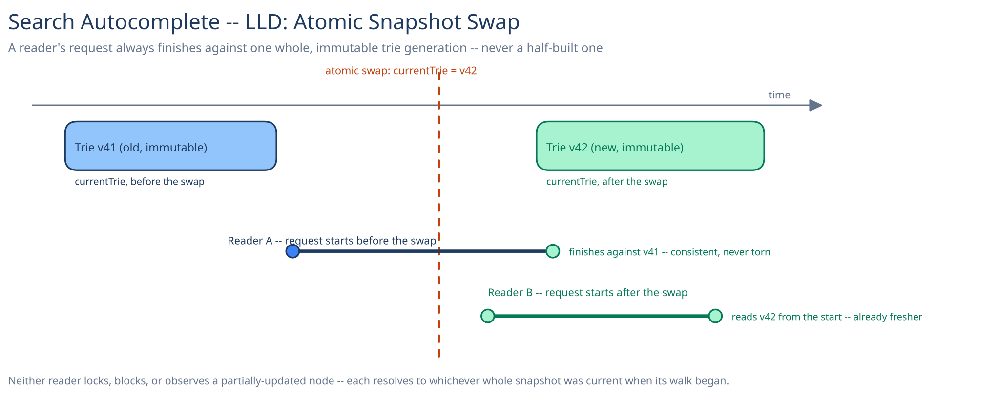

# Module 02 — Low-Level Design



## Interfaces vs. implementations

- **`TrieService`** *(interface)* → **`InMemoryTrieService`** — `lookup(prefix, limit)`, `loadSnapshot(snapshotRef)`. The only component that actually walks trie nodes; everything else depends on this interface, never on the node structure directly.
- **`ShardRouter`** *(interface)* → **`PrefixRangeRouter`** — `route(prefix) → shardId`, a pure function of the prefix's leading character(s) against a small, rarely-changing range table.
- **`SnapshotStore`** *(interface)* → **`BlobSnapshotStore`** — `latest() → snapshotRef`, `fetch(snapshotRef) → bytes`. Backed by object storage, never a database (see [Module 03](03-db-design.md)).
- **`TermFrequencyRepository`** *(interface)* → **`LogBackedFrequencyRepository`** — `countSince(checkpoint) → Map<term, count>`, the Frequency Aggregator's only dependency for reading the search-event log.
- **`PersonalizationBlender`** *(interface)* → **`RecentSearchBlender`** / **`NoopBlender`** — `blend(baseResults, userRecentSearches, limit) → results`, swappable independently of the base ranking.
- **`AutocompleteService`** — the orchestrator. Depends on all of the above, implements none of the storage or ranking logic itself.

## Pseudocode for the read path

```
AutocompleteService.suggest(prefix, limit, user):
    shard = router.route(prefix)                    # first char(s) -> shard id, no fan-out
    trie = shard.currentTrie                         # single atomic reference read
    node = trie.walk(prefix)                         # O(len(prefix)), read-only traversal
    if node is None:
        return []                                    # no known term starts with this prefix
    base = node.cachedTopK[:limit]
    if user is not None:
        return personalizer.blend(base, user.recentSearches, limit)
    return base
```

`shard.currentTrie` is read exactly once at the top of the call, into a local variable — every subsequent step in this call walks *that* reference, even if `currentTrie` is reassigned by a concurrent snapshot swap a moment later. That single read is what makes the whole method race-free without a lock (see Concurrency below).

## Pseudocode for the batch rebuild

```
FrequencyAggregator.rebuild(checkpoint):
    counts = frequencyRepo.countSince(checkpoint)     # closed window, not a live stream
    newTrie = TrieBuilder.build(vocabulary, counts)    # built off to the side, never exposed yet
    for node in newTrie.branchingNodes():
        node.cachedTopK = topK(termsInSubtree(node), counts, K=10)
    snapshotRef = snapshotStore.publish(newTrie)       # write the full blob, then the manifest row
    return snapshotRef

TrieServingReplica.pollForUpdate():
    latest = snapshotStore.latest()
    if latest != this.loadedVersion:
        newTrie = snapshotStore.fetch(latest)          # pulled and fully deserialized first
        this.currentTrie = newTrie                     # single atomic reference write -- the swap
        this.loadedVersion = latest
```

The `updateStatus`-style discipline this guide uses elsewhere for conditional writes has an analog here even though there's no database row: `currentTrie = newTrie` only ever happens *after* `newTrie` is completely built and fully deserialized — never a field-by-field mutation of a structure already live and being read.

## Error cases worth designing for deliberately

- **Prefix with no matches** (the walk hits a dead end partway through): `node is None` is a normal, common outcome — return an empty list, not an error. The vast majority of arbitrary typed prefixes ("qzx") legitimately have zero completions.
- **A replica receiving traffic before its snapshot has finished loading:** a cold-started replica must not enter the load balancer's rotation until `loadSnapshot` fully completes — a readiness check gates this, not a try/catch around a partially-loaded structure.
- **A never-before-seen term** typed by a user isn't in any published snapshot yet: the read path simply returns nothing for that specific full term (though shorter, shared prefixes may still match other known terms) until the next batch cycle incorporates it — this is Module 01's accepted staleness window surfacing at the code level, not a special case to handle.

## Concurrency at the code level

**No lock is needed on `TrieNode.cachedTopK` reads**, and this is worth stating precisely: the live trie in memory is fully immutable once built — every write to a node happens only inside `TrieBuilder.build()`, on a structure that has never been assigned to `shard.currentTrie` and therefore no reader can possibly be traversing. Concurrent readers never contend with each other or with the builder, because they're never touching the same generation the builder is still writing to.

**The one place a real guard is needed:** the reference reassignment itself, `currentTrie = newTrie`. This has to be an atomic reference write (a language-level atomic, e.g., Java's `AtomicReference` or Go's `atomic.Value`) so that a reader captures either the fully-old or the fully-new trie at the top of `suggest()` — never a torn, half-updated pointer. This is the same push-the-atomicity-requirement-down-to-the-one-thing-that-can-actually-provide-it-for-free principle this guide applies to database rows elsewhere ([distributed job scheduler](../distributed-job-scheduler/01-architecture-hld.md)'s claim-conditional-update is the same idea, one layer down): find the single primitive operation the runtime already guarantees, and build correctness on top of exactly that, instead of adding a lock around a much larger critical section.

## Design patterns you just used, named

- **Repository pattern** — `SnapshotStore` and `TermFrequencyRepository` hide storage details; `AutocompleteService` and `FrequencyAggregator` never touch a blob API or a log query directly.
- **Strategy pattern** — `PersonalizationBlender` is a strategy: `NoopBlender` and `RecentSearchBlender` are interchangeable behind one interface, and adding a smarter blend later (collaborative filtering, say) is a new strategy, not a rewrite of `suggest()`.
- **Builder pattern** — `TrieBuilder` constructs an entire new generation off to the side, fully formed, before it is ever exposed to a reader — the classic build-then-publish shape.
- **Copy-on-write / immutable snapshot** — not a GoF pattern by name, but the load-bearing one here: never mutate the live structure in place, always build a complete new copy and swap a single reference. It's what turns "concurrent reads and writes on the same object" into "concurrent reads of one object, and independent writes to a different, not-yet-visible object."

## Practice: extend it yourself

1. **Typo tolerance without rewriting the trie.** A pure prefix walk hits a dead end the instant a user mistypes one character. Sketch where you'd insert an edit-distance fallback pass when `trie.walk(prefix)` returns `None` partway through — does it live inside `TrieService`, or as a separate step `AutocompleteService` falls back to, and why does that boundary matter for testing each piece independently?
2. **A faster "trending now" signal**, reacting within minutes instead of waiting for the next full batch cycle, without turning the read path synchronous. Where would a lightweight, fast-moving trending boost blend in — inside `PersonalizationBlender` alongside per-user signal, or as its own pluggable step — and what's the smallest change to `suggest()`'s pseudocode above that accommodates it without adding a network call to the hot path?

Neither has one clean answer — the point is noticing that the interfaces already drawn (`TrieService`, `PersonalizationBlender`) make it obvious which component *should* own each new piece of behavior, even before you've fully worked out what that behavior is.
