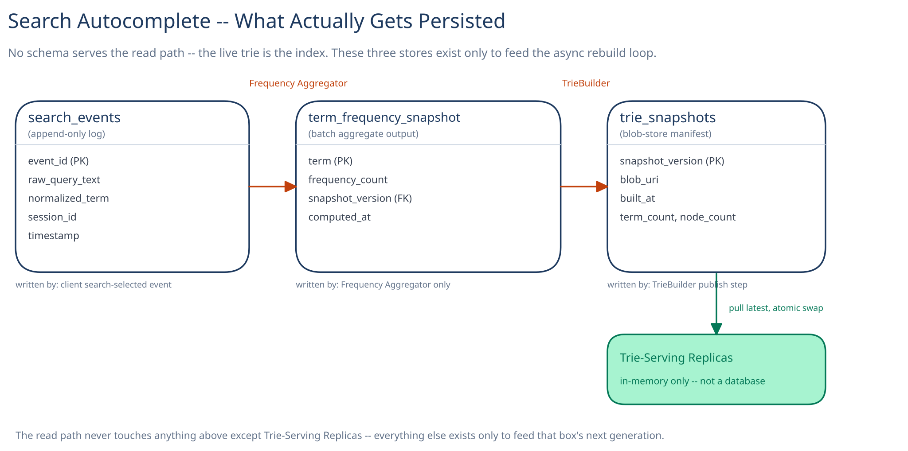

# Module 03 — Database Design & Scaling

## This system's real "database" is a data structure in memory, not a schema

Say this plainly rather than forcing the guide's usual entity-relationship treatment onto a system that doesn't have one: **the live trie is the index.** There is no query-per-request against a persistent store on the read path at all — that's the entire premise of Module 01. A relational or document representation of the trie itself would silently reintroduce the exact cost this whole design exists to avoid (Overview's "why a database query per keystroke doesn't work") — every lookup would still be a network round trip to a store, however efficiently indexed. So this module covers only what still legitimately needs durable storage: the raw signal feeding the next trie generation, and the versioned artifact that generation produces. Nothing here serves a suggestion request.

## From entities to schema

Three things fall out of the async pipeline directly — none of them read by a user-facing request:

- **`search_events`** `(event_id, raw_query_text, normalized_term, session_id, timestamp)` — an append-only log of completed/selected searches, written once per session, never updated.
- **`term_frequency_snapshot`** `(term, frequency_count, snapshot_version, computed_at)` — the Frequency Aggregator's aggregate output for one rebuild cycle; input to `TrieBuilder`, never queried by anything downstream of that.
- **`trie_snapshots`** `(snapshot_version, blob_uri, built_at, term_count, node_count)` — a manifest row per published trie generation; the pointer Trie-Serving Replicas poll to find "the latest complete one."

## Why `search_events` is append-only, not an in-place counter

Incoming events are cheap, out-of-order-tolerant appends — any log-shaped store handles millions of these per second without contention. Updating a running per-term counter *in place* on every event, by contrast, would make the single most popular search term a write hotspot: every one of its occurrences serializes against the same counter row, at exactly the volume where that would hurt most. Appending and aggregating later in a batch (a groupby over a time window) turns a per-event write-contention problem into a periodic, parallelizable scan — the same shape [Module 01](01-architecture-hld.md) already chose for the read path's freshness mechanism, applied one layer down to the storage itself.

## Why the trie snapshot lives in blob storage, not a database

A full trie snapshot is a large, single, query-pattern-free blob — fetched whole, by one key (its version), never partially queried. That's exactly the shape [Object / Blob Storage](../../scalability-resilience/object-blob-storage.md) already argues belongs outside a primary database, the same reasoning this guide applies to a web crawler's fetched pages. A database would add transactional overhead this workflow doesn't need: replicas just pull one complete object and swap a pointer (see [LLD](02-lld.md)) — there's no row to update, no transaction to commit, just a whole-file read.

## Indexes

Since nothing here serves live user traffic, these support the batch job and cold-start replicas, not request latency:

- `search_events(timestamp)` — the aggregation job's core query is "everything since the last checkpoint," a range scan this index turns into an index range scan instead of a full table scan as the log grows into the billions of rows.
- `search_events(normalized_term, timestamp)` — the groupby-by-term step within that window benefits from term-clustering directly, rather than re-deriving groups from unsorted raw text every run.
- `trie_snapshots(built_at DESC)` — a cold-started replica's poll query is always "the newest one"; this index turns that into a cheap single-row lookup instead of a scan.

## Consistency

- **`search_events`:** eventually consistent, deliberately. An event delayed or lost by seconds doesn't change correctness — it changes which batch cycle picks it up, the same staleness window [Module 01](01-architecture-hld.md) already names as acceptable.
- **`term_frequency_snapshot` / `trie_snapshots`:** need to be complete-or-absent, never partially visible — solved not by a database transaction but by upload discipline: the blob is written in full, and the manifest row (or pointer) is only created *after* that upload succeeds. This is the same all-or-nothing publish discipline as the atomic pointer swap in [LLD](02-lld.md), just one layer further out, at the storage boundary instead of in-process.
- **The live in-memory trie:** not a database consistency question at all. Every replica within a shard eventually converges on the same snapshot version, on its own independent poll schedule — different replicas being a few minutes apart in which version they're serving is an explicitly accepted trade (Module 01's Load Handling), not a bug to fix with coordination.

## Scaling the schema

- **`search_events` scales by time, not by a hash key.** A new partition per hour or day matches the query pattern exactly ("recent window"), and this is a volume problem, not a hot-key problem — unlike most write-heavy tables in this guide, there's no single row anything contends on.
- **The trie's own sharding is an architecture decision, not a schema one.** Prefix-range sharding (Module 01) partitions the *serving* structure; it has nothing to do with how `search_events` or `trie_snapshots` are laid out, since those are write-light, read-light-by-humans stores that don't need to mirror the serving topology.
- **Read replicas don't apply the usual way here.** `search_events` is written once and read only by the batch job on its own schedule — there's no user-facing read-replica story to build. The "replication" that actually matters in this system is replicating the *snapshot blob* to every region and every Trie-Serving Replica, not adding database read replicas.

## Connecting it back

Trace it end to end: [Module 00](00-overview.md)'s "answer inside 100ms, on every keystroke" requirement is why [Module 01](01-architecture-hld.md) moves serving out of a database entirely and into process memory, which is why this module has almost nothing that looks like a conventional schema — only the two things still legitimately durable, the raw signal (`search_events`) and the versioned artifact it eventually produces (`trie_snapshots`). Every design choice above (append-only over in-place counters, blob storage over a database row, time-based partitioning over a hash key) exists to keep the batch path cheap and out of the way — never to make the read path faster, because the read path was never touching any of this in the first place. That the DB design module for a "search" feature has no query the user's request ever runs is itself the clearest evidence the core architectural bet actually paid off.
