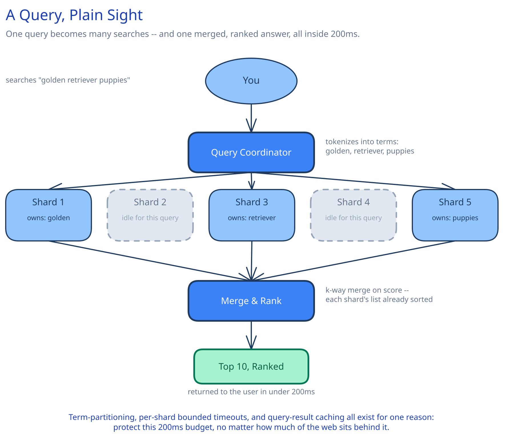

# Module 00 — Overview

## Requirements

**Functional:**
- Crawl the web and keep an index of pages fresh as they change.
- Given a text query, return a ranked list of the most relevant pages within a tight latency budget.
- Support basic query operators (phrase match, exclusion) — full natural-language understanding is out of scope for this pass.

**Non-functional** (stated as assumptions, interview-style):
- 10 billion pages indexed.
- 100,000 search queries/sec average across all users.
- p99 query latency under 200ms — a query answered slowly is worse than one answered slightly-stale, so serving latency wins over serving freshness whenever the two trade off.
- Pages don't need to appear in results the instant they're crawled; a lag of hours to a day between crawl and searchability is acceptable for most of the web, with a faster path reserved for high-value/rapidly-changing sources.

## Capacity Estimation

Using this guide's [back-of-envelope method](../../foundations/back-of-envelope-estimation.md):

- **Query rate:** 100,000/sec average. At a 3x peak factor (time-zone-clustered daytime usage): **~300,000/sec peak.**
- **Index size:** assume an average page contributes roughly 2KB of indexed terms (postings, not the raw page). 10B pages x 2KB = **~20TB** for the core inverted index — large enough that it cannot live on one machine, which is the whole reason sharding is this design's centerpiece, not an afterthought.
- **Crawl rate:** to fully refresh 10B pages on, say, a 30-day cycle: 10B / (30 x 86,400) ≈ **~3,900 pages/sec** sustained crawl throughput (cross-ref [Web Crawler](../web-crawler/README.md) for the politeness/dedup mechanics that actually deliver this rate).
- **Query fan-out cost:** each incoming query, if the index is sharded N ways, becomes N shard-level lookups — at 300,000 peak queries/sec and, say, 100 shards, that's 30M shard-level operations/sec across the fleet, which is the real number the serving tier has to be provisioned against, not the 300,000 client-facing figure.

## Approach Walkthrough

A page becomes searchable through three stages that run at very different speeds and don't block each other: crawling (continuous, politeness-limited, [Web Crawler](../web-crawler/README.md)'s job), indexing (turning crawled pages into an inverted index the query path can actually use, [Search & Inverted Indexes](../../scalability-resilience/search-inverted-indexes.md)'s job), and serving (answering a query against whatever index snapshot currently exists). A query, at request time, becomes a fan-out to every shard of the index that might hold a matching term, a per-shard ranked result set, and a merge of those partial results into one final ranked list — all within the 200ms budget.

## API Surface

- `GET /search?q={query}&page={n}` -> `{ results: [{url, title, snippet, score}], totalEstimate }`
- Internal: `POST /index/documents` (indexer -> shard, batch document upserts), `POST /crawl/seed` (add URLs to the crawl frontier).
