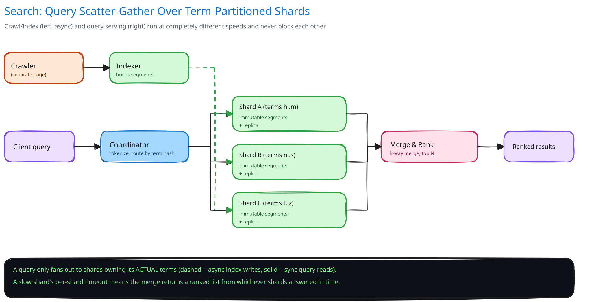

# Module 01 — Architecture & High-Level Design

**Crawler tier** — cross-ref [Web Crawler](../web-crawler/README.md) directly for the frontier/politeness/dedup mechanism; not re-derived here.

**Indexer** — consumes crawled pages, tokenizes, and builds inverted-index postings (cross-ref [Search & Inverted Indexes](../../scalability-resilience/search-inverted-indexes.md)) — asynchronously, off the query-serving path entirely, via a queue ([Message Queues & Pub/Sub](../../hld-building-blocks/message-queues-pubsub.md)) so indexing throughput and query-serving throughput scale independently.

**Ranking** — two signals combined: a query-independent authority score (a PageRank-style signal computed offline, in a periodic batch job over the link graph, since it barely changes page to page) and a query-dependent relevance score (TF-IDF or BM25 against the matched terms, cross-ref [Search & Inverted Indexes](../../scalability-resilience/search-inverted-indexes.md)'s mention of both by name). The offline signal is precomputed and stored WITH each document's postings, so the query path never computes it live.

**Index sharding** — the 20TB index is partitioned across shards by **term hash** (not by document): every posting list for a given term lives entirely on one shard. This means a single-term query only needs to fan out to the one shard owning that term, but a multi-term query needs results from every shard owning any of its terms, then an intersection/merge — the trade-off named explicitly in [Data Partitioning & Sharding](../../hld-building-blocks/data-partitioning-sharding.md): the shard key is chosen to match the dominant query pattern (multi-term queries against a term-partitioned index), accepting fan-out cost on the queries that don't fit it perfectly.

**Query-result caching** — identical or near-identical queries recur constantly (cross-ref [Caching Strategies](../../hld-building-blocks/caching-strategies.md)); a cache in front of the ranking/merge step absorbs a large fraction of the 300,000/sec peak before it ever reaches a shard.

**Load Handling.** The dominant cost under load is the shard fan-out multiplier, not the raw query count — a single popular multi-term query touching 20 shards at 300,000 peak queries/sec is 6M shard operations/sec from that one query pattern alone. Query-result caching absorbs repeat queries before fan-out happens at all; beyond that, [Backpressure, Load Shedding & Bulkheads](../../scalability-resilience/backpressure-load-shedding.md) applies directly — a slow or overloaded shard gets a bounded per-shard timeout, and the merge step returns a ranked list built from whichever shards answered in time rather than blocking the whole query on the single slowest shard (a partial-but-fast result beats a complete-but-late one against a 200ms budget). Load-test target: sustain 300,000 queries/sec with p99 under 200ms for 10 minutes, including a simulated single-shard slowdown.

**Concurrent-User Handling.** The read path (queries) and write path (index updates) touch the same shards concurrently, and they don't need to serialize against each other: a shard's index segment is updated by appending a new immutable segment and only atomically swapping which segment set is "current" for queries once the new segment is fully built — a query reading mid-build never sees a half-written segment, and no query-side lock is needed at all, since the swap itself is the only synchronization point (cross-ref [Distributed Locks](../../scalability-resilience/distributed-locks.md) for why a lock held on every read would be the wrong tool here: reads vastly outnumber writes, so the design puts the coordination cost entirely on the rare write side).
