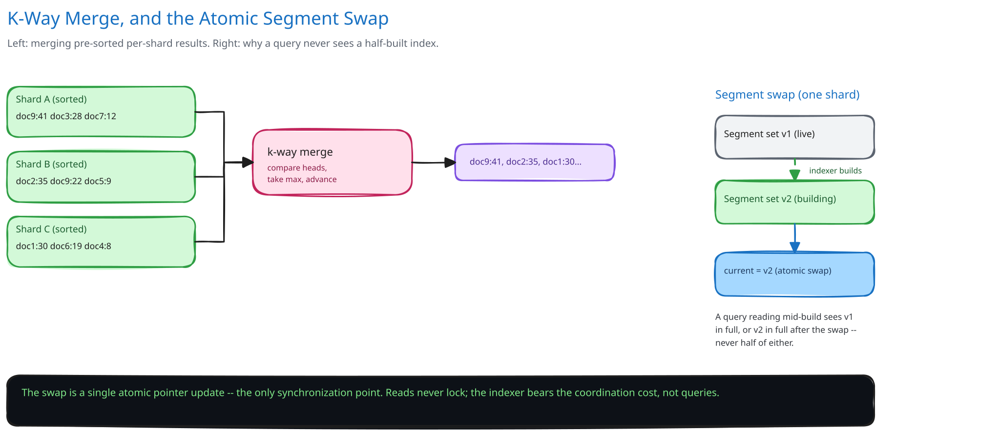

# Module 02 — Low-Level Design



## Interfaces vs. implementations

- **`IndexShardClient`** *(interface)* → **`GrpcIndexShardClient`** — `searchLocal(terms, timeout)`, returning a locally-ranked partial result set; the Coordinator depends only on this interface, never on how a shard actually stores or searches its postings.
- **`RankingStrategy`** *(interface)* → **`BM25RankingStrategy`** / **`TFIDFRankingStrategy`** — combines the offline authority score with a query-dependent relevance score into one final ranking score, swappable without touching the Coordinator or any shard.
- **`URLFrontier`** *(interface)* → **`PriorityURLFrontier`** — `claim(url)` (a conditional claim, see Concurrent-User Handling), `enqueue(url, priority)`.
- **`Crawler`** — depends on `URLFrontier` and a `PageFetcher` interface, implements neither storage nor networking itself.

## Scatter-gather query execution

```
Coordinator.search(query):
    terms = tokenize(query)
    shard_ids = { shardFor(term) for term in terms }   # term-hash routing

    partial_results = []
    for shard_id in shard_ids (in parallel, each with a bounded timeout):
        partial_results.append(Shard[shard_id].searchLocal(terms))
        # a shard that times out contributes nothing; it does not block the others

    merged = mergeAndRank(partial_results)   # k-way merge on score, since each
                                               # partial result is already locally sorted
    return merged.top(pageSize)
```
The merge is a k-way merge, not a full re-sort: each shard already returns its own locally-ranked top results, so combining N already-sorted lists into one final ranked list is `O(total results x log N)`, not `O(total results log total results)`.

**Indexer segment build**, briefly: new documents accumulate into an in-memory buffer; once it reaches a size threshold, it's flushed as a new immutable on-disk segment, and the shard's "current segment set" pointer is swapped to include it — the same immutable-segment-plus-atomic-swap pattern named above, which is what lets indexing and querying proceed concurrently without a shared lock.

## Concurrency at the code level

`Coordinator.search()` issues N parallel shard calls with no shared mutable state between them — each `searchLocal` call is independent, so there is nothing to lock inside the Coordinator itself. The only synchronization point anywhere in the read path is each shard's own atomic segment-pointer swap, and that's owned entirely by the indexing side; a query thread never touches it. This is the same discipline this guide applies everywhere two writers might race for the same resource: push the atomicity requirement down into the one place that actually needs it, and leave everything else lock-free. It's also why "Coordinator" is a slightly generous name — it merges and ranks, but there is nothing for it to coordinate in the sense of synchronizing concurrent access, since the shards it calls share no state with each other.

## Design patterns you just used, named

- **Strategy pattern** — `RankingStrategy` is the textbook case: BM25 and TF-IDF are interchangeable behind one interface, swappable without the Coordinator or any shard changing.
- **Repository pattern** — `IndexShardClient` hides how a shard actually stores and searches its postings behind a single method call.
- **Scatter-gather** — not a classic Gang-of-Four pattern, but the core structural pattern of the entire query path: fan identical work out to N independent workers, gather and merge their results, and tolerate partial failure from any one of them.

## Practice: extend it yourself

Before moving to Database Design, sketch (pseudocode is fine) how you'd add:

1. **Typo-tolerant matching** — this guide's [Search Autocomplete](../search-autocomplete/README.md) case study answers the identical question for its trie by layering a fuzzy-match pass on top rather than rebuilding the core structure. Where does that pass sit here — inside the Coordinator, or as a new pre-processing stage in front of it — and does `RankingStrategy` need to know a substitution happened?
2. **Personalized ranking** — a logged-in user's click history nudges their own results. Does this become a third input to `RankingStrategy`, alongside offline authority and query relevance? And what does it do to the query-result cache's key, given the entire premise of caching was that many different users' identical queries could share one cached answer?

Neither has one clean answer — the point is noticing that the interfaces already drawn (`RankingStrategy`, `IndexShardClient`) make it obvious which component *should* own each new piece of behavior, even before you've fully worked out what that behavior looks like.
