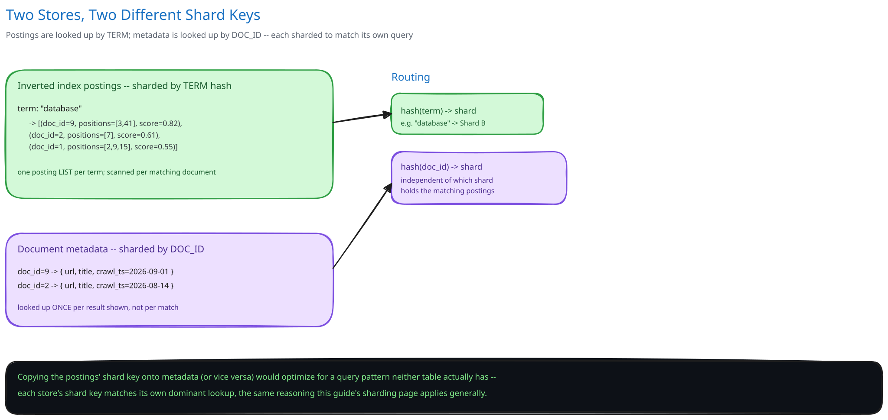

# Module 03 — Database Design & Scaling

- **Inverted index (per shard):** `term -> [(doc_id, positions, offline_score)]` postings, term-hash-sharded as described above.
- **Document metadata store:** `doc_id -> {url, title, crawl_timestamp, snippet_source}` — separate from the postings themselves, since metadata is looked up once per RESULT (a handful of rows) while postings are scanned per MATCHING document (potentially millions) — different access pattern, same reasoning [`ecommerce-schema-worked-example.md`](../../database-design/ecommerce-schema-worked-example.md) uses to split `inventory` from `products`.
- **Crawl frontier and dedup store:** owned entirely by the crawler tier, cross-ref [Web Crawler](../web-crawler/00-overview.md) — not part of the serving path at all.
- **Replication:** each shard is replicated (cross-ref [Database Replication & Failover](../../database-design/db-replication-failover.md)) so a single node failure doesn't take an entire term-range out of the index; the coordinator routes a shard's query to any healthy replica.

## Indexes

Worth being explicit about what "index" actually means in this case study, since it's easy to conflate with a conventional database index: **the inverted index itself IS the index** — `term -> [(doc_id, positions, offline_score)]` postings are the entire data structure the query path exists to search, not a secondary structure accelerating lookups into some other primary table. There is no un-indexed version of this data sitting somewhere else; the postings ARE the primary store for search, and building them well (term-hash partitioned, positions retained for phrase queries, the offline score precomputed and stored inline) is most of this system's actual database design.

The **document metadata store**, by contrast, is much closer to a conventional table, and it needs its own conventional index: `doc_id` as its primary key, matching its access pattern exactly — a handful of lookups per result, never a scan. That mismatch in access pattern (scan-heavy postings vs. point-lookup-heavy metadata) is the whole reason the two are split rather than stored together in the first place.

The **crawl frontier** needs one more index worth naming: a lookup on the URL itself (or its hash) for the dedup check in Concurrent-User Handling — a claim-before-fetch check that has to be fast and exact, since it's the one piece of this schema where a race produces a real duplicate, not just staleness.

## Consistency

- **Inverted index (postings):** consistency here is really a **freshness** question, not a classic ACID one — a query always sees whichever segment set was "current" at the atomic swap instant, so it's never a torn read, but it can be hours-to-a-day stale relative to the live web. That staleness window is an explicitly accepted trade from Module 00's requirements: serving latency wins over serving freshness whenever the two conflict.
- **Document metadata:** effectively the same freshness story as the postings, since a document's metadata and its postings are written together during the same indexing pass — they never drift independently of each other.
- **Crawl frontier / dedup store:** needs to be strongly consistent specifically for the "has this URL already been claimed" check (Concurrent-User Handling's second race) — a race here produces a genuine duplicate fetch and duplicate indexing work, not merely a staleness window like the postings tolerate.

## Scaling the schema

Sharding, once volume demands it, follows the same term-hash key already established: adding shards means re-hashing the term space across a larger shard count, redistributing postings but never changing the query path's fan-out logic. The document metadata store scales independently — by `doc_id`, or simply replicated broadly, since it's far smaller than the postings and its own access pattern (point lookups by `doc_id`) doesn't benefit from term-based sharding at all.

## Connecting it back

Trace the chain across all three modules: Module 00's "serving latency beats serving freshness" requirement is why indexing runs asynchronously off a queue instead of blocking crawls; that same requirement is why the postings' segment swap is the *only* synchronization point in the entire design, keeping every query lock-free; and it's why the document-metadata split exists at all — two different access patterns (per-result lookup vs. per-match scan) getting two different storage shapes, rather than one table trying to serve both well. Term-hash sharding, the offline/online ranking split, and the bounded-timeout partial-merge in Architecture & HLD are all downstream of the same one non-functional requirement stated at the very start. Nothing in this schema is arbitrary.
