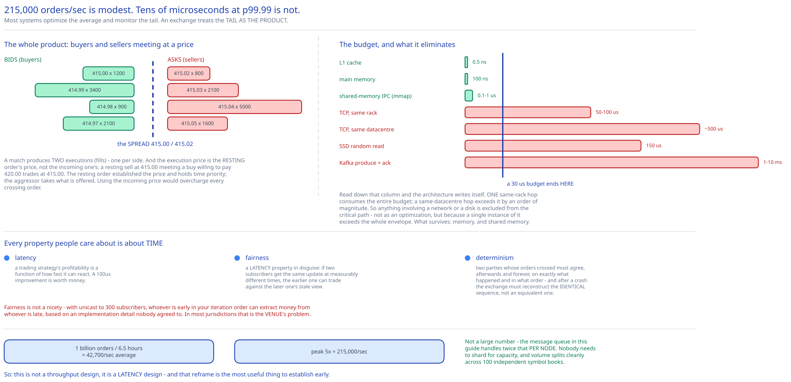

# Module 00 — Overview



## The feature, with no infrastructure in it yet

Someone wants to buy 100 shares of MSFT at no more than $415. Someone else wants to sell 100 at no less than $415. The exchange's job is to notice, pair them, and tell both parties it happened.

That's it. And the reason it's a hard system rather than a simple one is that **every property people actually care about is about time.**

- **Latency**, because a trading strategy's profitability is a function of how fast it can react. Not "fast enough to feel responsive" — fast in a way where a 100-microsecond improvement is worth money.
- **Fairness**, which is a *latency* property in disguise: if two subscribers receive the same price update at measurably different times, the earlier one can trade against the later one's stale view. That's not a performance bug, it's market manipulation you've enabled.
- **Determinism**, because two parties whose orders crossed must be able to agree, afterwards and forever, on exactly what happened and in what order. And after a crash the exchange must reconstruct the identical sequence, not an equivalent one.

Those three make this design unusual among everything else in this guide. Most systems here optimize average throughput and treat p99 as a quality metric. **An exchange treats the tail as the product** — a system with excellent median latency and an occasional 10ms garbage-collection pause is unusable, because the pause lands on somebody's order and they lose money.

The consequence is an architecture that looks backwards at first glance: the entire critical path runs **on one machine**, in **one thread**, with **no network hops, no database, and no logging**. [Module 03](./03-latency-determinism.md) derives why that's forced rather than eccentric.

## Requirements

**Functional:**
- Place and cancel **limit orders** (a price and a quantity). Market orders are out of scope, stated to bound the problem.
- **Match** buy and sell orders, producing two *executions* (fills) per match — one for each side.
- Stream **market data** in real time: the order book (L1/L2/L3) and candlestick charts.
- **Risk checks** before an order is accepted (e.g. no more than 1M shares of one symbol per client per day).
- **Wallet integration** — verify funds exist and withhold them while an order is live.
- **Reporting** for trading history, tax, compliance and settlement.

**Non-functional:**
- **Latency: tens of microseconds** round trip, measured at **p99 and p99.99**, not the mean. The tail *is* the requirement.
- **Throughput:** 100 symbols, 1 billion orders/day.
- **Availability: 99.99%** — about 8.6 seconds of downtime per trading day. An outage during market hours is a reputational and regulatory event.
- **Determinism:** given the same input sequence, the system must produce byte-identical output. This is what makes recovery, replay and dispute resolution possible.
- **Fairness:** every market-data subscriber must receive an update at the same instant, within the limits of physics.
- **Security & compliance:** KYC, audit trail, DDoS resistance on public endpoints.

## Capacity Estimation

Method from [Back-of-the-Envelope Estimation](../../foundations/back-of-envelope-estimation.md).

**Throughput**
- Trading hours 09:30–16:00 = **6.5 hours** = 23,400 seconds.
- 1B orders ÷ 23,400 s ≈ **42,700 orders/sec** average.
- Peak at 5× (the open and the close are dramatically busier than midday) ≈ **215,000 orders/sec**.
- Per symbol: 215,000 ÷ 100 ≈ 2,150/sec, though volume concentrates heavily in a few names.

215,000 orders/sec is **not a large number** by the standards of other systems in this guide — the [message queue](../distributed-message-queue/00-overview.md) handles twice that per node. Saying this out loud early is useful, because it reframes the problem correctly: **this is not a throughput design, it's a latency design.** Nobody needs to shard for capacity. They need one machine to answer in 20 microseconds.

**The latency budget, which is where the architecture comes from**

| Operation | Time |
|---|---|
| L1 cache reference | 0.5 ns |
| Main memory reference | 100 ns |
| **Shared-memory IPC (`mmap`)** | **0.1–1 µs** |
| **TCP round trip, same rack** | **50–100 µs** |
| TCP round trip, same datacenter | ~500 µs |
| Cross-region round trip | 150 ms |

Now put the target beside it. **Tens of microseconds, end to end.** A single same-datacenter network hop costs ~500 µs — **an order of magnitude over the entire budget, for one hop.** Even a same-rack hop at 75 µs consumes the whole budget by itself.

So the arithmetic dictates the architecture: **every component on the critical path must communicate without touching a network.** Shared memory is 100–1000× faster than the cheapest network hop available. That is the single measurement this whole design is built on, and it's why an exchange is one of the few remaining systems where "put it all on one big server" is the *sophisticated* answer rather than the naive one.

**Storage**
- 1B orders/day at ~200 bytes ≈ **200 GB/day** of order events, plus executions.
- Retained for compliance (typically 7 years) → ~500 TB, archived to object storage.
- But note: **nothing on the critical path writes to a database.** Persistence happens via the event log and the reporter, both off the hot path. Cross-ref the [object storage](../object-storage-s3/00-overview.md) case study for the archive.

**Market data fan-out**
- The order book for an active symbol updates thousands of times per second, and every update goes to every subscriber. With hundreds of subscribers, unicast would mean hundreds of copies of every update — which is both a bandwidth problem and, more importantly, a **fairness** problem, since the first subscriber written to receives it before the last. [Module 04](./04-market-data-ha.md#fairness-is-a-latency-property) resolves this with multicast.

## Business vocabulary you need

Interviewers use these without explanation, so they're worth having precisely:

- **Limit order** — buy/sell at a specified price *or better*. May not fill immediately; may fill partially.
- **Market order** — no price specified; fills immediately at whatever the book offers. Out of scope here.
- **Bid** — the highest price a buyer will pay. **Ask** (or offer) — the lowest price a seller will accept.
- **Spread** — the gap between best bid and best ask. A tight spread means a liquid market.
- **The order book** — all resting (unfilled) orders for a symbol, organized by price level.
- **Execution / fill** — a completed match. One match produces **two** fills, one per side.
- **Broker** — the intermediary between an end user and the exchange (Robinhood, Fidelity). The exchange's clients are brokers, not individuals.
- **L1 / L2 / L3 market data** — increasing depth: L1 is best bid/ask only; L2 adds several price levels; L3 adds the individual queued orders at each level.
- **Candlestick** — open/high/low/close plus volume over an interval. Derived from the execution stream.
- **FIX** — the Financial Information eXchange protocol, the industry standard for order messages. A pipe-delimited tag=value format, ugly and universal.
- **Colocation** — a broker renting rack space *inside* the exchange's datacenter to shave microseconds off their round trip. A revenue stream, and a fairness question.

## Approach Walkthrough

Three ideas, and the second is the one that makes the design work.

**1. The order book is an in-memory data structure, not a database table.** Matching means repeatedly asking "what's the best bid?" and "add this order at this price level" and "cancel this order id" — and all three must be O(1). [Module 02](./02-matching-engine.md) builds it: a map from price to price-level, and a doubly-linked list of orders within each level.

**2. A sequencer stamps every inbound order and every outbound fill with a monotonic ID, and that sequence *is* the definition of what happened.** This is the keystone. Once the order of events is an explicit, recorded fact rather than an emergent property of concurrent execution, three separate requirements collapse into one mechanism:
   - **Determinism** — replaying the sequence reproduces the identical state, because matching is a pure function of (book, next order).
   - **Fairness** — "first come, first served" becomes checkable, because arrival order is recorded rather than inferred.
   - **Recovery** — a crashed engine rebuilds by replaying the sequence, and a hot standby stays in lockstep by consuming the same sequence.

   It's the same state-machine-replication idea as the [digital wallet](../digital-wallet/03-event-sourcing-cqrs.md), reached from a completely different requirement.

**3. Everything on the critical path lives in one process address space, on one server, communicating through `mmap`'d shared memory.** Forced by the latency budget above. The consequence is that horizontal scaling is *not available* on the hot path, so the design instead strips the critical path down to the minimum — no logging, no database writes, no risk-service RPC — and moves everything else off it.

Off the critical path, ordinary architecture resumes: market data publishing, reporting, settlement and archival are all normal distributed systems with normal latency requirements.

## API Surface

Brokers use **FIX** for order flow (a binary/proprietary protocol for the lowest-latency clients), and REST for everything else.

```
POST /v1/order
  { symbol, side: BUY|SELL, price: 41500, quantity: 100, orderType: LIMIT }
  → 200 { id, creationTime, filledQuantity, remainingQuantity, status: NEW|PARTIALLY_FILLED|FILLED }
  → 429 risk limit exceeded  |  402 insufficient funds

DELETE /v1/order/{id}
  → 200 { status: CANCELED }
  → 409 CANNOT_CANCEL_ALREADY_MATCHED     ← a real and common outcome

GET /v1/execution?symbol=&orderId=&startTime=&endTime=
  → { executions: [{ id, orderId, symbol, side, price, quantity }] }

GET /v1/marketdata/orderBook/L2?symbol=MSFT&depth=10
  → { bids: [[price, size], …], asks: [[price, size], …] }

GET /v1/marketdata/candles?symbol=MSFT&resolution=60&startTime=&endTime=
  → { candles: [{ open, high, low, close, volume, timestamp }] }
```

Three API details worth noticing:

**Prices are integers.** `41500` means $415.00 in hundredths. Same reasoning as the [digital wallet](../digital-wallet/00-overview.md#api-surface): floating point cannot represent decimal prices exactly, and in a system where a price comparison decides whether two orders match, a representation error is a wrong match.

**Cancel can legitimately fail with `409`.** An order you're cancelling may have filled microseconds ago. This isn't an error condition to be engineered away — it's the honest expression of a race the client must handle, and pretending otherwise (by, say, blocking cancels during matching) would cost latency to hide a truth.

**The order response reports `filledQuantity` and `remainingQuantity` separately**, because a limit order can partially fill. A single-status API can't express "I bought 60 of the 100 I asked for and the other 40 are still resting in the book."

## Where this goes next

| Module | The question it answers |
|---|---|
| [01 · Architecture & HLD](./01-architecture-hld.md) | What are the boxes, and which flows are on the critical path versus off it? |
| [02 · The Matching Engine](./02-matching-engine.md) | **What data structure makes add/match/cancel all O(1)?** And which orders match first? |
| [03 · Latency & Determinism](./03-latency-determinism.md) | **How do you get to tens of microseconds?** One box, one thread, `mmap`, no logging — and why the sequencer makes it replayable. |
| [04 · Market Data & High Availability](./04-market-data-ha.md) | **How does every subscriber get the price at the same instant?** Multicast, ring buffers, and hot-standby failover. |
| [05 · DB Design](./05-db-design.md) | What's persisted, where, and why none of it is on the hot path. |
| [06 · Interviewer Q&A](./06-interviewer-qna.md) | The ten follow-ups this design invites. |
