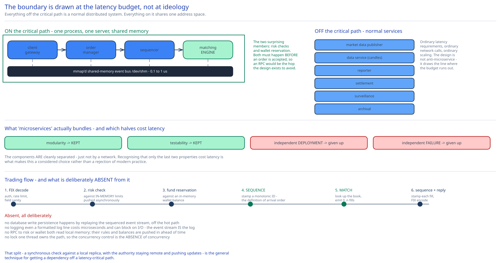

# Module 01 — Architecture & High-Level Design



## Monolith vs. microservices

This is the guide's clearest case for a monolith, and the argument is arithmetic rather than taste.

[Module 00](./00-overview.md#capacity-estimation) established the budget: **tens of microseconds end to end**, against a same-rack TCP round trip of **50–100 µs**. So *one* network hop consumes the entire budget. A microservice decomposition of the critical path — gateway service → order service → risk service → matching service — would spend four hops, 300 µs, and miss the requirement by an order of magnitude before doing any actual work.

So the critical path is **one process, on one server, with components communicating through `mmap`'d shared memory at 0.1–1 µs.** That's 100–1000× cheaper than the cheapest network hop available, and it's the only way the numbers close.

Two things worth being precise about, because "it's a monolith" is the easy half of the answer:

**The components are still cleanly separated — just not by a network.** Client gateway, order manager, sequencer and matching engine are distinct modules with distinct responsibilities, communicating over a well-defined shared-memory event bus. You get modularity, testability and independent reasoning; you give up independent *deployment* and independent *failure*. Recognising that "microservices" bundles those four properties together — and that only the last two are what cost latency — is what makes this a considered choice rather than a rejection of modern practice.

**Everything not on the critical path is a normal distributed system.** Market data publishing, reporting, settlement, surveillance and archival are separate services over the network with ordinary latency requirements. The design isn't anti-microservice; it draws the boundary at the latency budget:

| On the critical path (shared memory, one box) | Off the critical path (network, separate services) |
|---|---|
| Client gateway | Market data publisher |
| Risk checks (in-process, pre-loaded limits) | Data service (candlesticks, historical queries) |
| Wallet reservation (in-process cache) | Reporter (trade history, tax, compliance) |
| Sequencer | Settlement |
| Order manager | Surveillance / market-abuse detection |
| **Matching engine** | Archival to object storage |

The most surprising members of the left column are risk checks and wallet reservation. Both look like obvious separate services — they own their own data and their own rules — but both must happen **before** an order is accepted, so an RPC for either would put a network hop on the hot path. The resolution is that their *rules and balances* are pushed into the trading process's memory ahead of time and updated asynchronously, so the *check* is a memory read while the *authority* stays elsewhere. That split — synchronous check against a local replica, asynchronous truth — is the general technique for getting a dependency off a latency-critical path.

## Per-path walkthrough

**Trading flow (the critical path)**

```
Broker → Client gateway            [FIX decode, auth, rate limit, sanity-check the fields]
       → Order manager             [risk check against in-memory limits; reserve funds
                                    against the in-memory wallet balance]
       → Sequencer                 [stamp a monotonic sequence ID — THE definition of arrival order]
       → Matching engine           [look up the book for this symbol; match against the
                                    opposite side; emit 0..n fills]
       → Sequencer                 [stamp each outbound fill]
       → Order manager             [update order state: NEW → PARTIALLY_FILLED → FILLED]
       → Client gateway            [FIX encode] → Broker

   All arrows above are shared-memory writes, not network calls.
   Total budget: tens of microseconds.
```

Notice what is **absent** from this path, all deliberately:

- **No database write.** Persistence happens by replaying the sequenced event stream, off the hot path.
- **No logging.** Even a formatted log line costs microseconds and can block on I/O. The event stream *is* the log, and it's written by a separate consumer.
- **No RPC to a risk or wallet service.** Both checks read local memory.
- **No lock.** One thread owns the path ([Module 03](./03-latency-determinism.md#one-thread-pinned-to-one-core)).

**Market data flow (off the critical path)**

```
Matching engine → (shared memory) → Market data publisher
   → build/maintain the L2/L3 order book snapshot and deltas
   → build candlesticks from the execution stream (ring buffer, Module 04)
   → MULTICAST to all subscribers simultaneously   ← fairness, Module 04
   → Data service ← in-memory columnar store for historical/aggregate queries
```

The publisher **reconstructs** the order book from the execution and order stream rather than being handed the engine's own book. That looks wasteful and is deliberate: it keeps the matching engine free of any responsibility for serving readers, and it means the publisher can be restarted, scaled or changed without touching the engine. It also provides a **continuous correctness check** — if the publisher's independently-reconstructed book ever diverges from the engine's, something is badly wrong and you want to know.

**Reporting flow (off the critical path)**

```
Sequencer's event stream → Reporter → relational DB → (nightly) archive to object storage
   fields: client_id, symbol, price, quantity, order_type, filled_qty, remaining_qty, timestamps
```

Latency is irrelevant here; **accuracy and completeness are not.** Compliance requires that every order and fill be recorded, so the reporter is the one downstream consumer whose lag must be monitored and whose gaps are an incident.

**Recovery flow**

```
Matching engine crashes
   → hot standby (already consuming the same sequenced stream) has identical state
   → promote it; it begins publishing outbound events at the next sequence
   → the failed engine, on restart, replays the event stream from its last snapshot
```

This works **only** because matching is deterministic ([Module 03](./03-latency-determinism.md#determinism-is-what-makes-everything-else-possible)). If the engine's output depended on wall-clock time or thread interleaving, a standby consuming the same inputs would reach different state, and promoting it would produce a book that disagrees with what brokers were told.

## Building blocks

**Client gateway** — FIX/binary decode, authentication, rate limiting, field validation. Deliberately *thin*: it's on the critical path, so every feature added here is latency spent. There are typically several gateways for different client classes, including a **colo gateway** for brokers renting space in the exchange's datacenter.

**Order manager** — owns order lifecycle state (`NEW → PARTIALLY_FILLED → FILLED | CANCELED`), performs risk checks and fund reservation against in-memory replicas. Packaged as a **library linked into every critical-path component** rather than a service, so that "what's the state of order X?" is a memory read from wherever the question arises, not a call.

**Sequencer** — stamps a monotonic ID on every inbound order and outbound fill. Conceptually a message queue, and deliberately *not* Kafka: a Kafka round trip is milliseconds, three orders of magnitude over budget. It's a single-writer append into shared memory.

**Matching engine** (the "cross engine") — maintains one order book per symbol and produces fills. [Module 02](./02-matching-engine.md).

**Market data publisher** — reconstructs the book, builds candlesticks, multicasts to subscribers. [Module 04](./04-market-data-ha.md).

**Reporter, settlement, surveillance** — off-path consumers of the event stream, each a normal service.

**Risk manager** — the *authority* for risk rules, pushing limits into the trading process asynchronously. Its rules are consulted in memory; it is never called synchronously.

## Trade-offs to make explicit

| Decision | Chosen | Alternative | Why |
|---|---|---|---|
| Critical-path topology | **One process, one server, shared memory** | Microservices over the network | One same-rack hop is 50–100 µs against a total budget of tens of µs. Four hops miss by 10×. The arithmetic doesn't leave a choice. |
| Sequencer | **Custom, in shared memory** | Kafka or another message queue | Kafka's round trip is milliseconds — three orders of magnitude over budget. Kafka is the right *concept* (an ordered log) at the wrong *latency class*. |
| Risk & wallet checks | **In-process, against async-updated local state** | Synchronous RPC to a risk/wallet service | An RPC would be the network hop the whole design exists to avoid. The check reads a local replica; the authority stays remote and pushes updates. |
| Logging on the hot path | **None** | Structured logs per order | Formatting and I/O cost microseconds and can block. The sequenced event stream *is* the audit log, consumed off-path. |
| Persistence on the hot path | **None** | Write each order to a DB before acknowledging | Recovery comes from replaying the deterministic event stream plus a hot standby, not from a synchronous durable write. |
| Threading | **Single thread, pinned to a core** | Thread pool per symbol | Locks, context switches and cache eviction all produce tail latency, and the tail *is* the requirement. Serial execution also gives determinism for free. |
| Market data transport | **Multicast (reliable UDP)** | Unicast TCP per subscriber | With unicast, the first subscriber written to receives the update before the last — a measurable, exploitable information advantage. This is a fairness requirement, not an efficiency one. |
| Market data book | **Reconstructed independently by the publisher** | Engine hands over its own book | Keeps reader-serving responsibility out of the engine, allows independent restart, and gives a continuous cross-check on engine correctness. |
| Order book storage | **In-memory linked structures** | A database table with indexes | Add/match/cancel must be O(1) and measured in nanoseconds. A B-tree lookup plus a transaction is 4–6 orders of magnitude too slow. |

## Load Handling

- **Peak-vs-average.** 42,700 orders/sec average, ~215,000 peak — but the shape matters more than the ratio. **Volume is extremely concentrated at the open and the close**, and further concentrated in a handful of symbols. A design tuned for the average is comprehensively broken at 09:30:00.

- **Where backpressure kicks in first.** At the **client gateway's inbound queue.** The matching engine's single thread is the system's serialization point, so if order arrival exceeds match throughput, the queue grows. The right response is emphatically *not* to grow the queue — a deep queue means orders execute against a stale book, which is worse than rejection because the client believes their order is live. So the gateway **rejects** rather than buffers past a shallow bound. Cross-ref [Backpressure & Load Shedding](../../scalability-resilience/backpressure-load-shedding.md).

- **What gets shed under overload**, in order:
  1. **Public/retail market data queries** — the REST endpoints. Cacheable, and their consumers tolerate staleness.
  2. **New order submissions**, per client, by rate limit. Rejecting an order is honest; queuing it is a lie about liveness.
  3. **Never shed: cancels.** This is the important inversion. Under overload a client's most urgent need is to *withdraw* exposure, not add it. A system that sheds cancels while accepting orders is actively dangerous — it traps clients in positions they're trying to exit. Cancels get priority over new orders, always.
  4. **Never shed: in-flight fills.** A match that occurred must be reported. Both sides are legally committed.

- **Symbol partitioning as the scaling axis.** One engine thread per symbol group, so 100 symbols can be split across cores or boxes. This works *because symbols are independent* — MSFT's book never interacts with AAPL's, so there is no cross-symbol ordering requirement to preserve. That independence is the design's one free lunch, and it's why 215k orders/sec is comfortable: it's really 100 independent streams of ~2,150/sec.

- **Autoscaling: none, on the critical path.** You cannot add a matching engine for a symbol mid-session — there is exactly one authoritative book per symbol, and a second engine would fork it. Capacity is provisioned for peak, permanently. Off-path consumers autoscale normally.

- **Load-test target.** Replay a historical market-open sequence at 5× volume against 100 symbols and assert **p99.99 under 100 µs** (not p99 — the tail is the product), with **zero GC pauses** on the critical path and **zero orders queued more than 1 ms**. Separately: kill the primary engine mid-burst and confirm the standby's book is byte-identical and failover completes within the availability budget.

## Concurrent-User Handling

| Race | Mechanism | What the "loser" sees |
|---|---|---|
| Two orders arrive for the same symbol at the same instant | The **sequencer** assigns a total order, and the single engine thread processes them serially. Arrival order becomes an explicit recorded fact rather than an emergent one. | Whichever is sequenced second matches against the book *as the first left it*. No lock, and fairness is auditable because the sequence is recorded. |
| A cancel and a match race for the same order | Both are sequenced. If the match's sequence is lower, the order is gone by the time the cancel is processed. | `409 CANNOT_CANCEL_ALREADY_MATCHED`. A real, common, correct outcome — not a bug to be engineered away. |
| Two orders at the same price both want to match one resting order | **Price-time priority**: within a price level, the earlier-sequenced order matches first ([Module 02](./02-matching-engine.md#matching-algorithms-price-time-priority)). | The later order matches against whatever remains, or rests in the book. The FIFO queue at each price level makes this deterministic. |
| The engine is matching while the publisher reads the book | The publisher never touches the engine's memory — it consumes the **sequenced event stream** and maintains its own copy. | Nothing. The publisher is at most a few events behind, and its independence is what makes it a cross-check rather than a coupling. |
| The primary and standby engines both believe they're primary | Leadership is a **lease with an epoch**; outbound publication is gated on holding it. A deposed primary's events are rejected by downstream consumers as stale-epoch. | The deposed engine may still *process* inbound events (harmlessly, into its own memory) but cannot publish. Fencing is what prevents two books diverging in public. |
| A client's risk limit is consumed by two concurrent orders | Risk state is in the same single-threaded process, so consumption is serial. | The second order sees the already-decremented limit and is rejected with `429`. Single-threading makes this a non-race. |

## Scaling & Reliability

- **Horizontal scaling** exists only across symbols (independent books) and across off-path consumers. Within a symbol, scaling is **vertical and algorithmic** — a faster CPU, better cache behaviour, fewer instructions per order. That's a genuinely unusual position and worth stating plainly rather than glossing.

- **Circuit breaker** — two senses, and both apply. The software kind wraps off-path dependencies (settlement, reporting). The *market* kind is a regulatory halt: if a symbol moves more than X% in Y minutes, trading in it stops. That's a business rule implemented in the engine, and it's the one place where the engine deliberately refuses to match.

- **Retries** — brokers retry order submission on timeout, which makes **client-supplied order IDs mandatory**: without idempotency on the order ID, a retried submission becomes a second, duplicate order in the book, and a duplicate order that fills is a real position the client didn't want. Cross-ref [Idempotency Keys](../../scalability-resilience/idempotency-keys.md).

- **Dead-letter queue** — for off-path consumers only. An event the reporter can't process goes to a DLQ, and because the reporter's completeness is a compliance obligation, a non-empty DLQ is an incident rather than a debugging aid.

- **Graceful degradation:**
  1. **An off-path consumer fails** (reporter, surveillance) → trading continues; the event stream buffers. Compliance gaps accumulate, so there's a bounded window before this becomes serious.
  2. **The market data publisher fails** → trading continues, but subscribers are blind. In practice this is nearly as bad as an outage, because trading against an unknown book is something most participants will refuse to do. Worth naming: "trading continues" is technically true and commercially hollow.
  3. **The primary matching engine fails** → the hot standby is promoted. Determinism guarantees its book is identical.
  4. **The whole primary server fails** → a warm standby *server* takes over, with the event stream replicated to it by reliable UDP. Slower failover, and the exposure is bounded by replication lag.
  5. **Quorum/leadership uncertainty** → the exchange **halts the affected symbols.** Deliberate: an exchange that can't be certain which book is authoritative must stop trading rather than risk two divergent books being published. Halting is embarrassing; publishing two conflicting books is a regulatory catastrophe.

- **Multi-region.** Not for the critical path, and not because it's hard — because it's *wrong*. A cross-region hop is 150 ms, four orders of magnitude over budget, and more fundamentally an exchange is defined by a single authoritative order of events for a symbol, which is exactly what geographic distribution cannot provide. Disaster recovery is a **standby datacenter** for resuming after a catastrophe, not an active-active deployment. Real exchanges accept that a regional disaster means a trading halt.

## What you'd revisit as this grows

- **Colocation is a fairness problem the design creates and doesn't solve.** [Module 04](./04-market-data-ha.md#fairness-is-a-latency-property) goes to real lengths to make market data arrive simultaneously — then colocation sells brokers the right to be physically closer, reintroducing a latency advantage as a product. It's defensible (the advantage is bounded and openly purchasable rather than hidden) but it is not *fair* in the sense the multicast design implies, and pretending otherwise is dishonest.

- **Only limit orders are supported.** Market orders, stop orders, iceberg orders and fill-or-kill each change the matching logic, and iceberg orders in particular (where displayed quantity hides true size) interact awkwardly with the L3 market data feed that's supposed to show queued orders.

- **Single-symbol books cannot scale within a symbol.** If one symbol's volume exceeded a single core's capacity, there is no answer in this design — you cannot split a book without forking the authoritative order of events. The mitigations are all hardware or algorithmic, and eventually you run out of both.

- **No self-trade prevention.** A client whose buy and sell orders match each other creates a wash trade, which is a regulatory violation. Detecting it requires a check in the matching path, which costs latency — a genuine conflict between the compliance requirement and the design's core constraint, and this design hasn't priced it.

- **GC pauses are asserted away rather than engineered away.** The load test demands zero GC pauses, and the honest implication is that the critical path must be written in a language without a stop-the-world collector, or in a carefully allocation-free style. That's a language-and-discipline requirement masquerading as a test criterion, and it deserves to be stated as an architectural constraint.
