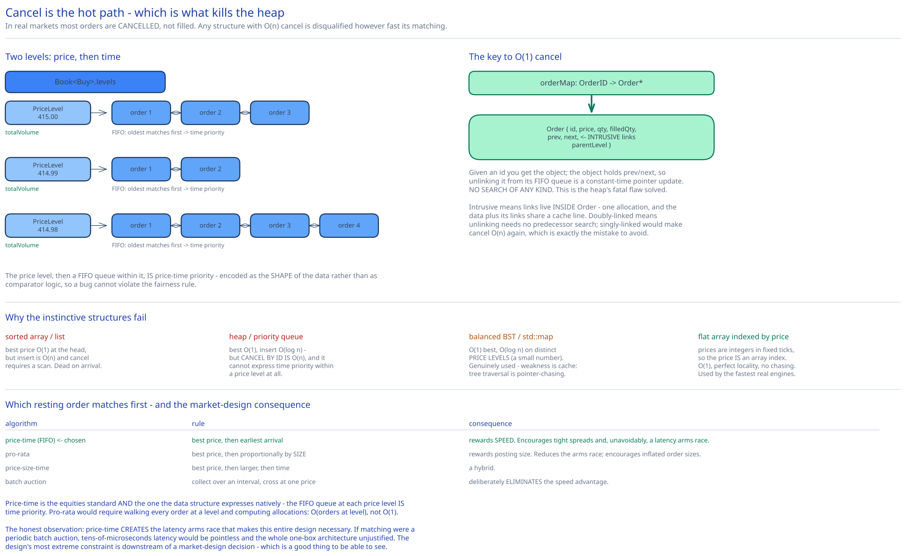

# Module 02 — The Matching Engine



The matching engine is the exchange. Everything else exists to feed it or to tell people what it did.

## What the data structure has to do

Four operations, and the frequencies are wildly uneven:

| Operation | Frequency | Required |
|---|---|---|
| **Add** a resting order to the book | Very high | O(1) |
| **Match** an incoming order against the best opposite price | Very high | O(1) per fill |
| **Cancel** an order by id | **Very high** — most orders are cancelled, not filled | **O(1)** |
| **Query** best bid/ask, or N levels of depth | High (market data) | O(1) for best, O(depth) for L2 |

That third row is the one people underestimate. In real markets **the large majority of submitted orders are cancelled rather than executed** — market makers continuously post and pull quotes as prices move. So cancellation is not a rare housekeeping operation; it's arguably the hottest path in the book, and a structure that makes cancel O(n) is disqualified regardless of how fast its matching is.

## Why the obvious structures fail

**A sorted array or list of orders.** Best price is O(1) at the head, but inserting in the middle is O(n) and cancelling requires a scan. Dead on arrival.

**A heap / priority queue.** This is the instinctive answer, and it's wrong for two specific reasons. Best price is O(1) and insert is O(log n), which sounds fine — but **cancelling an arbitrary order by id is O(n)**, because a heap gives you no way to locate an element you didn't pop. And a heap cannot express **price-time priority** within a price level: it orders by price alone, so two orders at $415 have no defined relative order, which destroys the fairness guarantee.

**A balanced BST / `std::map` keyed by price.** Closer, and this is genuinely used in production. Best price is O(1) (leftmost/rightmost), insert and lookup are O(log n) where n is the number of *distinct price levels* — a small number, typically hundreds. Its weakness is cache behaviour: tree traversal is pointer-chasing, and every cache miss is ~100 ns against a budget measured in tens of microseconds.

**A flat array indexed by price** — the technique used by the fastest real engines. Because prices are integers in fixed ticks ([Module 00](./00-overview.md#api-surface)), the price *is* an array index: `levels[41500]`. Lookup becomes O(1) with perfect cache locality and no pointer chasing. The cost is memory proportional to the price range rather than to occupied levels, which is affordable for equities (a bounded, known range around the current price) and not for instruments with unbounded prices.

## The structure

```
class Order:
    id, clientId, symbol, side, price, quantity, filledQuantity
    prev, next            ← intrusive doubly-linked list pointers
    parentLevel           ← back-pointer to its PriceLevel

class PriceLevel:
    price
    totalVolume           ← maintained incrementally; makes L2 depth O(1) per level
    head, tail            ← FIFO queue of orders at this price
    orderCount

class Book:                                   # one per side
    side
    levels: Map<Price, PriceLevel>            # array-indexed, or a tree
    bestLevel: PriceLevel*                    # cached; O(1) best bid/ask

class OrderBook:                              # one per symbol
    buyBook:  Book<BUY>                       # bids,  descending price priority
    sellBook: Book<SELL>                      # asks,  ascending price priority
    orderIndex: Map<OrderId, Order*>          # ← THE KEY TO O(1) CANCEL
```

Three design decisions do all the work:

**1. Two levels of structure: price, then time.** The outer map gets you to a price level; the inner FIFO queue orders the orders *within* that level. This directly encodes **price-time priority** — better price wins, and at equal price, earlier arrival wins. The fairness rule isn't implemented as comparison logic; it's implemented as the shape of the data structure, so it can't be violated by a bug in a comparator.

**2. `orderIndex` maps order id straight to the `Order` object.** This is what makes cancel O(1), and it's the single most important line in the structure. Given an id you get the object; the object holds `prev`/`next`, so unlinking it from its FIFO queue is a constant-time pointer update. No search of any kind. This is the answer to the heap's fatal flaw.

**3. The list is intrusive and doubly-linked.** Intrusive (pointers inside `Order`, not in separate node objects) means one allocation per order and one cache line holding both the order data and its links — no indirection to follow. Doubly-linked means unlinking needs no predecessor search. A singly-linked list would make cancel O(n) again, which is exactly the mistake to avoid.

## The operations

```
addOrder(order):                                        # O(1)
    level = book(order.side).levels.getOrCreate(order.price)
    level.appendTail(order)                             # FIFO: newest at the back
    level.totalVolume += order.remaining()
    orderIndex[order.id] = order
    updateBestIfNeeded(book, level)

cancelOrder(orderId):                                   # O(1) — the hot path
    order = orderIndex.get(orderId)
    if order is null: return ERROR(UNKNOWN_OR_ALREADY_MATCHED)
    level = order.parentLevel
    level.unlink(order)                                 # pure pointer updates
    level.totalVolume -= order.remaining()
    if level.isEmpty(): book.levels.remove(level.price); recomputeBest(book)
    orderIndex.remove(orderId)
    return SUCCESS

match(incoming):                                        # O(1) per fill
    opposite = (incoming.side == BUY) ? sellBook : buyBook
    while incoming.remaining() > 0 and opposite.bestLevel != null:
        if not crosses(incoming.price, opposite.bestLevel.price):
            break                                       # no longer any acceptable price
        level = opposite.bestLevel
        while incoming.remaining() > 0 and level.head != null:
            resting = level.head                        # FIFO: oldest matches first
            qty = min(incoming.remaining(), resting.remaining())

            incoming.filledQuantity += qty
            resting.filledQuantity  += qty
            level.totalVolume       -= qty

            emitFill(incoming, resting, level.price, qty)   # TWO fills: one per side
            #  ↑ the resting order's price is the execution price, NOT the incoming order's

            if resting.remaining() == 0:
                level.unlink(resting); orderIndex.remove(resting.id)
        if level.isEmpty(): opposite.levels.remove(level.price); recomputeBest(opposite)

    if incoming.remaining() > 0:
        addOrder(incoming)                              # the unfilled part rests in the book

crosses(incomingPrice, restingPrice, side):
    return side == BUY ? incomingPrice >= restingPrice
                       : incomingPrice <= restingPrice
```

Two subtleties in there worth calling out, because both are commonly got wrong:

**The execution price is the *resting* order's price, not the incoming order's.** If a resting sell sits at $415 and a buy arrives willing to pay $420, the trade happens at **$415** — the buyer gets a better price than they asked for. The resting order established the price and has time priority; the incoming order is the aggressor and takes what's offered. Using the incoming price would silently overcharge the aggressor on every crossing order.

**One match emits two fills.** The buy side and sell side each get their own execution record, with their own order id, and they are sequenced independently. There is no single "trade" object on the critical path — that's assembled downstream from the two fills.

## Matching algorithms: price-time priority

Which resting order matches first, when several are eligible? The structure above implements **price-time priority (FIFO)**, and it's worth knowing the alternatives because the choice has market-design consequences.

| Algorithm | Rule | Consequence |
|---|---|---|
| **Price-time (FIFO)** | Best price; then earliest arrival | Rewards being fast. Encourages tight spreads and, unavoidably, a latency arms race. The default for equities. |
| **Pro-rata** | Best price; then proportionally by order *size* | Rewards posting size rather than speed. Common in futures and rates markets. Reduces the latency arms race but encourages inflated order sizes. |
| **Price-size-time** | Best price; then larger orders; then time | A hybrid. |
| **Random / batch auction** | Collect orders over an interval, then cross at one price | Deliberately eliminates the speed advantage. Used at the open and close, and by some venues as their whole model. |

Price-time is chosen here because it's the equities standard and because it's the one the data structure expresses natively — the FIFO queue at each price level *is* time priority. Pro-rata would require walking every order at a level and computing proportional allocations, which is O(orders at level) rather than O(1), so it's a genuinely more expensive algorithm and not just a different comparator.

The honest observation about price-time: **it creates the latency arms race that makes this entire design necessary.** If matching were a periodic batch auction, tens-of-microseconds latency would be pointless and the whole one-box architecture would be unjustified. The design's most extreme constraint is downstream of a market-design decision, which is a good thing to be able to see.

## Order types and partial fills

A limit order can end up in four states, and the API has to express all of them ([Module 00](./00-overview.md#api-surface)):

```
NEW                 accepted, resting in the book, nothing filled
PARTIALLY_FILLED    some quantity filled, remainder resting
FILLED              fully executed, removed from the book
CANCELED            withdrawn before full execution
```

**Partial fills are the normal case, not an edge case.** An order for 10,000 shares will typically fill against many resting orders at several price levels, generating many fills, possibly over a long period, and possibly never completing. That's why the response carries `filledQuantity` and `remainingQuantity` separately, and why a client's position is derived from accumulated fills rather than from order status.

## What makes this fast, beyond the algorithm

O(1) is necessary and not sufficient — at these budgets, constant factors are the design:

- **Intrusive lists**: one allocation per order, links in the same cache line as the data. A non-intrusive list doubles allocations and adds a pointer dereference per hop.
- **Pre-allocated object pools**: `Order` objects come from a pool, never from the allocator, on the critical path. A malloc on the hot path is an unbounded-latency operation.
- **`totalVolume` maintained incrementally**: L2 depth queries read a field instead of summing a list.
- **`bestLevel` cached**: best bid/ask is a pointer dereference, and it's the most-read value in the system (every incoming order and every market data update needs it).
- **Array-indexed price levels** where the price range allows: O(1) with no pointer chasing and predictable prefetch.
- **No allocation, no logging, no syscall** inside the match loop. Any of the three introduces a tail-latency event, and [Module 00](./00-overview.md#requirements) makes the tail the requirement.

## Determinism

Matching is a **pure function of (book state, next sequenced order)**. Given the same book and the same order, it always produces the same fills in the same order.

That's not an accident — it's engineered, by the same discipline the [digital wallet](../digital-wallet/03-event-sourcing-cqrs.md#the-state-machine-must-be-deterministic) applies. No wall-clock reads in the matching logic; no randomness; no dependence on thread interleaving (there's one thread); no iteration over unordered containers.

The payoff is three separate capabilities from one property:

- **A hot standby consuming the same sequence has an identical book**, so promotion is safe.
- **Replaying the sequence rebuilds the book exactly**, so recovery needs no database.
- **A dispute is resolvable** — replay to the sequence number in question and see what happened.

And it's why the sequencer isn't merely a queue: by making arrival order an explicit recorded fact, it converts matching from "whatever the concurrent system happened to do" into a reproducible function. [Module 03](./03-latency-determinism.md) develops this.

## Practice: extend it yourself

1. **Add iceberg orders.** An iceberg displays only part of its quantity (say 100 of 10,000) and replenishes the displayed portion as it fills. Work out: what changes in `PriceLevel.totalVolume` and in the L2/L3 market data feed, where the hidden quantity sits in the FIFO queue relative to fully-displayed orders at the same price, and whether a refreshed slice keeps its original time priority or goes to the back — then argue which choice is fair and why exchanges disagree about it.
2. **Add self-trade prevention.** A client's own buy and sell orders must not match each other (it's a wash trade, and a regulatory violation). The naive fix is a client-id comparison inside the match loop, which adds a branch to the hottest code in the system. Design it, measure what it costs in the inner loop, and decide between the three behaviours: cancel the resting order, cancel the incoming one, or decrement both. State which the compliance requirement actually demands.
