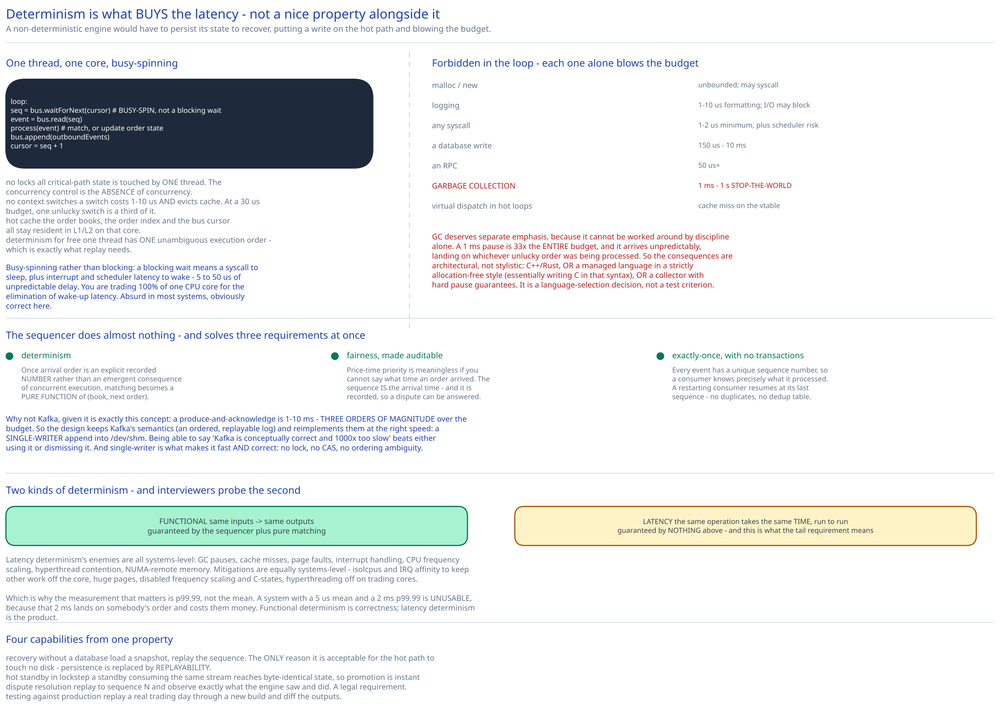

# Module 03 — Latency & Determinism



## The budget, and what it eliminates

Target: **tens of microseconds**, round trip, at **p99.99**.

| Operation | Cost | Fraction of a 30 µs budget |
|---|---|---|
| L1 cache reference | 0.5 ns | 0.002% |
| Main memory reference | 100 ns | 0.3% |
| **Shared-memory IPC** | **0.1–1 µs** | **0.3–3%** |
| **TCP round trip, same rack** | **50–100 µs** | **170–330%** |
| TCP round trip, same datacenter | ~500 µs | 1,700% |
| SSD random read | 150 µs | 500% |
| Kafka produce+ack | 1–10 ms | 3,000–33,000% |
| Cross-region round trip | 150 ms | 500,000% |

Read down that column and the architecture writes itself. **Anything involving a network or a disk is excluded from the critical path**, not as an optimization but because a single instance of it exceeds the entire budget. There's no tuning that recovers a 500 µs hop inside a 30 µs envelope.

What survives: memory access, and shared-memory IPC. That's the whole toolkit.

## `mmap` as the event bus

Components on the critical path communicate through a file mapped into memory by all of them:

```
fd = open("/dev/shm/exchange-bus", O_RDWR)
bus = mmap(fd, SIZE, PROT_READ|PROT_WRITE, MAP_SHARED, fd, 0)
```

Writing an event is a `memcpy` into the mapped region and a release-store to advance a cursor. Reading is an acquire-load of the cursor and a read from the region. **No syscall, no kernel crossing, no copy between address spaces.** Sub-microsecond, and — more importantly for a tail-latency requirement — *predictable*, because there's no queue, scheduler or driver involved.

**Why `/dev/shm` specifically.** It's a `tmpfs`, so the "file" lives entirely in RAM and is never written to disk. You get `mmap`'s convenient shared-memory semantics with zero possibility of a page flush stalling a write. Mapping a file on a real filesystem would work identically until the kernel decided to write back dirty pages, at which point you'd take an unpredictable multi-millisecond stall — the exact tail event the design cannot tolerate.

The cost, stated honestly: **nothing on the critical path is durable.** A power loss loses everything in flight. That's acceptable only because durability is provided by a **hot standby consuming the same event stream** plus an off-path consumer persisting it — the same substitution of *replication for `fsync`* that the [message queue](../distributed-message-queue/02-storage-engine.md#durability-without-fsync-per-message) and [digital wallet](../digital-wallet/04-lld.md#making-one-node-fast) both make.

## The sequencer

The sequencer stamps a monotonic ID on every inbound order and every outbound fill. It is a **single writer** appending to the shared-memory bus.

That's a peculiar-looking component — it does almost nothing, and it's on the critical path — so the justification has to be strong. It is: the sequencer is what turns three separate hard requirements into one solved problem.

**1. Determinism.** Once arrival order is an explicit recorded number rather than an emergent consequence of concurrent execution, matching becomes a **pure function of (book, next order)** ([Module 02](./02-matching-engine.md#determinism)). Replay the sequence, get the identical book. Without the sequencer, "what order did these arrive in" would be answerable only by whatever the network stack and scheduler happened to do — unrecorded, unreproducible, and different on a standby.

**2. Fairness, made auditable.** Price-time priority is meaningless if you can't say what time an order arrived. The sequence *is* the arrival time for priority purposes, and it's recorded, so a client disputing that they were first can be answered with evidence.

**3. Exactly-once, in a system with no transactions.** Every event has a unique sequence number, so a consumer knows precisely what it has processed. A restarting consumer resumes at its last sequence — no duplicates, no gaps, no dedup table.

**Why not Kafka**, given it's exactly this concept. Because it's the right idea in the wrong latency class: a Kafka produce-and-acknowledge is 1–10 ms, **three orders of magnitude** over the whole budget. The design keeps Kafka's semantics (an ordered, replayable log) and reimplements them at the right speed — a single-writer append into `/dev/shm`. Being able to say "Kafka is conceptually correct and 1000× too slow" is a better answer than either using it or dismissing it.

**Single writer is what makes it fast and correct at once.** One writer means no lock, no compare-and-swap contention, no ordering ambiguity — the sequence is just an integer incremented by one thread. A multi-writer sequencer would need atomic coordination and would still have to *decide* an order, so it would be slower *and* no more meaningful.

## One thread, pinned to one core

```
# The application loop. One thread. One core. Forever.
loop:
    seq = bus.waitForNext(cursor)        # BUSY-SPIN, not a blocking wait
    event = bus.read(seq)
    process(event)                       # match, or update order state
    bus.append(outboundEvents)
    cursor = seq + 1
```

Counter-intuitive, and the reasons compound:

**No locks.** All state mutated on the critical path is touched by one thread, so there are no mutexes, no atomics, no lock convoys. The [message queue](../distributed-message-queue/02-storage-engine.md#batching-is-the-whole-performance-story)'s append-lock contention problem doesn't arise; neither does any deadlock. **The concurrency control is the absence of concurrency.**

**No context switches.** A context switch costs 1–10 µs *and* evicts cache. At a 30 µs budget, one unlucky switch is a third of it. Pinning with `taskset`/`sched_setaffinity` and isolating the core from the general scheduler (`isolcpus`) means the thread is never descheduled.

**Hot cache.** The working set — the order books, the order index, the bus cursor — stays resident in L1/L2 on that core. A cache miss is ~100 ns; a working set that keeps getting evicted by another thread's activity turns every access into one.

**Determinism for free.** One thread has one unambiguous execution order. A multi-threaded matcher would need its interleaving *recorded* to be replayable — which means serializing it anyway, at extra cost.

**Busy-spinning, not blocking.** The loop polls the cursor rather than waiting on a condition variable, because a blocking wait means a syscall to sleep and an interrupt plus scheduler latency to wake — 5–50 µs of unpredictable delay. Busy-spinning burns a core continuously to remove that entirely. **You are trading 100% of one CPU for the elimination of wake-up latency**, which is an absurd trade in most systems and obviously correct here.

Multi-core capacity comes from **partitioning by symbol** ([Module 01](./01-architecture-hld.md#load-handling)) — one pinned thread per symbol group. Parallelism across symbols, strict serialism within one.

## What must not appear in the loop

Each of these is individually capable of blowing the budget, and every one of them is something a normal service does routinely:

| Forbidden | Cost | Why it's tempting |
|---|---|---|
| **`malloc`/`new`** | Unbounded; may trigger a syscall | Every allocation in ordinary code |
| **Logging** | 1–10 µs formatting, and I/O may block | Observability |
| **Any syscall** | 1–2 µs minimum, plus scheduler risk | Timing, I/O, metrics |
| **A database write** | 150 µs–10 ms | Durability |
| **An RPC** | 50 µs+ | Risk checks, wallet checks |
| **Exceptions** (in some runtimes) | Table lookups, unpredictable | Error handling |
| **Garbage collection** | 1 ms–1 s stop-the-world | Using a managed language |
| **Virtual dispatch in hot loops** | Cache miss on the vtable | Polymorphism |

The replacements: **pre-allocated object pools** instead of `malloc`; the **sequenced event stream** instead of logging (an off-path consumer writes the log); **in-memory replicas of risk limits and wallet balances**, updated asynchronously, instead of RPCs ([Module 01](./01-architecture-hld.md#monolith-vs-microservices)); **timestamps taken once at the gateway** and carried in the event instead of clock reads in the loop.

**Garbage collection deserves separate emphasis**, because it's the one that can't be worked around by discipline alone. A stop-the-world pause of even 1 ms is **33× the entire budget**, and it arrives unpredictably, landing on whichever unlucky order was being processed. That is a p99.99 catastrophe by construction. The consequences are architectural, not stylistic:

- Write the critical path in a language with no stop-the-world collector (C++, Rust), **or**
- Write it in a managed language in a strictly allocation-free style — pre-allocated pools, primitive arrays, no boxing, object reuse — which is essentially writing C in that language's syntax, **or**
- Use a collector with hard pause guarantees, and accept its throughput cost.

[Module 01](./01-architecture-hld.md#what-youd-revisit-as-this-grows) names this as a constraint that's easy to state as a test criterion ("zero GC pauses") while actually being a language-selection decision.

## Determinism is what makes everything else possible

Pull the threads together, because determinism is doing more work in this design than any other single property:

```
Deterministic matching  =  f(book_state, sequenced_order) is a pure function
```

**Recovery without a database.** The engine holds no durable state. It recovers by loading a snapshot and replaying the sequence from there. That's the *only* reason it's acceptable for the critical path to touch no disk — persistence is replaced by replayability. A non-deterministic engine would have to persist its state, which would put a write on the hot path, which would blow the budget. **Determinism is what buys the latency**, not merely a nice-to-have alongside it.

**Hot standby in lockstep.** A standby consumes the same sequenced stream and reaches byte-identical state. Promotion is instant and safe, because there's nothing to reconcile. Without determinism the standby's book could differ, and promoting it would publish a book that disagrees with what brokers were already told — the regulatory catastrophe [Module 01](./01-architecture-hld.md#scaling-reliability) says the exchange would rather halt than risk.

**Dispute resolution.** Replay to sequence N and observe exactly what the engine saw and did. This is a legal requirement, not an engineering nicety.

**Testing against production.** Replay a real trading day's sequence through a new build and diff the outputs. Any difference is a behaviour change — a genuine regression test over real market data, and impossible without determinism.

### Two kinds of determinism

Worth separating, because interviewers probe the second:

**Functional determinism** — same inputs produce same outputs. Guaranteed by the sequencer plus pure matching. This is what the four capabilities above depend on.

**Latency determinism** — the same operation takes the same *time*, run to run. This is *not* guaranteed by anything above, and it's what the tail-latency requirement is really about. Its enemies are GC pauses, cache misses, page faults, interrupt handling, CPU frequency scaling, hyperthread contention, and NUMA-remote memory access. Mitigations are all systems-level rather than algorithmic: `isolcpus` and IRQ affinity to keep other work off the core, huge pages to reduce TLB misses, disabling frequency scaling and C-states, disabling hyperthreading on trading cores, and pinning memory NUMA-local to the thread.

The measurement that matters follows from this distinction: **report p99.99, not the mean.** A system with a 5 µs mean and a 2 ms p99.99 is unusable, because the 2 ms lands on somebody's order and costs them money. Functional determinism is a correctness property; latency determinism is the product.

## Practice: extend it yourself

1. **Budget the whole path.** Allocate a 30 µs round-trip budget across: NIC receive and kernel network stack, FIX decode, risk check, sequencer append, match, sequencer append for the fill, FIX encode, and NIC transmit. Find which single stage dominates, then decide whether kernel-bypass networking (DPDK, or a solarflare-style userspace stack) is worth its complexity — and quantify what it actually saves against your allocation.
2. **Design the snapshot mechanism.** The engine must snapshot its books periodically so recovery doesn't replay from the session open, but snapshotting must not pause the matching thread. Work out how to capture a consistent snapshot at a specific sequence number without stopping the loop, who writes it to disk, and how a recovering engine knows which sequence the snapshot corresponds to — then explain what goes wrong if the snapshot is taken at a sequence *between* the two fills of a single match.
