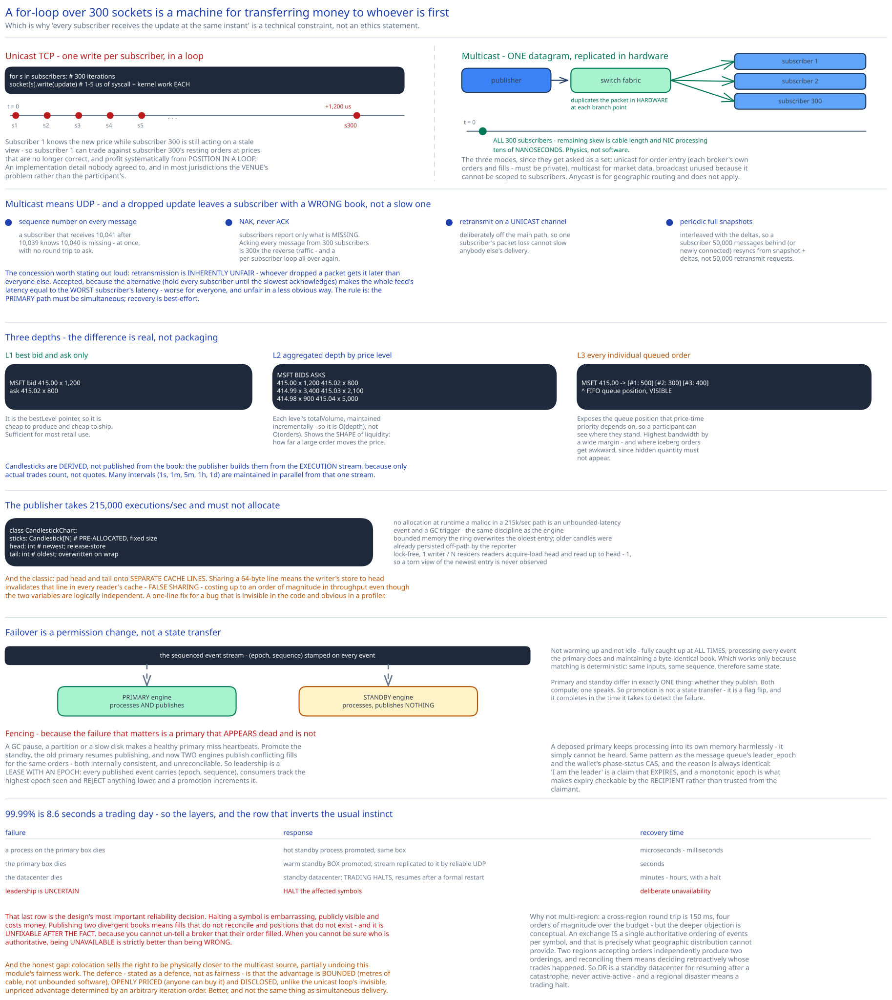

# Module 04 — Market Data & High Availability



## Fairness is a latency property

The requirement from [Module 00](./00-overview.md#requirements) sounds like an ethics statement and is actually a technical constraint: **every subscriber must receive a market data update at the same instant.**

Here's why it's technical. Suppose you publish over unicast TCP to 300 subscribers:

```
for subscriber in subscribers:          # 300 iterations
    socket[subscriber].write(update)    # each ~1-5 us of syscall + kernel work
```

Subscriber 1 receives the update **hundreds of microseconds to a millisecond** before subscriber 300. In that window, subscriber 1 knows the new price and subscriber 300 is acting on a stale view. Subscriber 1 can trade against subscriber 300's resting orders at prices that are no longer correct — and profit, systematically, purely from position in a loop.

That's not a fairness *nicety*. **You have built a machine that lets whoever is early in your iteration order extract money from whoever is late**, and the iteration order is an implementation detail nobody agreed to. It's also, in most jurisdictions, a regulatory problem for the venue rather than for the participant.

So the requirement is: one transmission, arriving everywhere at once.

## Multicast

```
Publisher → ONE datagram → network switch → replicated in HARDWARE to every subscriber
```

The switch fabric duplicates the packet at each branch point, so every subscriber's copy leaves the last shared hop at the same moment. Remaining differences come down to cable length and NIC processing — physics, not software, and bounded in the tens of nanoseconds rather than the hundreds of microseconds of a unicast loop.

The three transmission modes, since interviewers ask them as a set:

| Mode | Destinations | Use here |
|---|---|---|
| **Unicast** | One | Order entry (each broker's own orders and fills — must be private) |
| **Broadcast** | Every host on the subnet | Not used; can't scope to subscribers |
| **Multicast** | A subscribed group, across subnets | **Market data** |
| *Anycast* | Nearest of many | Not applicable — used for geographic routing |

### The problem with multicast: UDP is unreliable

Multicast means UDP, and UDP drops packets with no retransmission and no ordering guarantee. For market data that's unacceptable — a subscriber who misses an update has a **wrong book**, not a slow one, and will keep trading on it indefinitely.

So: **reliable multicast**, built on top:

- **Sequence numbers on every message.** A subscriber detects a gap immediately: it received 10,041 after 10,039, so 10,040 is missing.
- **A unicast retransmission request** to a separate recovery channel. Deliberately unicast and off the main path, so one subscriber's packet loss can't slow anyone else's delivery.
- **Periodic full snapshots** interleaved with the incremental stream, so a subscriber who is badly behind — or who just connected — can resynchronize from a snapshot plus subsequent deltas rather than requesting thousands of retransmissions.
- **NAK-based rather than ACK-based.** Subscribers report only what's *missing*. Acknowledging every message from 300 subscribers would create 300× the reverse traffic and reintroduce a per-subscriber loop.

The subtle fairness point in the recovery design: **retransmission is inherently unfair**, since the subscriber who dropped a packet gets it later than everyone else. That's accepted, because the alternative — delaying everyone until the slowest has acknowledged — would make the whole feed's latency the worst subscriber's latency, which is both worse for everyone and *also* unfair in a less obvious way. The principle is that the *primary* path must be simultaneous; recovery is best-effort.

## What gets published

Three depths, priced differently, and the differences are real rather than packaging:

**L1 — best bid and ask only.**
```
MSFT  bid 415.00 × 1,200   ask 415.02 × 800
```
Cheap to produce (it's the `bestLevel` pointer from [Module 02](./02-matching-engine.md#the-structure)) and cheap to distribute. Sufficient for most retail use.

**L2 — aggregated depth by price level.**
```
MSFT   BIDS                    ASKS
       415.00 × 1,200          415.02 ×   800
       414.99 × 3,400          415.03 × 2,100
       414.98 ×   900          415.04 × 5,000
```
Each level's `totalVolume`, maintained incrementally so this is O(depth) rather than O(orders). Shows liquidity shape — how far a large order would move the price.

**L3 — every individual queued order at every level.**
```
MSFT   415.00 →  [order#1: 500] [order#2: 300] [order#3: 400]     ← FIFO order visible
```
The most granular, and it exposes the queue position that price-time priority depends on — so a participant can see where they stand. Highest bandwidth by a wide margin, and this is where [iceberg orders](./02-matching-engine.md#practice-extend-it-yourself) become awkward, since their hidden quantity must not appear.

**Candlesticks** are derived, not published live from the book:

```
class Candlestick:  openPrice, closePrice, highPrice, lowPrice, volume, timestamp, interval
```

Built by the publisher from the **execution stream** — only actual trades count, not quotes. Multiple intervals (1s, 1m, 5m, 1h, 1d) are maintained in parallel from the same stream.

### Ring buffers for the publisher

The publisher receives executions at up to 215,000/sec and must maintain many candlestick series without allocating:

```
class CandlestickChart:
    sticks: Candlestick[N]      # PRE-ALLOCATED fixed-size circular buffer
    head: int                   # newest
    tail: int                   # oldest; overwritten as it wraps
```

A **ring buffer** — fixed-size, head connected to tail, space allocated once at startup. Three properties earn it here:

- **No allocation at runtime.** Same discipline as the matching engine ([Module 03](./03-latency-determinism.md#what-must-not-appear-in-the-loop)) — a `malloc` in a 215k/sec path is an unbounded-latency event and a GC trigger.
- **Bounded memory.** You cannot hold every candlestick for every interval forever; the ring overwrites the oldest, and older data has already been persisted off-path by the reporter.
- **Lock-free for one writer and many readers.** With a single writer advancing `head` with a release-store and readers doing acquire-loads, no lock is needed. Readers may see a torn view of the very newest entry, handled by having them read up to `head - 1`.

One low-level detail worth knowing because it's a classic: **pad the head and tail cursors onto separate cache lines.** If `head` and `tail` share a 64-byte cache line, the writer's update to `head` invalidates that line in every reader's cache — **false sharing**, which can cost an order of magnitude in throughput even though the two variables are logically independent. Padding is a one-line fix for a bug that's invisible in the code and obvious in a profiler.

## High availability

The target is **99.99%** — about 8.6 seconds per trading day. That doesn't permit a manual failover, so it has to be automatic, and the hard part is that the thing failing over holds the authoritative order book.

### Hot standby, in lockstep

```
Primary engine    ─┐
                   ├─ both consume the SAME sequenced event stream
Standby engine    ─┘   from shared memory / replicated bus

Primary:  processes events AND publishes outbound events
Standby:  processes events, publishes NOTHING
```

The standby is not idle and not warming up — it is **fully caught up at all times**, processing every event the primary does, maintaining an identical book. This works *only* because matching is deterministic ([Module 03](./03-latency-determinism.md#determinism-is-what-makes-everything-else-possible)): same inputs, same sequence, therefore byte-identical state.

The distinction that makes it safe is that **primary and standby differ only in whether they publish.** Both compute; one speaks. So failover is not a state transfer — it's a permission change, and it completes in the time it takes to detect the failure and flip a flag.

### Fencing, or you get two books

The failure that matters isn't a crash — it's a primary that **appears** dead and isn't. A GC pause, a network partition, or a slow disk can make a healthy primary miss heartbeats. If the standby is promoted and the old primary resumes publishing, **two engines publish conflicting fills for the same orders**, and there is no way to reconcile them because both are internally consistent.

So leadership is a **lease with an epoch number** (cross-ref [Distributed Locks](../../scalability-resilience/distributed-locks.md) and [Replication & Consensus](../../hld-building-blocks/replication-consensus.md)):

```
Every published event carries (epoch, sequence).
Downstream consumers track the highest epoch seen and REJECT anything from a lower one.
A promotion increments the epoch.
```

A deposed primary that resumes publishing is stamped with the old epoch and its output is discarded by every consumer. It may keep *processing* into its own memory harmlessly — it simply cannot be heard. This is the same fencing pattern as the [message queue's `leader_epoch`](../distributed-message-queue/05-state-metadata-storage.md#why-the-controller-is-a-single-broker) and the wallet's phase-status CAS, and the reason is always identical: **"I am the leader" is a claim that expires, and a monotonic epoch is what makes expiry checkable by the recipient rather than trusted from the claimant.**

### The layers of redundancy

| Failure | Response | Recovery time |
|---|---|---|
| A process on the primary box dies | Hot standby process promoted (same box) | Microseconds–milliseconds |
| The primary box dies | Warm standby **box** promoted; event stream replicated to it by reliable UDP | Seconds |
| The datacenter dies | Standby datacenter; **trading halts** and resumes after a formal restart | Minutes–hours, with a halt |
| Leadership is uncertain | **Halt the affected symbols** | Deliberate unavailability |

That last row is the design's most important reliability decision, and it's a genuine inversion of the usual instinct. Faced with "we cannot be certain which engine holds the authoritative book," the system **stops trading** rather than guessing. Halting a symbol is embarrassing, publicly visible, and costs money. Publishing two divergent books means fills that don't reconcile, positions that don't exist, and a regulatory event — and it is *unfixable after the fact*, because you cannot un-tell a broker that their order filled.

**When you can't be sure who's authoritative, being unavailable is strictly better than being wrong.** That's the same conclusion the [digital wallet](../digital-wallet/01-architecture-hld.md#scaling-reliability) reaches when a partition loses quorum, and for the same underlying reason.

### Why not multi-region

A cross-region round trip is 150 ms — four orders of magnitude over the budget. But the deeper objection is conceptual: **an exchange is defined by a single authoritative ordering of events per symbol**, and that is precisely what geographic distribution cannot provide. Two regions accepting orders independently would produce two orderings, and reconciling them means deciding retroactively whose trades happened.

So disaster recovery is a **standby datacenter for resuming after a catastrophe**, never active-active. Real exchanges accept that a regional disaster means a trading halt, which is a genuinely unusual availability posture worth being able to defend.

## Colocation, and the honest problem with it

Exchanges rent rack space inside their own datacenter to brokers who want to shave microseconds off their round trip. It's a substantial revenue line and it is completely standard.

It also **partially undoes the fairness work in this module.** Multicast goes to real lengths to ensure simultaneous delivery, and then colocation sells the right to be physically closer to the multicast source — reintroducing a latency advantage as a product.

The defence, which is real but should be stated as a defence rather than as fairness: the advantage is **bounded** (speed of light over tens of metres, not an unbounded software advantage), **openly priced** (anyone can buy it, versus a hidden advantage nobody knows exists), and **disclosed**. Compare it to the unicast-loop problem: there the advantage was invisible, unpriced, and determined by an arbitrary iteration order.

So colocation makes latency an explicit, purchasable input rather than an accident of implementation. That's better than the alternative, and it is not the same thing as everyone receiving data at the same instant — which is why [Module 01](./01-architecture-hld.md#what-youd-revisit-as-this-grows) lists it as a gap rather than a solved problem.

## Practice: extend it yourself

1. **Design the snapshot-plus-delta resynchronization protocol.** A subscriber connects mid-session, or falls 50,000 messages behind. Work out the snapshot cadence (what does a more frequent snapshot cost in bandwidth, and what does a less frequent one cost in recovery time?), how a subscriber splices a snapshot at sequence N together with deltas it has already buffered from N+1 onward, and what it must do if the snapshot arrives *older* than deltas it already holds.
2. **Detect a false failover.** Design the heartbeat and lease-timeout parameters so that a 5 ms GC pause on the primary does **not** trigger promotion, but a genuine process death is detected within the 99.99% availability budget (8.6 s/day). Then compute the worst case: how long can a wedged-but-alive primary keep publishing before it's fenced, and how many fills could be in dispute during that window?
