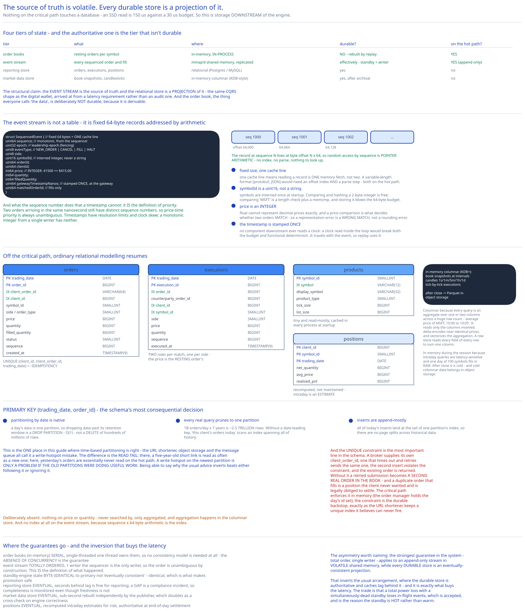

# Module 05 — Database Design



The defining fact about persistence here: **nothing on the critical path touches a database.** [Module 03](./03-latency-determinism.md#the-budget-and-what-it-eliminates) showed why — an SSD read is 150 µs against a 30 µs budget. So this module describes storage that is *downstream* of the matching engine, plus the one authoritative structure that isn't a database at all.

## Four tiers of state

| Tier | What | Where | Durable? | On the hot path? |
|---|---|---|---|---|
| **Order books** | Resting orders per symbol | **In-memory, in-process** ([Module 02](./02-matching-engine.md#the-structure)) | **No** — rebuilt by replay | **Yes** |
| **Event stream** | Every sequenced order and fill | `mmap`'d shared memory, replicated | **Effectively** — via standby + off-path writer | **Yes** (append only) |
| **Reporting store** | Orders, executions, positions | Relational (Postgres/MySQL) | Yes | No |
| **Market data store** | Order book snapshots, candlesticks | In-memory columnar (KDB-style), then archived | Yes, after archival | No |

The important structural claim: **the event stream is the source of truth, and the relational store is a projection of it.** That's the same CQRS shape as the [digital wallet](../digital-wallet/03-event-sourcing-cqrs.md#cqrs-why-reads-and-writes-split), arrived at from a latency requirement rather than an audit one. The order book — the thing everyone thinks of as "the data" — is deliberately *not* durable, because it is derivable.

## The event stream

Not a table. A sequence of fixed-size records in shared memory, and the fixed size is the point.

```
struct SequencedEvent {              // fixed 64 bytes — ONE cache line
    uint64  sequence;                // monotonic, assigned by the sequencer
    uint32  epoch;                   // leadership epoch (fencing, Module 04)
    uint8   eventType;               // NEW_ORDER | CANCEL | FILL | HALT | ...
    uint8   side;
    uint16  symbolId;                // an interned integer, never a string
    uint64  orderId;
    uint64  clientId;
    int64   price;                   // INTEGER: 41500 == $415.00
    int64   quantity;
    int64   filledQuantity;
    uint64  gatewayTimestampNanos;   // stamped ONCE, at the gateway
    uint64  matchedOrderId;          // fills only
}
```

Four decisions, each of which would be wrong in an ordinary system:

**Fixed-size records, one cache line each.** Fixed size means the record at sequence N is at offset `N × 64` — random access by sequence is pointer arithmetic, no index needed. One cache line means reading a record is one memory fetch rather than two. A variable-length format (protobuf, JSON) would need an offset index and a parse step, both on the hot path.

**`symbolId` is a `uint16`, not a string.** Symbols are interned once at startup. Comparing and hashing a 2-byte integer is free; comparing `"MSFT"` involves a length check and a memcmp, and storing it would blow the 64-byte budget.

**`price` is an integer.** `41500` for $415.00. Floating point cannot represent decimal prices exactly, and a price comparison is what decides whether two orders match — so a representation error is a *wrong match*, not a rounding error. Same reasoning as the [digital wallet](../digital-wallet/05-db-design.md#why-amount-minor-is-an-integer).

**`gatewayTimestampNanos` is stamped once, at the gateway.** No component downstream reads the clock, because a clock read inside the matching loop would break both the latency budget and functional determinism ([Module 03](./03-latency-determinism.md#determinism-is-what-makes-everything-else-possible)). The timestamp travels with the event, so replay uses the original value.

Note what the sequence number does that a timestamp cannot: **it is the definition of priority.** Two orders arriving in the same nanosecond have distinct sequence numbers, so price-time priority is always unambiguous. Timestamps have resolution limits and clock skew; a monotonic integer from a single writer has neither.

## The reporting store

Off the critical path, populated by a consumer of the event stream. This is where ordinary relational modelling resumes.

```sql
CREATE TABLE orders (
    order_id          BIGINT       NOT NULL,
    client_order_id   VARCHAR(64)  NOT NULL,   -- the broker's own id: idempotency key
    client_id         BIGINT       NOT NULL,
    symbol_id         SMALLINT     NOT NULL,
    side              SMALLINT     NOT NULL,
    order_type        SMALLINT     NOT NULL,
    price             BIGINT       NOT NULL,   -- integer minor units
    quantity          BIGINT       NOT NULL,
    filled_quantity   BIGINT       NOT NULL,
    status            SMALLINT     NOT NULL,   -- NEW|PARTIALLY_FILLED|FILLED|CANCELED
    sequence          BIGINT       NOT NULL,   -- the event that created it
    trading_date      DATE         NOT NULL,
    created_at        TIMESTAMP(9) NOT NULL,
    PRIMARY KEY (trading_date, order_id),
    UNIQUE (client_id, client_order_id, trading_date)   -- ← idempotency
);

CREATE TABLE executions (
    execution_id      BIGINT       NOT NULL,
    order_id          BIGINT       NOT NULL,
    counterparty_order_id BIGINT   NOT NULL,
    client_id         BIGINT       NOT NULL,
    symbol_id         SMALLINT     NOT NULL,
    side              SMALLINT     NOT NULL,
    price             BIGINT       NOT NULL,   -- the RESTING order's price (Module 02)
    quantity          BIGINT       NOT NULL,
    sequence          BIGINT       NOT NULL,
    trading_date      DATE         NOT NULL,
    executed_at       TIMESTAMP(9) NOT NULL,
    PRIMARY KEY (trading_date, execution_id)
);

CREATE TABLE products (                        -- reference data; tiny, read-mostly
    symbol_id         SMALLINT     NOT NULL,
    symbol            VARCHAR(12)  NOT NULL,   -- 'MSFT'
    display_symbol    VARCHAR(32)  NOT NULL,
    product_type      SMALLINT     NOT NULL,
    tick_size         BIGINT       NOT NULL,   -- minimum price increment
    lot_size          BIGINT       NOT NULL,
    PRIMARY KEY (symbol_id),
    UNIQUE (symbol)
);

CREATE TABLE positions (                       -- derived nightly and intraday
    client_id         BIGINT       NOT NULL,
    symbol_id         SMALLINT     NOT NULL,
    trading_date      DATE         NOT NULL,
    net_quantity      BIGINT       NOT NULL,
    avg_price         BIGINT       NOT NULL,
    realized_pnl      BIGINT       NOT NULL,
    PRIMARY KEY (client_id, symbol_id, trading_date)
);
```

### Why `trading_date` leads every primary key

This is the schema's most consequential decision. `PRIMARY KEY (trading_date, order_id)` rather than `(order_id)`.

Market data is **naturally partitioned by trading day**, and every query respects it: "today's orders", "this client's fills on the 14th", "reconcile yesterday". Leading with `trading_date` means:

- **Partitioning by date is native.** A day's data is one partition, so dropping data past its retention window is a `DROP PARTITION` — O(1) — rather than a `DELETE` of hundreds of millions of rows.
- **Every real query prunes to one partition.** 1B orders/day × 7 years is ~2.5 trillion rows; without date-leading keys, "this client's orders today" would scan an index spanning all of history.
- **Inserts are append-mostly.** All of today's inserts land in one partition at the tail of its index, so there are no page splits across historical data.

This is the one place where **time-based partitioning is right**, which is worth flagging because every other case study in this guide rejects it — the [URL shortener](../url-shortener/04-db-design.md#scaling-the-schema), [object storage](../object-storage-s3/04-db-design.md#scaling-the-schema) and the [message queue](../distributed-message-queue/00-overview.md) all call it a write-hotspot mistake. The difference is that those systems have a *long read tail* (a 5-year-old short link is read as often as a new one), while here yesterday's orders are essentially never read on the hot path. **A write hotspot on the newest partition is only a problem if the old partitions were doing useful work.** Here they aren't, and being able to articulate why the usual advice inverts is more valuable than either following or ignoring it.

### Why `UNIQUE (client_id, client_order_id, trading_date)`

The broker supplies its own order id, and this constraint makes submission **idempotent**. A broker that times out and retries sends the same `client_order_id`; the second insert violates the constraint and the existing order is returned.

Without it, a retried submission becomes **a second, real order in the book** — and a duplicate order that fills is a position the client never wanted and is legally obliged to settle. That makes this the single most important constraint in the schema. Cross-ref [Idempotency Keys](../../scalability-resilience/idempotency-keys.md).

Note the critical path enforces this in memory (the order manager holds the day's `client_order_id` set); the constraint is the durable backstop, exactly as the [URL shortener](../url-shortener/02-short-code-generation.md#b4-keep-the-unique-index-anyway) keeps a unique index it believes can never fire.

### Why `executions` stores the counterparty and both sides separately

One match produces **two** execution rows, one per side, each owned by its own client. There is no single "trade" row on the write path.

That's deliberate: the two sides have different owners, different reporting obligations, and are sequenced independently. A single trade row would have to be jointly owned, and every query — "my fills", "my P&L", "my tax lots" — is per-client anyway. `counterparty_order_id` preserves the linkage for surveillance and dispute resolution without forcing a shared row.

## Market data storage

Different shape, different engine:

```
Real-time (in-memory columnar, e.g. KDB+):
    order book snapshots at intervals
    candlesticks at multiple resolutions (1s, 1m, 5m, 1h, 1d)
    tick-by-tick execution stream

After market close → archived to object storage as columnar files (Parquet/ORC)
```

**Why columnar rather than relational.** Every query is an aggregate over one or two columns across a huge number of rows — *"average price of MSFT between 10:00 and 10:05"*, *"total volume by minute"*. A columnar store reads only the columns involved, compresses them extremely well (adjacent prices are nearly identical, so delta encoding is very effective), and vectorizes the aggregation. A row store would read every field of every row to sum one column. Cross-ref [SQL vs NoSQL](../../database-design/sql-vs-nosql.md).

**Why in-memory during the session.** Intraday queries are latency-sensitive (though nothing like the matching path) and the working set is one day of one hundred symbols — small enough to hold in RAM. After close it's cold, and cold columnar data belongs in object storage.

**What the publisher keeps versus what's persisted.** [Module 04](./04-market-data-ha.md#ring-buffers-for-the-publisher) uses fixed-size ring buffers, so the publisher holds only a bounded window of candlesticks in memory and older ones are overwritten. That's safe *because* the persistent store already has them — the ring buffer is a serving cache, not the record. Conflating the two would mean silently losing history when the ring wraps.

## Indexes

| Index | Serves |
|---|---|
| `PRIMARY KEY (trading_date, order_id)` on `orders` — clustered | Order lookup, partition pruning, append-mostly inserts. |
| `UNIQUE (client_id, client_order_id, trading_date)` | **Idempotency.** The most important constraint here. |
| `INDEX (trading_date, client_id, created_at)` on `orders` | "My orders today, chronologically" — the broker's main query. |
| `PRIMARY KEY (trading_date, execution_id)` on `executions` | Execution lookup; partition pruning. |
| `INDEX (trading_date, order_id)` on `executions` | All fills for one order — needed because partial fills are the norm, so this is how a client reconstructs what actually happened to an order. |
| `INDEX (trading_date, client_id, symbol_id)` on `executions` | Position and P&L calculation; the settlement query. |
| `INDEX (trading_date, symbol_id, executed_at)` on `executions` | Surveillance and market-abuse detection over one symbol's tape. |
| `PRIMARY KEY (symbol_id)` / `UNIQUE (symbol)` on `products` | Symbol interning at startup, and the string→id lookup at the gateway. |

**Deliberately absent:** nothing on `price` or `quantity` — never searched by, only aggregated, and aggregation happens in the columnar store. And no index at all on the event stream: it's addressed by `sequence × 64` byte arithmetic, which is why it needs none.

## Consistency

| Data | Model | Why |
|---|---|---|
| Order books (in-memory) | **Serial, single-threaded** | One thread owns them ([Module 03](./03-latency-determinism.md#one-thread-pinned-to-one-core)); no concurrent access, therefore no consistency model needed. The absence of concurrency is the guarantee. |
| Event stream | **Totally ordered, single writer** | The sequencer is the only writer, so the order is unambiguous by construction. This *is* the definition of what happened. |
| Standby engine state | **Byte-identical to primary** | Guaranteed by determinism plus identical input sequence. Not "eventually consistent" — *identical*, which is what makes promotion safe. |
| Reporting store | **Eventual**, seconds behind | A projection of the event stream. Lag is fine for reporting; a **gap** is a compliance incident, so completeness is monitored even though freshness isn't. |
| Market data store | **Eventual**, sub-second | Reconstructed independently by the publisher, which doubles as a cross-check on engine correctness. |
| Positions | **Eventual**, recomputed | Derived from executions. Intraday estimates for risk; authoritative at end-of-day settlement. |

**The asymmetry worth naming:** the strongest guarantee (total order, single writer) applies to an append-only stream in volatile shared memory, and the *durable* stores are all eventually consistent projections. That inverts the usual arrangement, where the durable store is authoritative and caches lag — and it's what buys the latency. The trade is that a total power loss with a simultaneously-dead standby loses in-flight events, which is accepted and is why the standby is *hot* rather than warm.

## Scaling the schema

**`orders` and `executions` — partitioned by `trading_date`, sub-sharded by `symbol_id` if needed.** Retention is a `DROP PARTITION`; queries prune to a day. For a 7-year compliance window, partitions older than ~90 days move to object storage as columnar files, queried through a federated engine when a regulator asks. 2.5 trillion rows never live in the operational store.

**`products` is tiny and replicated everywhere**, cached in every process at startup. It's read on every order (to intern the symbol and check tick size) and written approximately never.

**The market data store is partitioned by `(symbol, date)`**, which matches every query — market data questions are always about a symbol over a time range.

**The event stream doesn't shard; it partitions by symbol group**, one sequencer and one engine thread per group. That's the same reasoning as [Module 01](./01-architecture-hld.md#load-handling): symbols are independent, so there's no cross-symbol ordering requirement to preserve. It also means the sequence number is only monotonic *within* a symbol group — which is sufficient, because priority is only ever compared within a symbol.

**Read replicas** carry all reporting and analytics load. The primary reporting store absorbs the event-stream writes; brokers' queries, surveillance scans and settlement runs all hit replicas. Cross-ref [DB Replication & Failover](../../database-design/db-replication-failover.md).

## Connecting it back

**"Tens of microseconds at p99.99"** (Module 00) → everything on the critical path in shared memory, one pinned thread, no syscalls (Module 03) → so the order book must be an in-memory structure with O(1) add/match/cancel (Module 02) → surfacing here as the order book being **deliberately non-durable** and the event stream being **fixed 64-byte records addressed by arithmetic**, because an index lookup or a variable-length parse would be work on the hot path.

**"Determinism — same inputs, same outputs, forever"** (Module 00) → a sequencer stamping arrival order, and matching as a pure function (Modules 02–03) → surfacing here as `gatewayTimestampNanos` being stamped **once** and carried in the record (never re-read downstream), and as `sequence` appearing on every row in `orders` and `executions` so any durable row can be traced back to the exact event that produced it.

**"Fairness — price-time priority"** (Module 00) → FIFO queues within price levels (Module 02) → which requires an unambiguous arrival order → surfacing here as the **monotonic sequence number rather than a timestamp** being the priority key, because timestamps have resolution limits and skew while a single-writer integer has neither.

**"Compliance and settlement"** (Module 00) → off-path consumers of the event stream (Module 01) → surfacing here as `trading_date`-leading primary keys (making 7-year retention a partition operation), two execution rows per match (because the two sides have different owners and obligations), and `UNIQUE (client_id, client_order_id, trading_date)` — which prevents a retried submission from becoming a real duplicate position.

## What you'd revisit as this grows

- **The reporting store's completeness has no verifier.** Its lag is tolerable but a *gap* is a compliance breach, and nothing here continuously asserts that every sequence number in the event stream appears in `orders` or `executions`. A sequence-continuity check is a small job that should exist and doesn't.

- **Positions are recomputed rather than maintained.** Intraday risk uses estimates, and authoritative positions come at end-of-day. For a design whose risk checks are on the critical path ([Module 01](./01-architecture-hld.md#monolith-vs-microservices)), depending on an estimate is a real weakness — a client could exceed a limit intraday and it wouldn't be caught until settlement.

- **No tick-size or lot-size enforcement is modelled on the hot path.** `products` carries them, and the gateway ought to reject an order priced off-tick, but this schema doesn't say where that validation lives or what it costs in the latency budget.

- **`symbol_id` as a `uint16` caps the venue at 65,536 instruments.** Fine for 100 equities and inadequate for a venue listing options, where a single underlying generates thousands of contracts. Widening it breaks the 64-byte event record, which is a structural change rather than a schema migration.

- **Archived data is queryable in principle and untested in practice.** "Federated queries against Parquet in object storage" is easy to write and slow to execute, and a regulator's request has a deadline. The retrieval path deserves an SLA and a rehearsal, neither of which exists here.
