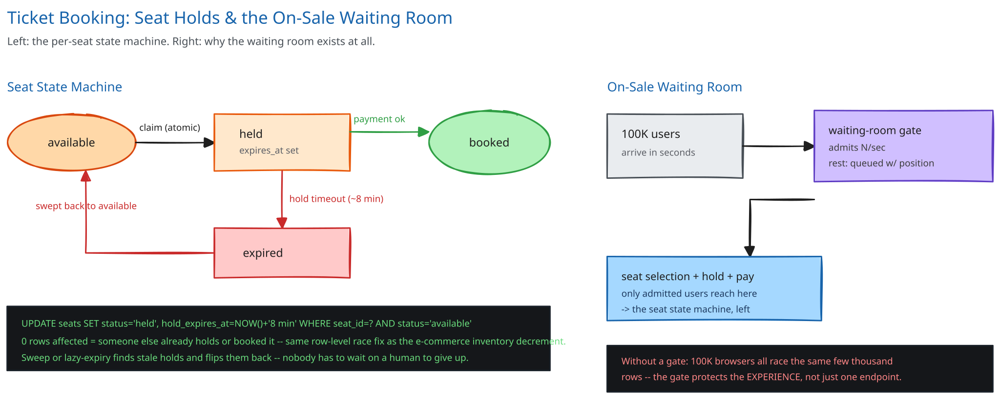

# Module 00 — Overview

## The feature, with no infrastructure in it yet

A seat map for a popular show goes on sale at noon. In the first sixty seconds, a hundred thousand people are looking at a few thousand seats. Two of them tap the same seat within the same second. Exactly one of them can end up holding it — not both, and not neither. Every other requirement in this module exists to make that one sentence true under load, not just in the quiet case.

That's a narrower bar than it sounds: this isn't "don't oversell inventory" in the general sense — it's that specific race, at that specific moment, at a concurrency the rest of a catalog rarely sees outside a single on-sale minute.

## Requirements

**Functional:** browse a seat map, select seats, hold them temporarily while paying, confirm the booking on successful payment, and release the hold automatically if payment isn't completed in time.

**Non-functional** (stated as assumptions, interview-style):
- A single popular event: **20,000 seats**, and **100,000 users** all trying to book within the first 60 seconds of going on sale.
- A held seat must **never** be sold to two people, and a hold must expire and become available again without manual intervention.
- Seat-selection latency for an *admitted* user stays fast (sub-second) — the spike is absorbed before it reaches that step, not by making that step itself heavier-weight.

## Capacity Estimation

Using this guide's [back-of-envelope method](../../foundations/back-of-envelope-estimation.md):

- **Peak hold-attempt rate:** 100,000 users / 60 seconds ≈ **1,667 hold attempts/sec**, directed at only 20,000 rows — meaning most seats are contended by several simultaneous attempts in that first minute, not evenly spread across the map.
- **Actual seats sold:** capped at 20,000, regardless of how many people are trying — this system's "throughput" ceiling isn't a server capacity number, it's the seat count itself.
- **Booking confirmation (payment) rate:** assume ~80% of holds convert to a completed payment within the hold window → ~16,000 successful bookings, at a rate spread across the hold-window duration (minutes), not compressed into the same 60-second spike as the hold attempts.
- **Storage:** trivial. A few thousand seat rows and a few thousand booking rows per event — this system is never storage-bound. The entire design problem is concurrency at one instant, not data volume.

## Approach Walkthrough

Before any boxes: this design has two jobs that are easy to conflate but need to stay separate. The first is deciding *who gets in the door* — with 100,000 people and one seat-selection UI, most of them have to wait, and that decision has to happen before anyone reaches a seat. The second is the seat claim itself, which is a much smaller, much better-understood problem once the crowd at the door has been metered: two requests hitting the same seat row resolve the same way [this guide's e-commerce inventory decrement](../../database-design/ecommerce-schema-worked-example.md) already does, extended with a timeout because a seat claim isn't final the instant it's made.

## API Surface

- `GET /events/{id}/seats` → a coarse availability map (not live per-seat status for every browsing user — see Architecture & HLD).
- `POST /events/{id}/seats/hold {seat_ids[], session_id}` → `{hold_id, expires_at}`, or `409` if any requested seat is no longer available.
- `POST /bookings {hold_id, idempotency_key, payment_method}` → `{booking_id, status}`.
- `GET /waiting-room/status {session_id}` → `{position, estimated_wait_seconds}` while queued; redirects into the flow once admitted.
