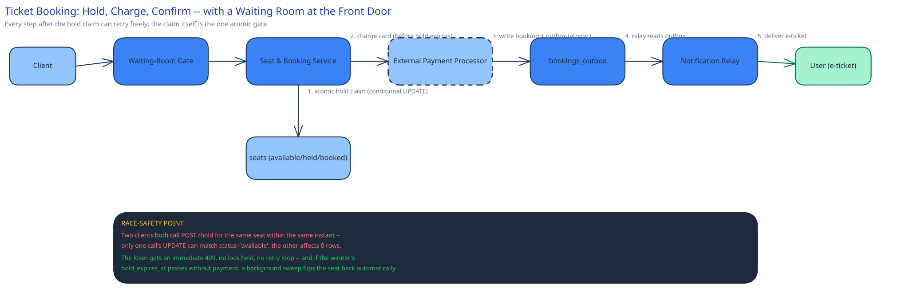

# Module 01 — Architecture & High-Level Design

## Monolith vs. microservices

Only one seam here is actually worth pulling out on its own: the **Waiting-Room Gate**. It has a completely different operational shape from the rest of the flow — it exists purely to absorb a 60-second, once-per-event spike (100,000 arrivals against 20,000 seats), and it can be scaled and load-tested in total isolation from booking logic, payment integration, or seat-map rendering. Folding admission control into the same service that also handles seat holds would mean the one component that needs to survive a thundering herd shares a deploy, a connection pool, and a capacity plan with the component that's supposed to be doing calm, well-behaved work once someone's actually let in.

The **Seat & Booking Service**, by contrast, stays a single service rather than being split into a "hold service" and a separate "booking service." A hold and its eventual booking are two states of the same lifecycle, not two different concerns — splitting them would mean two services need to agree on who owns the seat row's `status` column, which is exactly the kind of shared-ownership problem this guide's [monolith-vs-microservices](../../foundations/monolith-vs-microservices.md) reasoning warns against paying for without a real scaling reason to justify it.

## Building Blocks

| Block | Role |
|---|---|
| Waiting-Room Gate | Admits a bounded number of sessions per second into the booking flow; everyone else gets a queue position and polls it, never touching the seat map directly |
| Seat & Booking Service | Owns the seat-hold claim, the booking record, and the call to the payment processor — one service, one lifecycle |
| `seats` table | One row per physical seat per event; `status` + `hold_expires_at` are the entire concurrency mechanism |
| External Payment Processor | Out of this system's control plane by design — a real external dependency, called synchronously but never trusted to be fast or always up |
| `bookings_outbox` | Durable record of "this booking confirmed, notify the user," written in the same transaction as the booking itself |
| Notification Relay | Reads the outbox, delivers the e-ticket (email/SMS), retries independently of the booking transaction |
| Sweeper | Background process that flips expired holds back to `available` — the release side of the concurrency mechanism |

## Per-path walkthrough

**Admission (write)** — `Client → Waiting-Room Gate (admit or queue) → [if admitted] Seat & Booking Service`. This is the step that exists purely because of scale: at any traffic level low enough that everyone could reach the seat map directly, this box would be a no-op pass-through and wouldn't need to exist at all.

**Hold claim (write)** — `Seat & Booking Service → seats table, conditional UPDATE (status='available' → 'held')`. This is the one step in the whole design that has to be airtight — see Concurrent-User Handling below — because it's the only place two users can legitimately both believe they're about to get the same seat.

**Payment and confirmation (write)** — `Seat & Booking Service → External Payment Processor (charge) → seats + bookings, atomic write (status='held' → 'booked') → bookings_outbox (same transaction)`. The atomic write here mirrors the payments case study's "write intent, then act, then record outcome" discipline: the booking record and the outbox event for notifying the user are written together, so a crash right after payment succeeds can never leave a paid booking with no record of it.

**Notification (async)** — `bookings_outbox → Notification Relay → user (email/SMS)`. Fully decoupled from the booking transaction — a slow or down notification provider never blocks or fails a booking that already succeeded.

**Release (async, out-of-band)** — `Sweeper (periodic scan or lazy check) → seats table, conditional UPDATE ('held' + expired → 'available')`. Runs independently of any user request; nothing about a booking depends on the sweeper's timing except how soon an abandoned seat becomes visible to the next browser.

## Trade-offs to make explicit

| Decision | Chosen | Alternative | Why |
|---|---|---|---|
| Admission control | A waiting room that queues excess arrivals | Let everyone hit the seat-map/hold endpoints directly and rely on rate limiting alone | Rate limiting protects a service from being overwhelmed, but doesn't protect the *user experience* — without a queue, 100,000 people get an unpredictable mix of fast responses and timeouts; a queue makes the wait itself legible ("you're #4,201") |
| Seat concurrency | Conditional `UPDATE ... WHERE status='available'` | A distributed lock per seat during the hold attempt | A lock has to be acquired, held, and explicitly released (including on crash) for every attempt; a conditional update is a single round-trip with no separate release path for the failure case |
| Hold expiry | A timeout (~8 min) plus a sweeper, not an immediate release on payment failure alone | Release the seat the instant a payment attempt fails, no timeout | Users abandon checkout without an explicit failure (closed tab, phone died) far more often than they hit a real decline — a timeout is the only mechanism that reliably reclaims those seats |
| Payment call placement | Synchronous, inside the request that holds the seat | Queue the charge asynchronously and confirm later | The seat is already reserved for this specific user during the hold window — there's no benefit to async payment here the way there is for, say, order fulfillment; the user is present and waiting for a yes/no |
| Confirmation notification | Async via outbox, decoupled from the booking write | Send the e-ticket synchronously before returning the booking response | A slow email/SMS provider must never be the reason a successful booking looks like it failed to the user |

## Load Handling

- **Peak-vs-average tolerance:** the entire design problem is the ratio between peak (1,667 hold attempts/sec in the first minute) and steady-state (near zero, once an event is mostly sold out) — this system spends almost all its life idle and needs to survive a spike that looks nothing like its average.
- **Where backpressure kicks in first:** at the Waiting-Room Gate, not at the database. The gate admits a fixed rate regardless of how many people are waiting, so the seat-hold claim never sees more concurrent attempts than the gate lets through — the contention the database has to resolve is bounded by design, not by hope.
- **What gets shed under overload:** nothing is shed — a user who can't be admitted immediately is queued with a position, not rejected. The only thing that degrades is wait time, which is communicated, not hidden.
- **Autoscaling lag:** the Seat & Booking Service and payment-call path autoscale on the usual 1–3 minute horizon; the Waiting-Room Gate's admission rate is the knob that keeps load on everything downstream inside what's already provisioned, so autoscaling lag on the backend tier matters far less than it would without a gate smoothing the input.
- **Load-test target:** simulate 100,000 concurrent sessions arriving within 60 seconds for a 20,000-seat event; confirm the admission rate stays within its configured budget, zero seats are held by more than one confirmed booking, and every queued session's position estimate stays accurate within a few seconds.

## Concurrent-User Handling

| Race | Mechanism | What the "loser" sees |
|---|---|---|
| Two users hold the same seat within the same instant | Conditional `UPDATE seats SET status='held', hold_expires_at=... WHERE seat_id=? AND status='available'` — only the first commit's `WHERE` clause still matches | An immediate `409`, no retry loop, no lock ever acquired — the second request simply never affected a row |
| A user's hold expires while their payment is still processing | The payment call and the hold-status check both reference the same `hold_expires_at`; if it's passed, confirmation is rejected even if the processor later approves the charge, and the charge is refunded | The user sees "hold expired, please retry" rather than a confirmed booking for a seat that may have already been re-held by someone else |
| The sweeper and a late-arriving payment both act on the same expired hold | Same conditional-update discipline: confirmation's `UPDATE` requires `status='held'`; if the sweeper already flipped it to `available`, confirmation's update affects zero rows | The late payment is treated as if it arrived after expiry — refunded, not confirmed — regardless of which process "noticed" the expiry first |
| Thousands of users try to enter the flow in the same second the event opens | The Waiting-Room Gate's admission budget doesn't distinguish first-in-line from ten-thousandth — it's a rate, not a lottery; ordering is by arrival timestamp into the queue | Nobody is silently dropped; every arrival gets a queue position and a wait estimate, never a bare failure |

## Scaling & Reliability

- **Horizontal scaling:** the Seat & Booking Service is stateless and scales horizontally behind the gate; the `seats` table itself doesn't need sharding at this scale (Capacity Estimation: 20,000 rows per event) — the concurrency mechanism, not raw throughput, is the hard part here.
- **Circuit breaker:** the call to the External Payment Processor is wrapped in a circuit breaker (cross-ref [Circuit Breakers & Retries](../../scalability-resilience/circuit-breakers-retries.md)) — if the processor is degraded, the service fails fast rather than holding seats hostage behind a slow, likely-doomed charge attempt.
- **Retries:** a charge attempt is retried with an idempotency key scoped to the specific hold, so a network timeout on the processor call never risks a double charge or a double-confirm.
- **Dead-letter queue:** an outbox row that fails to relay after repeated attempts (a malformed notification payload, a provider outage) moves to a dead-letter table rather than blocking every other booking's notification behind it.
- **Graceful degradation:** if the Notification Relay is fully down, bookings still succeed — outbox rows simply accumulate and drain once the relay recovers, exactly like the payments case study's webhook relay.
- **Multi-region:** not built here — a seat map for a single venue's event is a natural single-region problem; named as a real gap below rather than glossed over.

## What you'd revisit as this grows

- **Waiting-room fairness under reconnects.** This design assumes a queue position survives a refresh; a mobile user losing connectivity and rejoining the queue at the back is a real UX problem not solved here.
- **Partial holds across a group booking** (5 seats together) aren't addressed — claiming 5 seats atomically as a single unit, rather than one at a time, needs its own transaction boundary.
- **Dynamic pricing during the on-sale spike** (surge pricing as a section fills) would change what "available" even means moment-to-moment and isn't modeled here.
- **Secondary/resale market** integration is explicitly out of scope — this design covers primary sale only.
