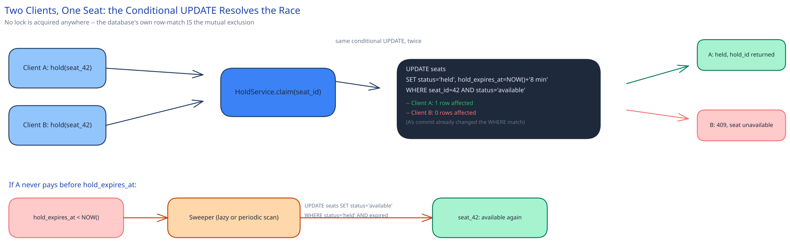

# Module 02 — Low-Level Design



## Interfaces vs. implementations

- **`SeatRepository`** *(interface)* → **`SqlSeatRepository`** — `findAvailable(eventId)` (seat-map read), `claim(seatId, holdId, expiresAt)` (the atomic conditional update), `release(seatId)` (the sweeper's update), `confirm(seatId, bookingId)`.
- **`HoldService`** — orchestrates a hold attempt: calls `SeatRepository.claim(...)`, returns a `hold_id` and `expires_at`, or a `409` if zero rows were affected.
- **`PaymentGateway`** *(interface)* → **`StripeGateway`** (or equivalent) — `charge(amount, paymentMethod, idempotencyKey)`, `refund(chargeId)`.
- **`BookingService`** — orchestrates confirmation: validates the hold hasn't expired, calls `PaymentGateway.charge(...)`, then atomically writes the booking + outbox row.
- **`AdmissionStrategy`** *(interface)* → **`TokenBucketAdmission`** — decides whether an arriving session is let into the flow now or queued, backing the Waiting-Room Gate.

## Core method: claiming a seat

```
HoldService.hold(eventId, seatId, sessionId):
    hold_id = generateId()
    expires_at = now() + HOLD_DURATION   # ~8 minutes

    rows_affected = seatRepository.claim(seatId, hold_id, expires_at)
    if rows_affected == 0:
        return HTTP_409("seat no longer available")

    return { hold_id, expires_at }

# SqlSeatRepository.claim, the entire mechanism:
#   UPDATE seats
#   SET status = 'held', hold_id = ?, hold_expires_at = ?
#   WHERE seat_id = ? AND status = 'available'
#   -- returns rows affected: 1 (won) or 0 (lost)
```

## Core method: confirming a booking

```
BookingService.confirm(holdId, idempotencyKey, paymentMethod):
    seat = seatRepository.findByHold(holdId)
    if seat is None or seat.hold_expires_at < now():
        return HTTP_410("hold expired")          # never call the processor for a dead hold

    charge = paymentGateway.charge(seat.price_cents, paymentMethod, idempotencyKey)
    if charge.failed:
        return HTTP_402("payment declined")       # seat stays held until its own timeout

    # single transaction: confirm the seat AND record the outbox event
    with transaction():
        rows_affected = seatRepository.confirm(seat.seat_id, holdId, booking_id=charge.id)
        if rows_affected == 0:
            paymentGateway.refund(charge.id)      # hold expired between the check above and this write
            return HTTP_410("hold expired")
        bookingRepository.insert(booking_id, seat.seat_id, ...)
        outboxRepository.insert("booking_confirmed", booking_id, payload)
```

The re-check inside the transaction (`rows_affected == 0` on confirm) matters: the read at the top of the method and the write inside the transaction aren't the same instant, so the hold could expire and get swept in between. Trusting only the first check would risk confirming — and charging for — a seat the sweeper already released.

## Error cases worth designing for deliberately

- **Payment succeeds, but the confirm write fails (crash, connection drop).** The charge already happened; the booking record doesn't exist yet. This is resolved the same way the payments case study resolves it: a reconciliation job queries the processor for any charge with no matching `booking_id`, past a threshold, and either completes the booking or issues a refund — never left as a silent double-loss for the user.
- **The hold expires in the few hundred milliseconds between the client submitting payment and the server processing it.** Handled explicitly above — the transaction's own conditional write is the final word, not the read at the top of the method.
- **The payment processor times out with no response** (not a decline — genuinely unknown). Treated as failure for booking purposes (the hold is not confirmed), but the charge itself is *not* assumed failed — the idempotency key on the charge means a retry is always safe, and reconciliation catches a charge that actually went through upstream.

## Concurrency at the code level

`SeatRepository.claim` needs no in-process lock, and no distributed lock either. Two `HoldService.hold()` calls for the same seat, running on two different service instances, race purely at the database: the conditional `UPDATE`'s `WHERE status='available'` is what the database itself evaluates atomically against the current row — by the time the second request's `UPDATE` runs, the first one's commit has already changed what that `WHERE` clause matches. No application code anywhere has to reason about mutual exclusion; the row's own current value *is* the lock.

This is worth contrasting with what an application-level lock would actually buy here: nothing. A mutex only ever protects threads on the same process — it does nothing for two separate service instances behind a load balancer, which is the entire concurrency shape this system has to handle (100,000 arrivals, spread across many stateless instances). Reaching for a distributed lock (Redis, Zookeeper) would add a whole extra failure mode — lock acquisition timeouts, stale locks after a crash — to solve a problem the database already solves for free.

## Design patterns you just used, named

- **Repository pattern** — `SeatRepository` hides the conditional-update SQL behind a method call; `HoldService` and `BookingService` never issue SQL directly.
- **State pattern** — a seat's `status` is an enum with enforced transitions (`available → held → booked`, `held → available` on expiry), never a set of independent booleans that could disagree with each other.
- **Strategy pattern** — `PaymentGateway` and `AdmissionStrategy` are both swappable behind an interface; swapping payment processors or changing the admission algorithm touches neither `HoldService` nor `BookingService`.
- **Transactional outbox** — the same pattern this guide's payments and job-scheduler case studies use: durably record "notify the user" in the same transaction as the state change it describes, rather than trusting a direct call to the notification provider to always succeed.

## Practice: extend it yourself

Before moving to Database Design, sketch (pseudocode is fine) how you'd add:

1. **Group holds** — a user wants to hold 5 seats together, and it should be all-or-nothing (if even one of the 5 is already held by someone else, none of them should be claimed). Does `SeatRepository.claim` change to accept a list, and what does "0 rows affected" mean when some rows *did* match? What isolation level does this actually require?
2. **A "reserve for me in 10 seconds" fast-lane for a user who's already completed a hold-and-abandon cycle once this session** — does this live inside `AdmissionStrategy`, inside `HoldService`, or as a new concern entirely? What's the risk if this fast-lane isn't itself rate-limited?

Neither has one clean answer — the point is noticing which existing interface is the natural home for the new behavior, and which one would be the wrong place to bolt it onto.
