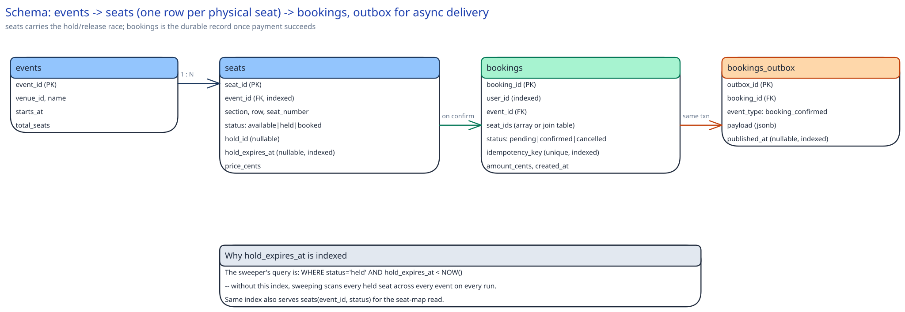

# Module 03 — Database Design & Scaling

## From entities to schema

- **Events:** `(event_id, venue_id, name, starts_at, total_seats)` — mostly static metadata, read far more than written.
- **Seats:** `(seat_id, event_id, section, row, seat_number, status, hold_id, hold_expires_at, price_cents)` — one row per physical seat per event. This table carries the entire concurrency mechanism; every other table is comparatively inert.
- **Bookings:** `(booking_id, user_id, event_id, seat_ids, status, idempotency_key, amount_cents, created_at)` — the durable record of a completed purchase, independent of the seat rows' own lifecycle.
- **Bookings outbox:** `(outbox_id, booking_id, event_type, payload, published_at)` — written in the same transaction as a booking's confirmation, drained asynchronously by the Notification Relay.

## Why `seats` and `bookings` are separate tables, not one

A seat's identity and status exist independent of any particular booking attempt — the same seat row lives through many failed holds before one succeeds, and the row itself needs to reflect "currently held by attempt #47" without a booking record ever being created for attempts #1 through #46. Collapsing them into one table would mean either creating a booking row for every failed hold (polluting the bookings table with non-purchases) or overloading the seats table with purchase-specific fields (`amount_cents`, `idempotency_key`) that only make sense once a booking actually exists. This is the same reasoning the distributed-job-scheduler case study uses for keeping job definitions separate from run history: identity and outcome are different things with different lifecycles.

## Why `hold_id` and `hold_expires_at` live on the seat row itself, not a separate `holds` table

The claim, the check for whether a hold is still valid, and the eventual confirm-or-release all need to happen against the *same* row, in the *same* conditional update, for the atomicity to work at all. If holds lived in a separate table, claiming a seat would require a join or a second write, and the two tables could disagree about a seat's true status during the gap between updating one and the other. Putting the hold fields directly on `seats` means one row, one atomic `UPDATE ... WHERE status='available'`, one source of truth.

## Why `idempotency_key` is a unique constraint on `bookings`, not just an application-level check

A network retry on the confirm call (client times out, resubmits) must not create two booking records for one payment. A unique constraint at the database level means the second insert simply fails on the constraint — no race window exists between "check if this key was already used" and "insert the row," the way there would with an application-level check-then-insert. This is the same idempotency-key discipline this guide names generally in [Idempotency Keys](../../scalability-resilience/idempotency-keys.md).

## Indexes

- `seats(event_id, status)` — serves the seat-map read ("show me available seats for this event"), the single highest-volume query in the system during an on-sale spike.
- `seats(status, hold_expires_at)` — the sweeper's entire query is `WHERE status='held' AND hold_expires_at < NOW()`; without this index, sweeping scans every held seat across every event on every run rather than only the expired ones.
- `bookings(idempotency_key)` — **unique**, enforcing the constraint above and serving the retry-detection lookup in the same index.
- `bookings(user_id, created_at)` — supports "show me my bookings," a read-heavy, low-urgency query that never competes with the hot path above.
- `bookings_outbox(published_at)` — partial index where `published_at IS NULL`, so the relay's poll only scans unpublished rows, the same pattern the payments case study's outbox uses.

## Consistency

- **Seats:** must be strongly consistent for the `status` column specifically — this is the one non-negotiable guarantee the whole design rests on, identical in spirit to the job-scheduler case study's claim column. A stale read of `status` risks showing a held seat as available, letting a user attempt a hold that's doomed to lose the race anyway (not incorrect, just a wasted round trip) — but a stale *write path* would risk the double-sale this entire case study exists to prevent, which is why the claim itself always goes to the primary, never a replica.
- **Bookings:** strongly consistent for the same reason — a booking, once confirmed, must never appear to not exist to a subsequent read (e.g., the confirmation page immediately after checkout).
- **Bookings outbox:** can tolerate the relay lagging behind by seconds; the booking itself is already durable and confirmed by the time the outbox row exists, so a delayed notification is a UX lag, not a correctness problem.
- **Events:** fully eventually-consistent-tolerant — venue metadata changes rarely and isn't part of any race.

## Scaling the schema

- **Sharding key, if this ever needs to shard:** by `event_id`. Every hot query (the hold claim, the seat-map read, the sweep) is naturally scoped to one event at a time — there's no cross-event query in the entire hot path that a shard-by-event-id scheme would break.
- **Read replicas vs. sharding:** at this system's actual scale (Capacity Estimation: 20,000 seats, ~1,667 hold attempts/sec for one popular event), a single well-indexed primary handles the write load fine — the case for sharding only appears if *many* large events go on sale simultaneously, at which point sharding by `event_id` isolates one event's on-sale spike from affecting another's. Read replicas serve the "my bookings" and general browsing queries, which have no freshness requirement anywhere near as strict as the claim itself.
- **Bookings outbox growth:** unlike the job-scheduler case study's run-history table, this table doesn't grow unboundedly relative to `seats` — one outbox row per confirmed booking, capped at `total_seats` per event — so it needs no independent sharding scheme of its own.

## Connecting it back

Every decision in this schema traces back to Module 00's one hard requirement: two people racing for the same seat must resolve to exactly one winner. That's why `hold_id` and `hold_expires_at` sit on the `seats` row itself rather than a separate table — the atomicity the claim needs is only free when there's one row and one conditional update. It's why `seats(status, hold_expires_at)` is indexed at all — without it, the sweeper (the mechanism that makes "never sold twice" also mean "never stuck forever") would be too slow to run often enough to matter. And it's why bookings and their outbox events are written in the same transaction as the seat's final `status='booked'` update — so that the one moment a seat becomes truly, durably sold is also the one moment the user is guaranteed to eventually hear about it.
