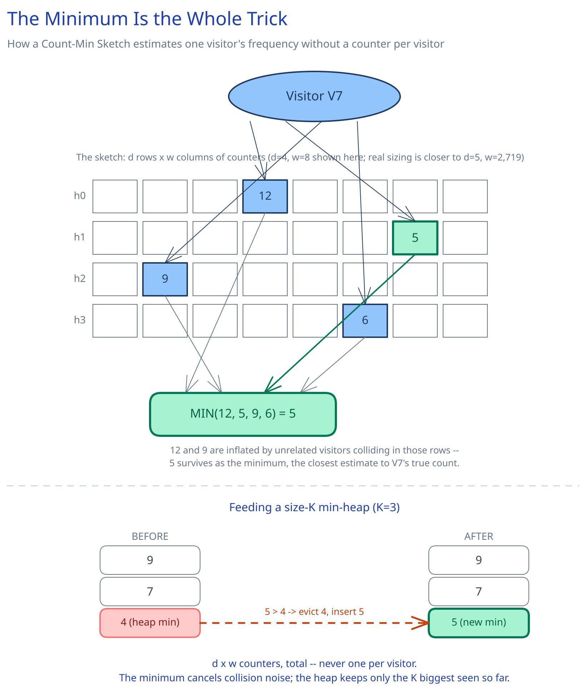

# Module 00 — Overview

## The feature, with no infrastructure in it yet

A billion-row access log has one column that matters for this problem: visitor ID. Somewhere in there are the handful of visitors who showed up far more than everyone else — the top K. Framed that way, it sounds like a `SELECT visitor_id, COUNT(*) ... GROUP BY visitor_id ORDER BY COUNT(*) DESC LIMIT K`, and at small scale it is exactly that. At a billion rows, with potentially hundreds of millions of *distinct* visitor IDs, it isn't: a `GROUP BY` has to materialize one running counter per distinct ID before it can sort anything, and that intermediate state — not the final K-row answer — is what breaks a single machine's memory first.

That's the one hard constraint this whole module is downstream of: **the number of distinct visitor IDs, not the number of rows, is what makes exact counting expensive.** This is a heavy-hitters problem, not a lookup problem — nobody needs to know any one specific visitor's exact count, only who the top K are, which opens the door to an approximate answer with a bounded, known error, traded for a massive reduction in memory. That's the same trade [Bloom Filters](../../scalability-resilience/bloom-filters.md) makes for set membership, applied here to frequency counting instead.

## Requirements

**Functional:**
- Given a log of visit events (one row per page visit, each with a visitor ID), return the K visitor IDs that appear most often.
- Support a streaming variant: the answer stays approximately current as new events keep arriving, without re-scanning everything already processed.

**Non-functional** (stated as assumptions, interview-style):
- 1B+ log rows, with potentially hundreds of millions of distinct visitor IDs — too large to sort centrally, and too many distinct keys to hold one exact counter per key in memory on one machine.
- An approximate answer is explicitly acceptable, as long as the error is bounded and one-directional (overestimate-only, never undercount a real heavy hitter into invisibility) — this is a firm requirement, not a shortcut, and it's what licenses everything else in this design.
- In the streaming variant, "most frequent" has to mean *recently* frequent — a count that only ever accumulates would make yesterday's spike invisible against a year of history.

## Capacity Estimation

Using this guide's [back-of-envelope method](../../foundations/back-of-envelope-estimation.md):

- **Exact counting, sized honestly:** assume 1B rows collapse to ~200M distinct visitor IDs. A hash map with real per-entry overhead (key, counter, bucket/node bookkeeping) runs ~50 bytes/entry in most managed runtimes: 200M × 50B ≈ **~10GB**, just for the counters — before merging that same structure across any partition boundary, which for an exact approach means a shuffle keyed by visitor ID (a full group-by-and-combine across machines), not a cheap fixed-cost merge.
- **Count-Min Sketch, sized from error tolerance:** for a target error of ε = 0.1% of total event count N and confidence δ = 99%, the standard sizing is `w = e/ε ≈ 2,719` columns and `d = ln(1/δ) ≈ 5` rows (cross-ref the same sizing math [Bloom Filters](../../scalability-resilience/bloom-filters.md) walks through for its own false-positive-rate trade-off). At 4 bytes/counter: 5 × 2,719 × 4B ≈ **~54KB** — a fixed size that depends only on `ε` and `δ`, not on N or on how many distinct visitor IDs actually showed up.
- **Top-K heap:** K entries (say K=100), each a visitor ID plus a count — a few KB at most, regardless of log size.
- **The gap is the whole point:** ~10GB of exact per-ID state collapses to ~54KB of sketch state, a >99.999% reduction, in exchange for a bounded, provably one-directional error instead of an exact answer.

## Approach Walkthrough

Instead of one counter per distinct visitor ID, maintain a small 2D array of counters — a **Count-Min Sketch** — with `d` independent hash functions, one per row: recording a visit hashes the visitor ID `d` ways and increments each hashed cell, and estimating a visitor's count hashes the same `d` ways and takes the **minimum** across those cells, which cancels out most of the collision noise any single row picks up from unrelated IDs. Pair the sketch with a **size-K min-heap**: for every event, look up the visitor's estimated count and, if it beats the heap's current smallest tracked count, evict the smallest and insert the new one — the heap never holds more than K entries no matter how many billions of events flow through. At billion-row scale, the log is partitioned (by time window or by a hash of the visitor ID), each partition gets its own local sketch and local top-K candidates, and a final merge step sums the per-partition sketches cell-by-cell (they're just counter arrays) and re-derives the global top-K from the merged sketch.

## API Surface

- `POST /jobs/top-k {log_source, k, partition_strategy: time_window|visitor_hash, error_tolerance}` → `{job_id}` — kicks off a batch computation over a fixed log range.
- `GET /jobs/top-k/{job_id}` → `{status, top_k: [{visitor_id, estimated_count}], error_bound}` — poll for the batch result.
- Streaming ingestion (fire-and-forget, one event per visit): a `visitor_events` topic/stream, `{visitor_id, timestamp, page}`.
- `GET /top-k/live?window=1h&k=100` → `{top_k: [{visitor_id, estimated_count}], as_of}` — the continuously-updated approximate answer for the streaming variant, always served from the last finalized result, never from a live, still-mutating sketch.
