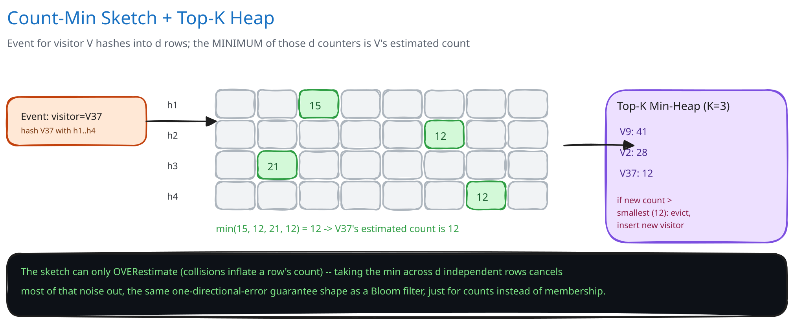

# Module 01 — Architecture & High-Level Design

## Monolith vs. microservices

This is pulled apart as its own analytics pipeline — a partitioner, a fleet of partition workers, and a merge coordinator — entirely separate from whatever system actually produced the log (the web servers writing access records) and separate from whatever eventually reads the finalized top-K (a dashboard, a report). The reason isn't a default preference for more services; it's a concrete throughput/latency mismatch, the same shape [Ad Click Aggregation](../ad-click-aggregation/01-architecture-hld.md) argues for its own pipeline: the system producing the log has to keep writing rows in real time no matter what, and the system reading the final top-K needs a small, cheap lookup — folding a billion-row scan into either of those paths would make a batch computation's runtime someone else's latency problem.

There's a second, load-bearing reason the seam holds here specifically: **a single machine cannot hold one exact counter per distinct visitor ID at this scale** (per Module 00's capacity math, ~10GB of hash-map state for 200M distinct IDs). That's not a throughput argument for splitting a service, it's a hard memory ceiling that forces the log itself to be partitioned across independent workers, each of which only ever needs to hold a fixed-size, tiny sketch (~54KB) regardless of how much of the log it's assigned. If your log actually fits in one machine's memory as an exact hash map — a few million distinct IDs, not hundreds of millions — this entire pipeline is solving a problem you don't have yet; say so rather than partitioning by default.

## Building Blocks

| Block | Role |
|---|---|
| **Log Source** (batch) / **Event Stream** (streaming) | Raw visit events, either a static object-storage log or a continuously-arriving `visitor_events` stream |
| **Partitioner** | Assigns each row/event to exactly one partition — by time window (batch) or by a hash of the visitor ID (streaming/skew control), cross-ref [Data Partitioning & Sharding](../../hld-building-blocks/data-partitioning-sharding.md) |
| **Partition Worker** | Streams through its assigned slice once, maintaining one local Count-Min Sketch (`d` rows × `w` columns) and one local size-K min-heap over that slice alone |
| **Merge Coordinator** | Waits for every partition worker to finish, sums all partition sketches cell-by-cell into one global sketch, re-scores the union of every partition's local top-K candidates against the merged sketch, and derives the final global top-K |
| **Result Store** | Persists the finalized top-K list per run/window; the only thing a reader ever queries |
| **Decay/Windowing Job** (streaming variant only) | Periodically halves counters or rotates per-time-bucket sketches so "most frequent" tracks recent behavior instead of accumulating forever |

## Per-path walkthrough

**Batch computation path (write)** — `Log Source (partitioned by time window or visitor-ID hash) → Partition Worker (stream partition once, update local sketch + local top-K heap) → Merge Coordinator (barrier: wait for all partitions, sum sketches cell-by-cell, re-derive global top-K from merged sketch + union of local candidates) → Result Store`. The partition step is what turns "too big for one machine" into "trivially parallel"; the merge step is cheap — O(d×w) per partition pair — precisely *because* a sketch is nothing but a fixed-size counter array, unlike merging exact per-ID hash maps, which would need a full shuffle keyed by visitor ID.

**Streaming path (write)** — `Event Stream (partitioned) → Partition Worker (continuous sketch/heap updates, periodic decay pass) → periodic snapshot → Merge Coordinator (same cell-by-cell merge, run on a schedule) → Result Store (rolling top-K)`. Structurally identical to the batch path — the only addition is the decay job keeping each local sketch's notion of "frequent" anchored to recent traffic instead of all of history.

**Query path (read)** — `Client/Dashboard → Result Store (read the last finalized top-K)`. Deliberately never touches a live, still-mutating sketch or heap — matching [Ad Click Aggregation](../ad-click-aggregation/01-architecture-hld.md)'s serving-path discipline of only ever reading a store that's already finalized, which is what makes concurrent reads safe without any coordination with the write side at all.

## Trade-offs to make explicit

| Decision | Chosen | Alternative | Why |
|---|---|---|---|
| Counting mechanism | Count-Min Sketch (probabilistic, one-directional overestimate) | Exact per-ID hash map counters | Exact counters' memory scales with the number of DISTINCT visitor IDs, which can exceed one machine's memory at this scale; a sketch's memory is fixed by the chosen error tolerance, independent of cardinality entirely |
| Top-K tracking | Size-K min-heap, updated incrementally per event | Materialize every count, sort at the end, take the top K | Sorting requires holding every distinct ID's count first — exactly the memory problem the sketch exists to avoid; the heap never exceeds K entries no matter how many billion events pass through |
| Scale-out strategy | Partition the log, one local sketch + heap per partition, merge once at the end | One shared sketch across all workers, guarded by a distributed lock | A shared sketch needs a network round-trip per increment to stay atomic across workers — orders of magnitude slower than each worker incrementing its own in-memory counters and merging exactly once |
| Partitioning key | Time window, for a batch log that's already chunked that way | Hash of visitor ID | Time-window partitioning scatters any one visitor's events across many partitions' sketches — that's only safe to do because sketches merge *additively*, with no shuffle required to reunite one visitor's total; an exact-counting approach couldn't get away with this without a full group-by shuffle first |
| Local candidate set size | Track more than exactly K locally per partition (an oversampled `C×K`) | Track exactly the local top K per partition | A visitor who ranks just below the cutoff in every single partition, but is a genuine global top-K visitor once summed, would never surface in any partition's *exact*-K candidate list — oversampling locally is what keeps that visitor in the merge's candidate pool at all (Module 02 covers this failure mode in detail) |

## Load Handling

- **Peak-vs-average tolerance:** the batch variant's real constraint is total wall-clock completion time on a fixed-size log, not a request rate — adding partition workers is an ordinary horizontal-scaling move, the same reasoning [Data Partitioning & Sharding](../../hld-building-blocks/data-partitioning-sharding.md) applies generally. The streaming variant's real load axis is sustained events/sec, and a partition worker's per-event cost is `O(d)` — a handful of hash computations, `d` counter increments, one heap comparison — cheap enough that a single worker sustains a very high event rate before this becomes the bottleneck.
- **Where backpressure kicks in first:** at the partition consumer, for the streaming variant — if a worker falls behind a sustained spike, events queue in the partitioned stream itself rather than being dropped, the same [backpressure](../../scalability-resilience/backpressure-load-shedding.md) pattern [Ad Click Aggregation](../ad-click-aggregation/01-architecture-hld.md) uses for its own ingestion tier. For the batch variant, backpressure shows up as the Merge Coordinator's completion barrier simply waiting longer on the slowest partition.
- **What gets shed under overload:** nothing on the counting path — an event is either ingested and eventually counted, or never ingested at all (a true producer-side failure, outside this pipeline's control). What *can* lag under sustained pressure is how promptly a new top-K snapshot appears; widening the merge/refresh interval is the acceptable degradation, since the sketch's approximation is already an accepted, bounded trade — silently dropping events on top of that would introduce unbounded error instead of the sketch's own guaranteed one-directional error.
- **Autoscaling lag:** partition worker count scales with the number of partitions in the log or stream, up to that ceiling — the same partition-count-bounds-parallelism constraint [Kafka & the Distributed Log](../../hld-building-blocks/kafka-distributed-log.md) names for any partitioned consumer group.
- **Load-test target:** process a 1-billion-row log across N partition workers, confirm the merged global top-K matches an offline exact top-K (computed once, for verification only) within the sketch's stated error bound, with zero partitions silently missing from the merge.

## Concurrent-User Handling

| Race | Mechanism | What the "loser" sees |
|---|---|---|
| A visit event's timestamp lands exactly on a partition boundary | Partition assignment is a pure, deterministic function of the timestamp (`partitionFor(ts)`), evaluated identically no matter where or how many times it runs | The event lands in exactly one partition's sketch, every time — there's no "losing" side, because the function never returns two different answers for the same input |
| A partition worker crashes mid-scan and is retried | Each partition's sketch and local top-K are rebuilt from that partition's raw slice alone, deterministically — a crashed attempt's half-built in-memory sketch is simply discarded, never merged | The retry reprocesses the partition from scratch; nothing from the crashed run survives into the eventual merge |
| The Merge Coordinator's merge step racing a still-in-progress partition worker | The merge waits on a completion barrier — every partition must report done before the cell-by-cell sum runs | A slow partition delays when the final top-K becomes available; the merge never runs against a partition's incomplete sketch |
| (Streaming) A periodic decay pass racing a concurrent increment on the same local sketch | Both run on the same single-threaded per-partition consumer loop, so they're never actually concurrent within one partition — atomicity by construction, not by locking | There's no race to lose; the decay pass and the increment simply can't overlap in the first place |

## Scaling & Reliability

- **Horizontal scaling:** adding partition workers adds parallel scan/ingest capacity directly — throughput scales with partition count, the same reasoning [Data Partitioning & Sharding](../../hld-building-blocks/data-partitioning-sharding.md) applies to any partitioned workload.
- **Circuit breaker:** the Merge Coordinator's write to the Result Store is wrapped in a circuit breaker; if the store is unreachable, partition workers keep accumulating locally rather than blocking ingestion on a downstream write that has nothing to do with counting.
- **Retries:** a failed partition run is retried by simply re-running that partition from its raw slice — deterministic and idempotent by construction, never a partial re-merge of a half-finished sketch.
- **Dead-letter handling:** a malformed row (missing or corrupt visitor ID) is skipped and logged, not allowed to crash the whole partition's scan over one bad row.
- **Graceful degradation:** if the Merge Coordinator or Result Store is briefly unavailable, partition workers keep completing their local sketches regardless — the merge and the final answer are simply delayed, and the last successfully published top-K stays visible to readers in the meantime (stale, never wrong, matching [Ad Click Aggregation](../ad-click-aggregation/01-architecture-hld.md)'s "dashboards show stale data, never wrong data" framing).
- **Multi-region:** not built here — named as a real gap below rather than glossed over.

## What you'd revisit as this grows

- **Adversarial or naturally skewed hot IDs.** A single bot or crawler responsible for a huge share of hits can overload the one partition it hashes to, regardless of how evenly the hash spreads *other* IDs — a mature design needs a hot-key detection and sub-partitioning strategy for that one ID's own traffic, which this module doesn't build.
- **Error compounding across many partitions.** Merging D partitions' sketches doesn't just carry each partition's own error forward independently in a simple way; a production system would tie the choice of `d`/`w` and partition count together deliberately, rather than sizing each independently, and this module names that as a gap rather than solving it.
- **Adaptive decay tuning**, for the streaming variant — a fixed decay interval is a blunt instrument, the same gap [Ad Click Aggregation](../ad-click-aggregation/01-architecture-hld.md) names for its own fixed watermark grace period; a mature version would tune the decay rate to the traffic pattern rather than use one global constant.
- **Multi-region merge-of-merges.** If visitor traffic is logged region-locally, a global top-K needs a second merge layer across regions' already-merged sketches — a harder problem than this module takes on, worth naming as future work rather than pretending it's solved.
