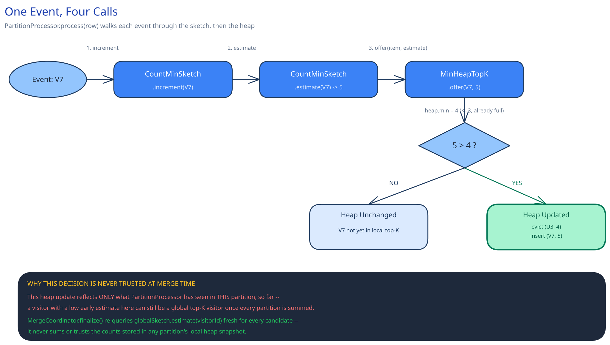

# Module 02 — Low-Level Design



## Interfaces vs. implementations

- **`FrequencySketch`** *(interface)* → **`CountMinSketch`** — `increment(item)`, `estimate(item)`, `merge(other: FrequencySketch): FrequencySketch`. Modeling this as an interface, not a concrete class the rest of the system reaches into directly, is what lets a different sketch (e.g. a Count-Sketch using a median instead of a minimum, trading the one-directional-error guarantee for a tighter variance) get swapped in later without touching `PartitionProcessor` at all.
- **`TopKTracker`** *(interface)* → **`MinHeapTopK`** — `offer(item, estimatedCount)`, `snapshot(): List<(item, count)>`.
- **`HashFunctionFamily`** *(interface)* → **`UniversalHashFamily`** — supplies the `d` independent hash functions a `CountMinSketch` needs, seeded once and reused identically by every partition worker so that merging sketches later is comparing counts under the *same* hash assignment, not two unrelated random projections.
- **`PartitionProcessor`** — the per-partition orchestrator. Depends on `FrequencySketch` and `TopKTracker`, implements neither itself.
- **`MergeCoordinator`** — depends on a repository of partition results and produces the final global top-K; implements no counting logic of its own, only reduction.

## Pseudocode for the core methods

```
CountMinSketch.increment(item):
    for i in 0..d-1:
        col = hashFunctions[i](item) mod w
        table[i][col] += 1

CountMinSketch.estimate(item):
    best = +infinity
    for i in 0..d-1:
        col = hashFunctions[i](item) mod w
        best = min(best, table[i][col])
    return best

CountMinSketch.merge(other):
    assert self.d == other.d and self.w == other.w and self.hashFunctions == other.hashFunctions
    result = new CountMinSketch(d, w, hashFunctions)
    for i in 0..d-1:
        for j in 0..w-1:
            result.table[i][j] = self.table[i][j] + other.table[i][j]
    return result
```

```
PartitionProcessor.process(partitionSource):
    sketch = new CountMinSketch(d, w, sharedHashFunctions)
    topK = new MinHeapTopK(limit = C * K)          # oversampled, see below
    for row in partitionSource:
        sketch.increment(row.visitor_id)
        topK.offer(row.visitor_id, sketch.estimate(row.visitor_id))
    return PartitionResult(sketch, topK.snapshot())
```

```
MergeCoordinator.finalize(partitionResults):        # one per partition, all done (barrier)
    globalSketch = reduce(merge, [r.sketch for r in partitionResults])
    candidates = dedupe(union(r.topKCandidates for r in partitionResults))
    globalTopK = new MinHeapTopK(limit = K)
    for visitorId in candidates:
        globalTopK.offer(visitorId, globalSketch.estimate(visitorId))     # re-scored fresh, never trusting stale local counts
    return globalTopK.snapshot()
```

The re-scoring step in `finalize` is not optional bookkeeping: a candidate's count as recorded in its own partition's snapshot reflects that partition's data *only*, but the same visitor may have events scattered across several other partitions too. `globalSketch.estimate(visitorId)` is what actually answers "this visitor's count across the whole log," which is why the merge always re-queries the merged sketch rather than summing each partition's already-stored candidate counts by hand.

## Error cases worth designing for deliberately

- **Local top-K under-covers the global top-K.** A visitor who ranks just below the local cutoff in *every single* partition, but is a genuine top-K visitor once all partitions are summed, would never appear in any partition's exact-K candidate list — and a candidate who never gets recorded anywhere can't be re-scored at merge time, no matter how good the re-scoring step is. This is why `PartitionProcessor` tracks an **oversampled** local candidate set (`C × K` for some small constant `C`, not exactly `K`) — it doesn't eliminate the failure mode, but it substantially reduces it, and `C` is a real, tunable knob against a real, named risk, not free.
- **Sketch collisions can only ever inflate an estimate, never deflate one.** Because every increment only ever adds, and the minimum-across-rows step can only pick the *smallest* of several always-truthful-or-inflated numbers, an estimate can never fall below a visitor's true count. The failure mode this leaves is the mirror of the one above: a visitor with a genuinely low true count can occasionally get inflated by collision noise into occupying a top-K slot that should belong to someone else. Both are accepted, bounded costs of the memory savings — the same trade [Bloom Filters](../../scalability-resilience/bloom-filters.md) makes in the opposite direction (false positives on membership, never false negatives).
- **A malformed row** (a missing or corrupt visitor ID) is skipped and logged by `PartitionProcessor`, not allowed to abort the whole partition's scan over one bad row — one partition's data quality issue shouldn't cost every other partition's already-completed work.

## Concurrency at the code level

Inside a single-threaded `PartitionProcessor`, the sketch and heap need **no lock at all** — not because some external system provides atomicity (the usual pattern this guide reaches for elsewhere), but because there's only ever one writer, period, for the lifetime of that partition's scan. This is worth stating explicitly as a *different* kind of "no lock needed" than [Distributed Job Scheduler](../distributed-job-scheduler/02-lld.md)'s conditional database update: there, many writers race and the database's own atomicity resolves it; here, there is no race to resolve because the design simply never introduces a second writer.

If a single partition is itself parallelized across multiple threads to raise per-partition throughput further, that guarantee no longer holds automatically, and two things change: each `table[i][col] += 1` needs to become an atomic increment (a compare-and-swap loop or a language-level atomic integer) since two threads can now land on the same cell concurrently — a lightweight, in-memory primitive, not a network round-trip. The min-heap is the harder case: a heap isn't naturally safe for concurrent multi-writer restructuring, so the practical answer is the same pattern recursively applied — each thread keeps its own local sketch and heap over its own slice of the partition, and those get merged exactly the same way partitions themselves get merged. Partitioning, in other words, is fractal: the identical "local state, merge once at the end" shape applies whether the granularity is machines or threads, because a Count-Min Sketch's merge is associative regardless of how finely the input was sliced.

## Design patterns you just used, named

- **Strategy pattern** — `FrequencySketch` and `HashFunctionFamily` are both strategies: a different sketch implementation or hash family swaps in behind the same interface without `PartitionProcessor` or `MergeCoordinator` changing at all.
- **Map-Reduce, by name** — `PartitionProcessor.process` is the map phase (local, parallel, no coordination needed); `MergeCoordinator.finalize` is the reduce phase (a single combine step over already-summarized local results). Naming it explicitly is worth doing because it's the same shape as almost any "answer a global question about data too large for one machine" problem, cross-ref [Data Partitioning & Sharding](../../hld-building-blocks/data-partitioning-sharding.md).
- **Composite-safe reduction** — `CountMinSketch.merge` being associative and commutative (summing counter arrays cell-by-cell) is what makes the reduce step correct regardless of the order partitions finish in, or how many merge steps get chained together — a property worth calling out because it's exactly what an *exact* per-ID hash map merge would lack without an expensive keyed shuffle first.

## Practice: extend it yourself

Before moving to Database Design, sketch (pseudocode is fine) how you'd add:

1. **Recency-weighted decay for the streaming variant** — periodically halve every counter in a partition's sketch so old activity fades. Does the decay pass need to block concurrent increments on the same sketch, and does it matter whether a given cell is decayed *before* or *after* an increment that arrives in the same instant? What does halving a counter do to the sketch's own error-bound math from Module 00 — does `ε` stay the same, get worse, or does it depend on how often you decay?
2. **Top-K per category** (e.g., top K visitors per country) instead of one global top K. Does this need a completely separate `CountMinSketch` per category, or can one shared sketch serve every category if you hash `(category, visitor_id)` as a single combined key? What specifically breaks — in accuracy, not in code — if you take the combined-key shortcut versus keeping per-category sketches?

Neither has one clean answer — the point is noticing that the interfaces already drawn (`FrequencySketch`, `TopKTracker`) make it obvious which component *should* own each new piece of behavior, even before you've fully worked out what that behavior should do.
