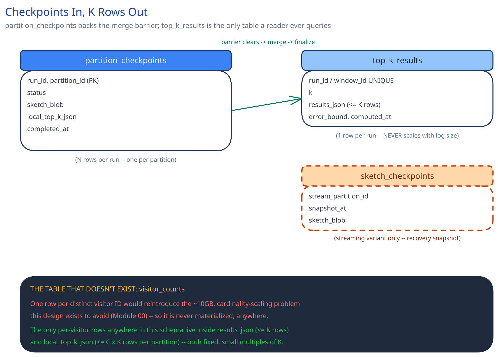

# Module 03 — Database Design & Scaling

## From entities to schema

This system's whole reason for existing is compressing a billion-row problem down to a result set of size K — so unlike almost every other case study in this guide, **the schema doesn't scale with input size at all.** Three entities fall out of the pipeline directly:

- **`partition_checkpoints`** `(run_id, partition_id, status, sketch_blob, local_top_k_json, completed_at)` — the durable artifact each `PartitionProcessor` produces on completion. This is what lets the Merge Coordinator's barrier (Module 01's Concurrent-User Handling) be a database read rather than an in-memory wait on a fleet of workers that might crash and restart independently of it.
- **`top_k_results`** `(run_id | window_id, k, results_json, error_bound, computed_at)` — the finalized answer, at most K rows' worth of `(visitor_id, estimated_count)` pairs per run or window. This is the only table a reader ever queries.
- **`sketch_checkpoints`** `(stream_partition_id, snapshot_at, sketch_blob)` — streaming variant only: a periodic snapshot of a partition's live sketch, so a crashed streaming worker resumes from its last snapshot plus a bounded replay window instead of from the beginning of the stream.

## Why there is no `visitor_counts` table

This is the single most important absence in this schema, and it's deliberate: the entire point of the Count-Min Sketch was avoiding a row (or a hash-map entry) per distinct visitor ID. Persisting one would silently reintroduce the exact scaling problem Module 00 opens with — a table with as many rows as there are distinct visitors is precisely the "~10GB, and growing with cardinality" state this design exists to never materialize. The only per-visitor rows that ever exist anywhere in this schema are the handful inside `results_json` (bounded by K) and the oversampled local candidate lists inside `local_top_k_json` (bounded by `C × K` per partition, per Module 02) — both fixed, small multiples of K, never of the input log's cardinality.

## Why `partition_checkpoints` is a real table, not just an in-memory barrier

A purely in-memory "wait for N workers to report done" coordination scheme dies with whichever process is holding that state the moment it crashes — the Merge Coordinator itself becoming a single point of failure for a pipeline whose entire design is otherwise built to survive individual worker crashes (Module 01's Scaling & Reliability). Making the checkpoint durable and queryable means the Merge Coordinator's own restart is just another read of `partition_checkpoints WHERE run_id = ? AND status = 'done'` — no different from its first read, and no coordination protocol beyond a table scan/index lookup.

## Why the sketch itself is stored as an opaque blob, not unpacked into rows

A Count-Min Sketch is nothing but a fixed-size 2D counter array — unpacking it into `d × w` individual rows (a few thousand rows per partition, for the sizing in Module 00) would buy nothing, since nothing ever queries an individual cell on its own; every real operation (`merge`, `estimate`) needs the whole array at once. Storing it as a single serialized blob keyed by `(run_id, partition_id)` matches the actual access pattern — read the whole thing, or don't read it at all — the same reasoning [SQL vs NoSQL](../../database-design/sql-vs-nosql.md) gives for letting the access pattern choose the storage shape rather than defaulting to "always normalize."

## Indexes

- `partition_checkpoints(run_id, partition_id)` — **unique**, and the Merge Coordinator's exact lookup: "give me every partition's checkpoint for this run."
- `partition_checkpoints(run_id, status)` — the barrier check itself: "are all partitions for this run done yet" is a single indexed range scan, not a full-table scan, as the number of historical runs grows.
- `top_k_results(run_id)` or `(window_id)` — **unique**, the dashboard/query path's entire lookup pattern: "give me the latest (or a specific) finalized top-K."
- `sketch_checkpoints(stream_partition_id, snapshot_at DESC)` — streaming only: "this partition's most recent snapshot," so a recovering worker's resume query is a single indexed lookup rather than scanning every snapshot ever taken.

## Consistency

- **`partition_checkpoints`:** must be strongly consistent — this is the non-negotiable guarantee the merge barrier rests on, the same way [Distributed Job Scheduler](../distributed-job-scheduler/03-db-design.md)'s claim column has to be strongly consistent for its own barrier-like guarantee. A stale read that shows a partition as "done" before its write actually committed risks the merge running against an incomplete sketch; a stale read the other way just delays the merge slightly, which is safe.
- **`top_k_results`:** can tolerate eventual consistency and read replicas without concern — it's written once per run/window and read by many dashboard queries afterward, the same read-heavy, rarely-written shape [Ad Click Aggregation](../ad-click-aggregation/03-db-design.md)'s aggregate store has, and for the same reason: a replica's small lag doesn't change what the finalized answer actually is, only how promptly a query sees the very latest run.
- **`sketch_checkpoints`:** eventual consistency is fine by construction — a slightly stale snapshot on recovery just means replaying a bit more of the stream to catch back up, never an incorrect final count, since the sketch's own increments are idempotent-by-replay as long as the replay window is bounded and known.

## Scaling the schema

- **Sharding `partition_checkpoints`, once run volume demands it:** by `run_id` — every query this table serves ("this run's checkpoints," "is this run's barrier satisfied") is scoped to one run, so keeping one run's checkpoints together avoids any fan-out for the common case, the same shard-key-matches-the-query-pattern reasoning [Data Partitioning & Sharding](../../hld-building-blocks/data-partitioning-sharding.md) argues for generally.
- **`top_k_results` never needs sharding.** Its row count is bounded by K times the number of historical runs or windows — it does not grow with the size of the input log, no matter how large that log gets. This is worth stating explicitly as the exception to almost every other case study in this guide, where the serving-side table's growth tracks write volume; here it's structurally decoupled from it.
- **Read replicas vs. sharding, once more:** replicas would help if `top_k_results` read volume ever became the bottleneck (many dashboard viewers polling the same run); sharding would only ever be needed for `partition_checkpoints`, and only at a scale of concurrent runs this design doesn't assume by default. Reaching for sharding on a table whose whole point is staying small is the mistake to avoid here.

## Connecting it back

Look at all three modules together: Module 00's "the number of distinct IDs, not the number of rows, breaks exact counting" is why Module 01 partitions the log and gives each partition its own fixed-size sketch instead of one shared exact counter map; that same constraint is why this schema has no `visitor_counts` table at all — persisting one would undo the entire design. The Merge Coordinator's completion barrier from Module 01's Concurrent-User Handling is why `partition_checkpoints` exists as a durable, indexed table rather than in-memory coordination state; and the fact that `top_k_results` never grows with the input log is the schema-level proof of Module 00's core claim — that this system compresses a billion-row problem into an answer of size K, and nothing in between ever has to be that big.
