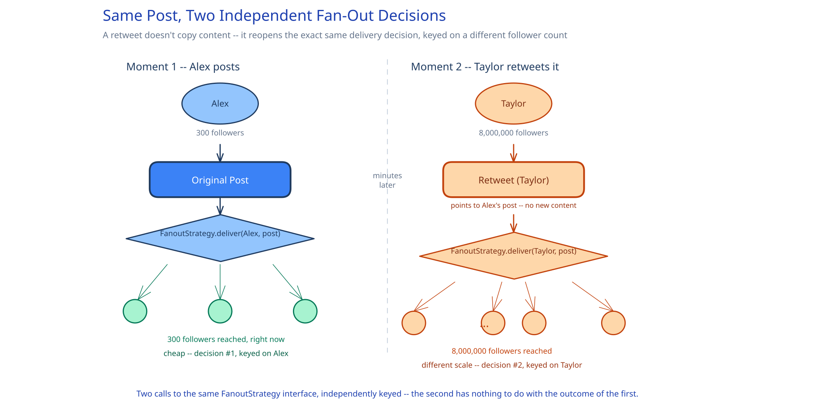

# Module 00 — Overview

## The feature, with no infrastructure in it yet

A user types up to 280 characters, taps post, and it has to show up in their followers' timelines. They can follow other accounts, like a post, search for a hashtag someone else just started using, and — the action that makes this case study its own thing rather than a rerun of a feed you've already seen — reshare anyone else's post to their own followers with one tap, no new content required. That last action is the one hard constraint worth naming up front: **a retweet doesn't just copy a post, it reopens the exact delivery decision the original post already made, from scratch, against a completely different follower count.** A tweet from an account with 300 followers is a small, cheap delivery problem. The instant a follower with 8 million followers of their own retweets it, the system has to deliver *that same content* at celebrity scale — even though the original author never crossed any threshold themselves.

This guide's [News Feed System](../news-feed-system/00-overview.md) case study already works out the underlying feed-generation problem in full — fan-out-on-write vs. fan-out-on-read, and the celebrity-account threshold that picks between them. Read that first if you haven't; this page assumes it and spends its own depth on what Twitter/X adds on top: the retweet's second fan-out hop, a search feature with a tighter freshness bar than the timeline itself, and a storage story that splits hard between cheap text and expensive media.

## Requirements

**Functional:**
- Post a text update up to 280 characters, optionally with one attached image or video.
- Follow / unfollow another account.
- View a timeline of posts from followed accounts (mechanics: see News Feed System).
- Like a post; retweet a post to your own followers.
- Search posts by hashtag or keyword.

**Non-functional** (stated as assumptions, interview-style):
- 250M DAU.
- 500M posts/day, of which roughly 30% (150M) are retweets rather than original content — reposting is a first-class, high-volume action here, not an edge case.
- ~15% of original posts carry an attached image or video.
- Timeline delivery tolerates a few seconds of lag, per News Feed System's own requirement.
- Search is held to a **tighter** bar: a newly-posted tweet matching a hashtag or keyword query must be searchable within about 2 seconds, p99 — noticeably stricter than the timeline's own fan-out tolerance, because someone searching a hashtag is usually looking for something that just happened.

## Capacity Estimation

Using this guide's [back-of-envelope method](../../foundations/back-of-envelope-estimation.md):

- **Posts/sec, average:** 500M / 86,400 ≈ 5,800/sec (350M original + 150M retweets). Unlike News Feed System's smoothly-distributed posting rate, the *retweet* portion of this number clusters hard around trending events — a single viral moment can push retweet volume to many multiples of this average within seconds, while original-post volume barely moves.
- **The second-hop fan-out number, worked concretely:** an ordinary post from a 300-follower account fans out to 300 people (cheap, per News Feed System). If one follower with 8M followers of their own retweets it a minute later, that single retweet triggers **8,000,000 new fan-out writes** — a number that has nothing to do with the original post's own follower count, and dwarfs it by four orders of magnitude. This is the number that actually matters here, not the aggregate average.
- **Text storage:** 350M original posts/day × ~300 bytes (280 chars + metadata) ≈ 105GB/day — cheap, and it stays cheap regardless of how many times a post is retweeted, since a retweet stores no content of its own (see Database Design).
- **Retweet storage:** 150M thin reference rows/day × ~80 bytes (`retweeter_id`, `original_post_id`, `created_at`) ≈ 12GB/day.
- **Media storage:** 15% of 350M original posts ≈ 52.5M attachments/day × ~400KB average (a mix of images and short clips) ≈ **21TB/day** — roughly 200x the text-tweet volume despite being a small minority of posts. That ratio alone is why media storage has to be architected separately from the tweet row (see Approach Walkthrough below).
- **Search indexing throughput:** has to sustain the same ~5,800/sec ingest rate as the write path, including the same retweet-driven bursts, but against a 2-second freshness target rather than the feed's looser "a few seconds, sometimes more under backpressure."

## Approach Walkthrough

Before any boxes: reuse the News Feed System's push/pull hybrid wholesale for how a post reaches followers — that problem is already solved, and re-solving it here would just be restating that case study. What's actually new is that a retweet re-runs the *same* fan-out decision a second time, independently, keyed off the retweeter rather than the original author — so "did this post fan out expensively" isn't a fact fixed at post-creation time, it's re-evaluated on every reshare, potentially over and over as a chain of increasingly-large accounts retweet the same content. Layered on top of that: search has to feel near-real-time even though the timeline itself doesn't, which means it needs its own indexing pipeline tuned to a tighter SLA rather than riding on the feed's own fan-out lag; and a tweet's text is so cheap relative to its media that the two are never allowed to travel together — media always lives in object storage, referenced by a pointer, never inlined into the tweet row itself.

## API Surface

- `POST /tweets {author_id, body<=280, media_url?}` → `{tweet_id, created_at}`.
- `POST /tweets/{id}/retweet {retweeter_id}` → `{retweet_id, created_at}` — no `body`; a retweet carries no content of its own.
- `POST /media/upload` → `{media_url, upload_url}` — a pre-signed URL for a direct client-to-object-storage upload, used before calling `POST /tweets` with the resulting `media_url`.
- `POST /users/{id}/follow` / `DELETE /users/{id}/follow`.
- `GET /timeline?cursor=&limit=` → the caller's assembled timeline (mechanics: News Feed System).
- `GET /search?q=&cursor=` → ranked, near-real-time results for a hashtag or keyword.
- `POST /tweets/{id}/like`.
