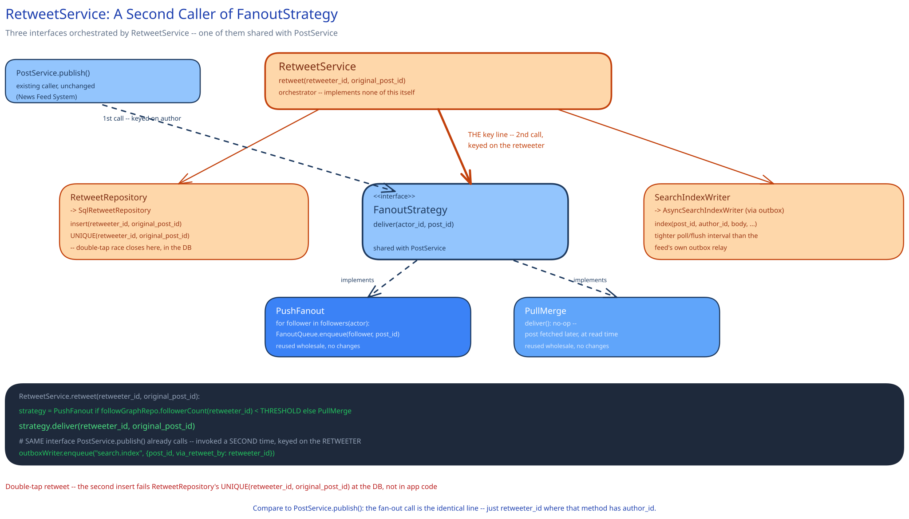

# Module 02 — Low-Level Design



## Interfaces vs. implementations

- **`FanoutStrategy`** *(interface)* → **`PushFanout`** / **`PullMerge`** — reused, unmodified, from [News Feed System](../news-feed-system/02-lld.md). Nothing about the interface changes here; what's new is that `RetweetService` becomes a **second caller** of it, alongside `PostService`.
- **`RetweetRepository`** *(interface)* → **`SqlRetweetRepository`** — `insert(retweeter_id, original_post_id)` (a thin row, no content), `exists(retweeter_id, original_post_id)`.
- **`SearchIndexWriter`** *(interface)* → **`AsyncSearchIndexWriter`** — `index(post_id, author_id, body, hashtags, created_at)`, invoked by an outbox relay tuned to a tighter poll/flush interval than the feed's own relay, since search's freshness target is stricter.
- **`MediaStore`** *(interface)* → **`ObjectStoreMediaClient`** — `presignUpload()` (returns an upload URL the client writes to directly), `resolve(media_url)`.
- **`RetweetService`** — the orchestrator for this module. Depends on `RetweetRepository`, `FanoutStrategy`, and `SearchIndexWriter` (via outbox); implements none of the storage or delivery mechanics itself.

## Pseudocode for the retweet's second fan-out decision

```
RetweetService.retweet(retweeter_id, original_post_id):
    if not postRepo.exists(original_post_id):
        raise NotFound("original post no longer exists")     # can't retweet a deleted post

    retweet = retweetRepo.insert(retweeter_id, original_post_id)
                                                    # ^ unique constraint on (retweeter_id, original_post_id):
                                                    #   a duplicate insert fails here, not in application code

    strategy = PushFanout if followGraphRepo.followerCount(retweeter_id) < THRESHOLD else PullMerge
    strategy.deliver(retweeter_id, original_post_id)
                                                    # ^ THE key line: same interface PostService.publish()
                                                    #   already calls, invoked a SECOND time, keyed on the
                                                    #   RETWEETER -- entirely independent of whatever decision
                                                    #   was already made for original_post_id's own author

    outboxWriter.enqueue("search.index", {post_id: original_post_id, via_retweet_by: retweeter_id})

    return retweet
```

Compare this directly to News Feed System's `PostService.publish()` pseudocode: the fan-out call is the *identical* line (`strategy.deliver(...)`), just with `retweeter_id` where that method has `author_id`. That symmetry is the whole design insight — a retweet doesn't need a new delivery mechanism, it needs the existing one invoked from a second place with a different actor as the input.

## Error cases worth designing for deliberately

- **Retweeting a deleted or nonexistent post:** rejected outright (`NotFound`) rather than silently creating a dangling reference — a `retweets` row whose `original_post_id` never resolves would need special-casing everywhere the row is later read, instead of being prevented once, here.
- **Double-tapping retweet on the same post:** not an error from the caller's point of view — `findByIdempotencyKey`-style handling (cross-ref [Idempotency Keys](../../scalability-resilience/idempotency-keys.md)): the second attempt returns the existing `retweet_id` rather than creating a duplicate row or firing fan-out twice.
- **Search indexing falling behind during a fan-out burst:** never blocks the write path — `outboxWriter.enqueue` durably records the intent to index regardless of how quickly the Search Indexer actually gets to it; a widening lag past the 2-second target is a monitored degradation, not a failure the caller of `retweet()` ever sees.

## Concurrency at the code level

`strategy.deliver(retweeter_id, original_post_id)` needs no in-process lock, for the same reason News Feed System's own fan-out needs none: two different retweets of the same post (by different retweeters) touch entirely independent follower lists and entirely independent feed-cache entries — there is no shared mutable state between them to protect in the first place.

The one place an actual constraint is needed is `retweetRepo.insert` — and, as with this guide's payments case study's idempotency key, the constraint belongs at the database level, not as an `if exists(...)` check in application code. Two concurrent double-taps can both pass an application-level existence check before either has inserted; only the database's unique constraint on `(retweeter_id, original_post_id)` closes that race for good, with the losing insert failing cleanly and the handler returning the winner's row.

## Design patterns you just used, named

- **Strategy pattern (reused, not reinvented)** — `FanoutStrategy` is exactly News Feed System's Strategy, called from a second site. The pattern's whole value shows up here: neither `PushFanout` nor `PullMerge` needed to change at all to support an entirely new caller.
- **Repository pattern** — `RetweetRepository` and `MediaStore` hide their storage engines behind method calls; `RetweetService` never issues SQL or talks to object storage directly.
- **Transactional outbox** — `SearchIndexWriter`'s enqueue is this pattern by name, the same one this guide's payments and job-scheduler case studies use: durably record the intent to index in the same transaction as the retweet write, and let a relay do the actual, possibly-slower work of indexing.
- **Facade / orchestrator** — `RetweetService` composes calls to three interfaces and implements none of them itself, matching this guide's `OrchestrationService` (payments) and `FeedAssembly` (News Feed System) shape.

## Practice: extend it yourself

Before moving to Database Design, sketch (pseudocode is fine) how you'd add:

1. **Cascading retweets** — a user retweets something that is *itself* a retweet. Does the new row's `original_post_id` point at the tweet the user actually saw (the intermediate retweet), or does it resolve back to the true original post? What breaks in `FanoutStrategy.deliver()` or in a retweet-count display if you pick the wrong one?
2. **Un-retweeting** — removing a retweet a user posted moments ago. Does this need to reverse fan-out jobs already enqueued or delivered to followers who saw it, or does it lean on the same snapshot-semantics tolerance News Feed System already accepts for an unfollow racing a fan-out? What's the actual user-visible difference between "reverse it" and "just stop delivering it going forward"?

Neither has one clean answer — the point is noticing that `RetweetService` and `FanoutStrategy`'s existing boundaries already tell you where each new piece of behavior has to live, even before you've worked out exactly what it should do.
