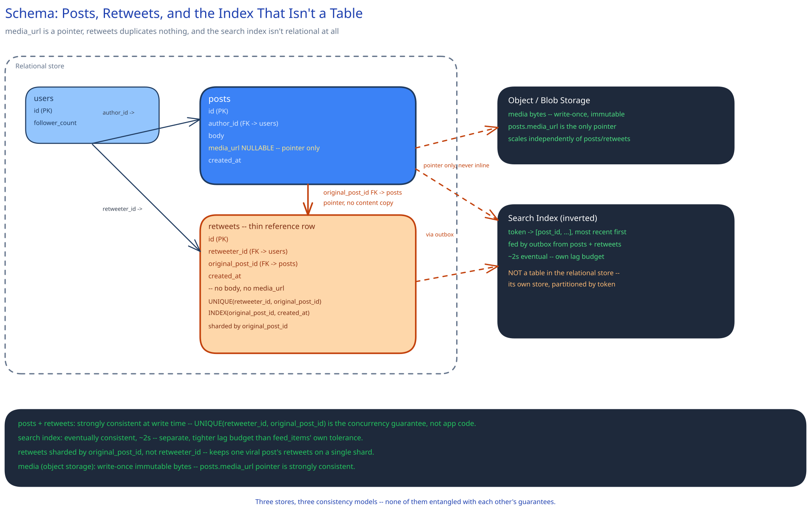

# Module 03 — Database Design & Scaling

## From entities to schema

Reusing `users`, `follows`, and `feed_items` wholesale from [News Feed System](../news-feed-system/03-db-design.md) — nothing about them changes here. What's new or modified:

- **`posts`** `(id, author_id, body, media_url NULLABLE, created_at)` — identical to News Feed System's `posts` table with exactly one addition: `media_url`, a pointer, never the media itself.
- **`retweets`** `(id, retweeter_id, original_post_id FK -> posts, created_at)` — deliberately has no `body` or `media_url` column at all; there is nothing for those columns to hold.
- **Search index** — conceptually `hashtag/token -> [post_id, ...]`, ordered by recency; **not** a table in the primary relational store at all (see below).

## Why `retweets` is a thin reference row, not a duplicate `posts` row

A retweet stores `(retweeter_id, original_post_id, created_at)` and nothing else, matching this guide's [Normalization & Schema Design](../../database-design/normalization-schema-design.md) "one fact, one place" reasoning generally, but worth stating concretely here: if a retweet duplicated the original's `body` and `media_url`, an edit or deletion of the original would leave every duplicate silently out of sync — a real inconsistency, not just wasted space. At 150M retweets/day, duplication would also roughly double text-storage volume for zero new content. The pointer design means `posts` stays the single source of truth for a piece of content's own text, media, and engagement counts, no matter how many times it's reshared.

## Why `media_url` is a pointer, never inline bytes

Module 00's own capacity math makes this one mechanical: media outweighs tweet text by roughly 200x (21TB/day vs. 105GB/day). Storing media inline — a BLOB column, or base64 in `body` — would force every read replica of `posts` to physically copy megabytes of data it never queries on a normal timeline or search read, the same reasoning [Object / Blob Storage](../../scalability-resilience/object-blob-storage.md) gives generally. Keeping `media_url` as a pointer means `posts` stays cheap and fast to replicate regardless of how much media the platform is storing in aggregate.

## Why the search index isn't a table in the primary relational store

`posts` is optimized for point lookups and author-scoped range scans (`author_id, created_at`) — exactly the shape [News Feed System](../news-feed-system/03-db-design.md) needs. A hashtag/keyword search is a completely different access pattern: "every post containing this token, most recent first," across the *entire* corpus, which is what an inverted index (cross-ref [Search & Inverted Indexes](../../scalability-resilience/search-inverted-indexes.md)) is purpose-built for and a B-tree index on `posts.body` is not. Keeping it a separate store also isolates its freshness contract: the ~2-second indexing SLA from Module 00/01 is a property of this store's own write pipeline, and would otherwise be entangled with whatever consistency model the primary relational tier uses for everything else.

## Why `retweets(retweeter_id, original_post_id)` gets a unique index, non-negotiably

The same reasoning this guide's payments case study gives for `idempotency_key`: the unique constraint is the actual concurrency-safety mechanism for the double-tap race in Module 01's Concurrent-User Handling, not an application-level nicety layered on top. Two concurrent identical retweet requests both reading "not yet retweeted" and both attempting an insert is a real interleaving in application code; it isn't a possible outcome at the database level once the constraint exists, because the second insert simply fails it.

## Indexes

- `retweets(retweeter_id, original_post_id)` — **unique**, the concurrency-safety mechanism above, and also the natural "have I already retweeted this" check on the write path.
- `retweets(original_post_id, created_at)` — "who retweeted this post, most recent first" — the query a viral post's own detail view runs constantly, and the exact table a celebrity retweet cascade hammers hardest.
- `posts(author_id, created_at)` — reused from News Feed System, unchanged.
- The search index has no equivalent to a relational secondary index — its entire structure *is* the access path, keyed by token rather than by row, per [Search & Inverted Indexes](../../scalability-resilience/search-inverted-indexes.md).

## Consistency

- **`posts`:** strongly consistent at write time, unchanged from News Feed System — a post either exists or it doesn't, no ambiguous intermediate state.
- **`retweets`:** strongly consistent at write time for the same reason, with the unique constraint above providing the concurrency guarantee rather than an application check.
- **Search index:** eventually consistent, but on a **tighter, separately-tracked** lag budget (~2s) than `feed_items`'s "a few seconds, sometimes more under backpressure" — both are async by design, but they are not the same SLA, and conflating them would either make search feel laggy or force the feed's fan-out relay to run faster than its own requirements demand.
- **Media (object storage):** the blob itself is write-once and immutable after upload; the `posts.media_url` pointer is strongly consistent — a tweet either has its pointer at creation time or it doesn't, with no intermediate "half-uploaded" tweet ever visible.

## Scaling the schema

- **`retweets` is sharded by `original_post_id`, not `retweeter_id`** — the hot query during exactly the scenario this case study is built around (a celebrity retweet cascade) is "every retweet of this one post," and keeping them together avoids a scatter-gather across shards during the highest-load moment this system sees. A user's own retweet history (for their profile) is comparatively low-volume per request and is served by the secondary index above rather than driving the shard key, the same asymmetric-access-pattern reasoning News Feed System applies to `follows`.
- **Media scales entirely independently of the relational tier** — object storage's own scaling story (cross-ref Object / Blob Storage) has nothing to do with how `posts` or `retweets` are sharded, which is the whole point of keeping them separate stores rather than one system trying to serve both access patterns.
- **The search index scales on its own axis too** — partitioned by token/shard the way a general inverted index shards, independent of both the relational tier's sharding and the fan-out worker pool's scaling, since none of the three shares a bottleneck with either of the others.

## Connecting it back

Look at all three modules together now: Module 00's observation that a retweet reopens the fan-out decision from scratch is why Module 01 puts `RetweetService` in front of the *same* `FanoutStrategy` interface a second time rather than building a new delivery mechanism; that same reuse is why `retweets` needed only a thin schema here — the heavy lifting (push/pull, celebrity thresholds) was already solved by News Feed System's `posts`/`feed_items` design, and this module only had to add what's actually new. The unique constraint on `(retweeter_id, original_post_id)` is what makes Module 01's double-tap race a guaranteed, database-enforced outcome rather than an application-level hope; the separate search index and its own tighter SLA is what lets search feel real-time without forcing the feed's own async delivery to run faster than its requirements need; and the `media_url` pointer is what keeps `posts` cheap despite the 200x storage gap Module 00's capacity math surfaces. Nothing here is arbitrary — every addition traces back to one of the three things this case study named as genuinely different from News Feed System.
