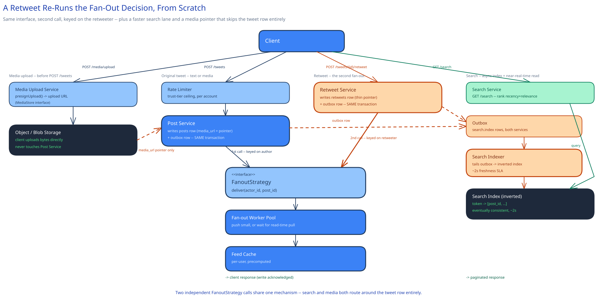

# Design Twitter / X

## Requirements

Post a short text update (a "tweet"), follow other accounts, see a timeline of tweets from followed accounts, like and retweet, search tweets by keyword or hashtag.

## The core problem is already solved elsewhere in this guide

The core feed-generation problem here — fan-out-on-write vs. fan-out-on-read, and the celebrity-account problem that decides between them — is the exact same problem this guide's [News Feed System](../news-feed-system/README.md) case study already covers in depth: the threshold-based hybrid, the `FanoutStrategy` LLD, the `posts`-by-author-id / `feed_items`-by-user-id sharding split. Read that first. This page covers only what's specifically different about Twitter/X's shape of the same problem.

## What's actually different here

**The retweet adds a second fan-out hop.** A retweet isn't a new post with new content — it's a pointer to an existing tweet, but it still needs to appear in the *retweeter's own* followers' timelines, which means fanning out again, this time from the retweeter. That second hop is what makes the celebrity problem sharper than News Feed System's version of it: an ordinary user's tweet, originally fanned out (or not) based on *their* modest follower count, can suddenly need celebrity-scale fan-out the moment a celebrity retweets it — the fan-out decision has to be re-evaluated per retweet, not decided once at the original post's creation time.

**Search has to run near-real-time, on a feed that's otherwise fine with a few seconds of lag.** Unlike a chronological timeline, "search for this hashtag" needs freshly-posted tweets to show up within seconds, not whenever a batch index job next runs. This guide's [Search & Inverted Indexes](../../scalability-resilience/search-inverted-indexes.md) page already names the trade-off: the index lags the primary write path slightly, via the same async-update mechanism as any other secondary index — an acceptable lag here, since "a few seconds behind" for search is a much looser bar than "never inconsistent" for, say, a payment.

**A tweet's text is cheap; its media isn't.** At ~280 characters, a tweet row is tiny to store and replicate compared to this guide's other content-heavy systems — attached images or video still go to [Object / Blob Storage](../../scalability-resilience/object-blob-storage.md), never inline with the tweet row, for the same reasons that guide already gives (a primary DB replica shouldn't have to copy megabytes of blob data it never queries).

## Interviewer follow-ups

**How does a retweet's fan-out differ from an original post's fan-out?**
An original post fans out (or not) based on *its author's* follower count. A retweet is a second, independent fan-out decision based on the *retweeter's* follower count — so a low-follower user's tweet can trigger a full celebrity-scale fan-out the moment a high-follower account retweets it, even though the original post itself never needed one.

**How would you rank search results by recency vs. relevance?**
The same two-signal blend this guide's News Feed System page uses for ranking — recency and an engagement/relevance score combined into one ordering — applies here too; it's a scoring function over already-matched candidates, and doesn't change how the inverted index itself is built or kept current.

**How would you rate-limit posting to prevent spam without blocking legitimate high-frequency accounts (e.g. a news account)?**
A per-account rate limit (this guide's [Rate Limiting](../../hld-building-blocks/rate-limiting.md) page) with a materially higher ceiling for verified/established accounts than for a brand-new one — the limit is a property of the account's trust level, not one fixed number for every poster.

**Does a retweet need its own row in the `posts` table?**
No — storing it as a thin reference (`retweeter_id`, `original_post_id`, `created_at`) rather than a duplicate copy of the tweet keeps the original post as the single source of truth for its own content and like/retweet counts, the same "one fact, one place" reasoning this guide's [Normalization & Schema Design](../../database-design/normalization-schema-design.md) page makes generally.
