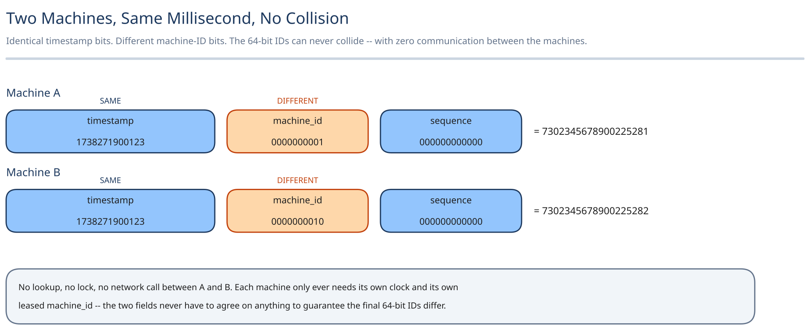

# Design a Unique ID Generator



Every row created anywhere in a distributed, sharded system needs an ID that's unique *globally*, not just within the shard that created it. The hard constraint that makes this an interesting problem: generating that ID must never require asking another machine "is this one free?" A design that phones home before handing out an ID has just reintroduced, on every single write, the exact single-node bottleneck sharding was supposed to remove.

## Requirements

**Functional:** generate a unique 64-bit ID for every new row, usable directly as a primary key, with no two machines — ever, under any interleaving — producing the same one.

**Non-functional**, stated as assumptions, not guessed:
- ~100K IDs/sec across all machines combined, at steady state.
- IDs should be roughly time-sortable — a later-created ID is numerically larger — so range scans and keyset pagination work without a separate timestamp column.
- p99 generation latency under 1ms. This runs on literally every write's critical path, so "usually fast" isn't good enough.
- **No coordination between machines on the hot path.** This is the constraint the rest of this design exists to satisfy; every other requirement bends around it.

## Capacity Estimation

Using this guide's [back-of-envelope method](../../foundations/back-of-envelope-estimation.md): 100K IDs/sec average, a 3x peak factor for a traffic spike → ~300K IDs/sec peak. Spread across the maximum 1,024 machines this design supports (see Architecture), that's ~293 IDs/sec/machine at peak — worth comparing against a single machine's actual ceiling, covered below, because the gap between them is the whole point of this design.

## Approach Walkthrough

Build the ID out of **concatenated bit-fields**, each contributing a different, independently-true guarantee, so no two fields ever have to communicate to stay unique: a timestamp (when), a machine ID (where), and a per-machine sequence counter (which one, if several were generated in the same instant on the same machine). Uniqueness falls out of composition, not coordination.

## API Surface

The generation call is a **local, in-process library function** — `IdGenerator.next() -> uint64` — deliberately not a network call, because a remote "give me an ID" service would reintroduce a round trip on every single write, which is precisely the cost this design is built to avoid.

The only network-facing surface is a control-plane one, called once per process lifetime, not per ID:

```
POST /machine-ids/lease
  -> { machine_id: 0-1023, lease_expires_at: <timestamp> }

POST /machine-ids/{id}/renew   (background heartbeat, not per-ID)
```
