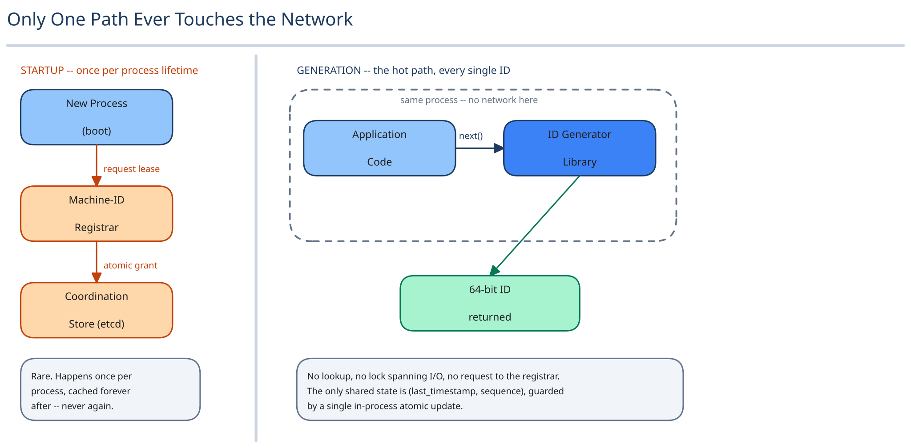

# Module 01 — Architecture & High-Level Design

## Monolith vs. microservices

Unusually for this guide, the right call here runs the other direction: the ID generator is **not** a separate service at all. It's a library embedded inside every process that needs IDs. A remote "ID-issuing" service would put a network round trip on the hot path of every single write in the system — exactly the coordination cost the whole design exists to eliminate. There's nothing to gain from centralizing logic that's already coordination-free by construction.

What genuinely is worth a small, separate service is the **machine-ID registrar** — the control-plane piece that leases a machine ID to a process at startup. That needs shared state (which of the 1,024 slots are taken) and benefits from being centralized, but it's called once per process lifetime, not once per ID, so pulling it out costs nothing on the path that actually matters for latency.

## Building Blocks

| Block | Role |
|---|---|
| **ID Generator library** (embedded, in-process) | Combines timestamp + machine ID + sequence into a 64-bit ID; the only thing called on the hot path |
| **Machine-ID Registrar** (small, centralized service) | Leases a machine ID (0–1023) to a process at startup; called once per process lifetime |
| **Coordination store** (e.g. etcd/Zookeeper) | Backs the registrar's leases — cross-ref [Distributed Locks](../../scalability-resilience/distributed-locks.md) |
| **Clock guard** (in-process) | Detects the local clock moving backward before it can produce a bad ID |

## Per-path walkthrough

**Startup path (once per process)** — `Process boot → Machine-ID Registrar (request lease) → Coordination store (atomic conditional grant) → process caches machine_id for its entire lifetime`.

**Generation path (the hot path — no network call at all)** — `Application code → IdGenerator.next() (read local clock, compare to last-seen timestamp, advance sequence, concatenate bit-fields) → 64-bit ID returned`.

**Clock-regression path** — `IdGenerator.next() → detects local_clock < last_seen_timestamp → stalls until the clock catches up (or raises an alarm) → resumes normal generation`.

## Trade-offs to make explicit

| Decision | Chosen | Alternative | Why |
|---|---|---|---|
| Coordination model | Concatenated independent bit-fields | A centralized ID-issuing service | A remote call reintroduces the exact network round trip and single point of coordination this design exists to eliminate |
| Machine-ID assignment | Leased once at startup from a small registrar | Statically hardcoded per deployment | Static config doesn't survive autoscaling — a new instance spun up mid-spike needs a machine ID *now*, not from a file someone edited in advance |
| Uniqueness guarantee | Bit-field composition (timestamp/machine/sequence) | A 128-bit random UUID (v4) | A UUIDv4 is also coordination-free, but gives up rough time-ordering entirely — this design's range-scan/pagination requirement rules it out, not a blanket "UUIDs are worse" |
| Clock-regression handling | Detect and stall/alarm | Ignore it, accept the rare duplicate | A silently-accepted duplicate primary key is an unbounded correctness bug wearing a probability argument as a disguise; stalling is a small, bounded cost |
| ID width | 64-bit | 128-bit (ULID/UUID-like) | 64-bit fits a native integer column in every mainstream database with no special handling; 128-bit buys headroom this scale doesn't need yet at the cost of a wider key everywhere |

## Load Handling

- **Peak-vs-average tolerance:** 300K IDs/sec peak spread across up to 1,024 machines is ~293/sec/machine — nowhere near a single machine's actual ceiling of 4,096 IDs *per millisecond* (4.096M/sec). This design has enormous per-machine headroom baked in by construction; the real ceiling is machine *count*, not per-machine throughput.
- **Where backpressure kicks in first:** never on generation itself (no network, no lock beyond a single in-process one) — the only place load can back up is the registrar during a mass simultaneous cold start, e.g. an entire fleet restarting at once during a deploy and all requesting leases within the same second.
- **What gets shed under overload:** nothing on the generation path. A process that can't get a machine-ID lease yet retries registration with backoff *before* serving any traffic, rather than generating IDs without one.
- **Load-test target:** 1,024 simultaneous lease requests during a fleet-wide restart complete with zero duplicate leases within a few seconds; independently, a single machine sustains 4M IDs/sec locally with zero collisions.

## Concurrent-User Handling

| Race | Mechanism | What the "loser" sees |
|---|---|---|
| Two machines request a lease from the registrar at the same instant | The registrar's grant is a single atomic conditional write against the coordination store — the same claim shape this guide's job-scheduler and web-crawler pages use | Its request simply returns the next still-unclaimed machine ID, never the winner's |
| The same process generates two IDs from two threads in the same millisecond | The `(last_timestamp, sequence)` pair updates via a single atomic in-process operation — no lock spans I/O | The second thread receives the next sequence value in line; nothing blocks but a single in-memory atomic increment |
| A machine's lease expires (assumed dead) while the process is actually still alive and generating IDs | Lease renewal is a background heartbeat, separate from generation; if a lease is reassigned before the old holder notices, both could briefly generate under the same machine ID — the real mitigation is a lease timeout generous relative to the heartbeat interval, plus fencing (cross-ref [Distributed Locks](../../scalability-resilience/distributed-locks.md)) | Both processes keep producing individually well-formed IDs; a genuine collision becomes possible only during that narrow overlap window, which is why the timeout is set generously rather than tightly |

## Scaling & Reliability

- **Horizontal scaling:** adding machines just means leasing more machine IDs — generation logic itself never changes, up to the 1,024-machine bit budget.
- **Circuit breaker:** only relevant to the registrar's coordination-store calls at startup (cross-ref [Circuit Breakers & Retries](../../scalability-resilience/circuit-breakers-retries.md)) — never on the generation path, which has nothing to break.
- **Retries:** a failed lease request retries with backoff; generation itself has nothing to retry in the normal case.
- **Dead-letter queue:** not applicable — there's no message/event pipeline here, worth saying plainly rather than forcing an analogy that doesn't fit.
- **Graceful degradation:** if the registrar is briefly unavailable, every already-running process is entirely unaffected (its machine ID was cached at startup) — only *new* process startups block waiting for a lease, a visible, bounded failure mode, not a silent one.
- **Multi-region:** not built here — each region would need its own disjoint slice of the machine-ID space (or a dedicated region-ID bit field), named as a real gap below.

## What you'd revisit as this grows

- **Multi-region ID-space partitioning** — carving region bits out of the existing 64, shrinking either the machine-ID or sequence field to make room.
- **Faster lease reclaiming** if machine churn is high (frequent autoscale up/down) — the current lease-and-forget model with a generous timeout favors safety over quick reuse of freed machine IDs.
- **Monitoring on clock-regression events specifically** — "detect and stall" has no defined escalation path today if a clock never catches back up.
- **Migrating to a wider ID** if machine count needs to exceed 1,024, or a single machine's sequence throughput needs to exceed 4M/sec — not built here, but the trade-off is already named above.
